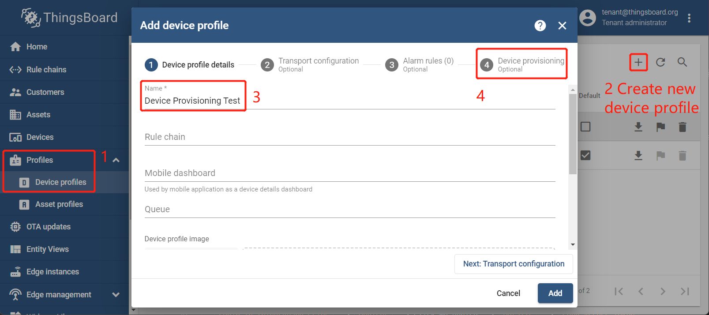

# Add / Modify a device profile for device provisioning - Allow to create new devices

## Add a new device profile and allow to create new devices

1. `Login in ThingsBoard CE/PE as tenant` --> `Devices` -->`Device profiles` --> `+`  --> `Create new device profiles` --> Input *Device Profile Name* --> `Device provisioning Optional`.

    

1. `Allow to create new devices` --> Input `Provision device key` & `Provision device secret`, copy to a safe place --> `Add`.

    

1. Now my device profile should be listed first, since the table sort devices using the time of the creation by default.

    

## Modify a device profile to allow to create new devices

1. `Login in ThingsBoard CE/PE as tenant` --> `Device profiles` --> click *my device profile*  --> `Device provisioning` --> `Toggle edit mode` (red icon).

    

1. `Allow to create new devices` --> Input `Provision device key` & `Provision device secret`, copy to a safe place --> `Apply changes` (red icon).

    
