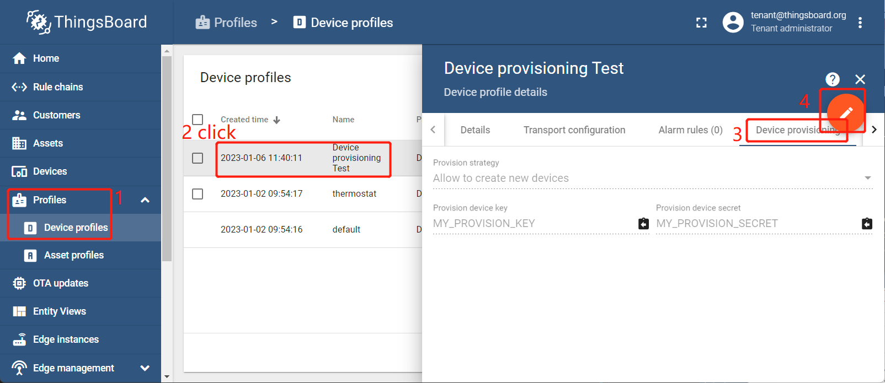
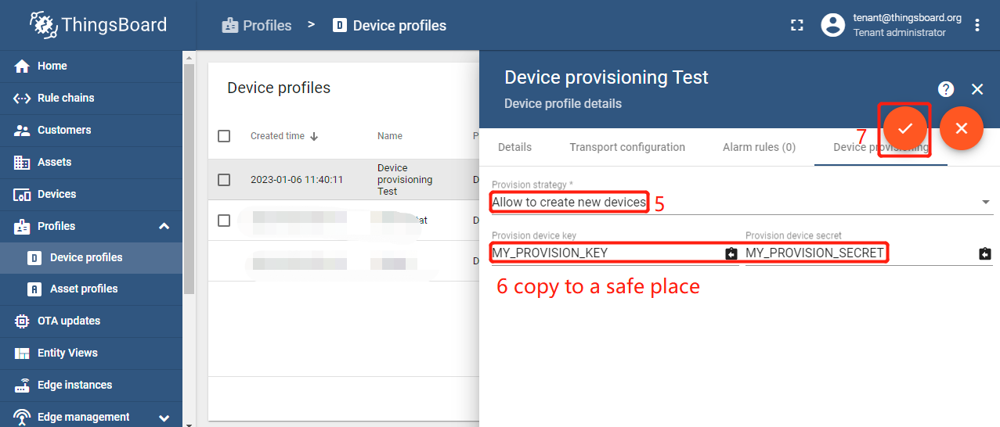
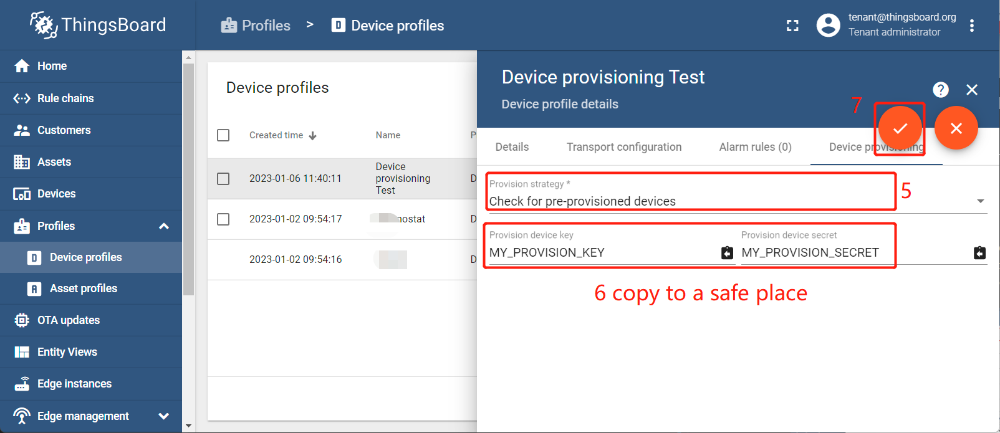

# Add / Modify a device profile for device provisioning

- [Add / Modify a device profile for device provisioning](#add--modify-a-device-profile-for-device-provisioning)
  - [Add / Modify a device profile for device provisioning - Allow to create new devices](#add--modify-a-device-profile-for-device-provisioning---allow-to-create-new-devices)
    - [Add a new device profile and allow to create new devices](#add-a-new-device-profile-and-allow-to-create-new-devices)
    - [Modify a device profile to allow to create new devices](#modify-a-device-profile-to-allow-to-create-new-devices)
  - [Add / Modify a device profile for device provisioning - Check for pre-provisioned devices](#add--modify-a-device-profile-for-device-provisioning---check-for-pre-provisioned-devices)
    - [Add a new device profile and check for pre-provisioned devices](#add-a-new-device-profile-and-check-for-pre-provisioned-devices)
    - [Modify a device profile to check for pre-provisioned devices](#modify-a-device-profile-to-check-for-pre-provisioned-devices)

## Add / Modify a device profile for device provisioning - Allow to create new devices

### Add a new device profile and allow to create new devices

1. `Login in ThingsBoard CE/PE` --> `Devices` -->`Device profiles` --> `+`  --> `Create new device profiles` --> Input *Device Profile Name* --> `Device provisioning Optional`.

    

1. `Allow to create new devices` --> Input `Provision device key` & `Provision device secret`, copy to a safe place --> `Add`.

    

1. Now my device profile should be listed first, since the table sort devices using the time of the creation by default.

    

### Modify a device profile to allow to create new devices

1. `Login in ThingsBoard CE/PE` --> `Device profiles` --> click *my device profile*  --> `Device provisioning` --> `Toggle edit mode` (red icon).

    

1. `Allow to create new devices` --> Input `Provision device key` & `Provision device secret`, copy to a safe place --> `Apply changes` (red icon).

    

## Add / Modify a device profile for device provisioning - Check for pre-provisioned devices

### Add a new device profile and check for pre-provisioned devices

1. `Login in ThingsBoard CE/PE` --> `Devices` -->`Device profiles` --> `+`  --> `Create new device profiles` --> Input *Device Profile Name* --> `Device provisioning Optional`.

    

1. `Check for pre-provisioned devices` --> Input `Provision device key` & `Provision device secret`, copy to a safe place --> `Add`.

    

1. Now my device profile should be listed first, since the table sort devices using the time of the creation by default.

    

### Modify a device profile to check for pre-provisioned devices

1. `Login in ThingsBoard CE/PE` --> `Device profiles` --> click *my device profile*  --> `Device provisioning` --> `Toggle edit mode` (red icon).

    

1. `Check for pre-provisoned devices` --> Input `Provision device key` & `Provision device secret`, copy to a safe place --> `Apply changes` (red icon).

    