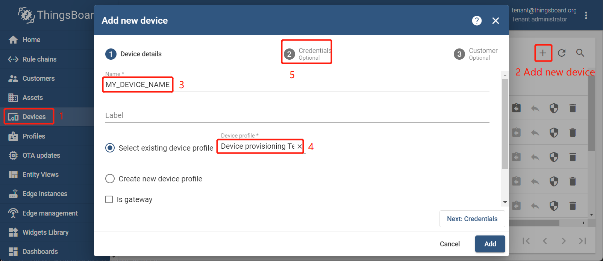

# Pre-provisioning device with Access token

1. `Login in ThingsBoard CE/PE` --> `Device` --> `+` --> `Add new device` --> Input *device name* --> Select *my device profile* --> `Credentials Options`.
     

1. Checked `Add credentials` --> Select `Access token` --> Input *my access token* --> `Add`.
     
