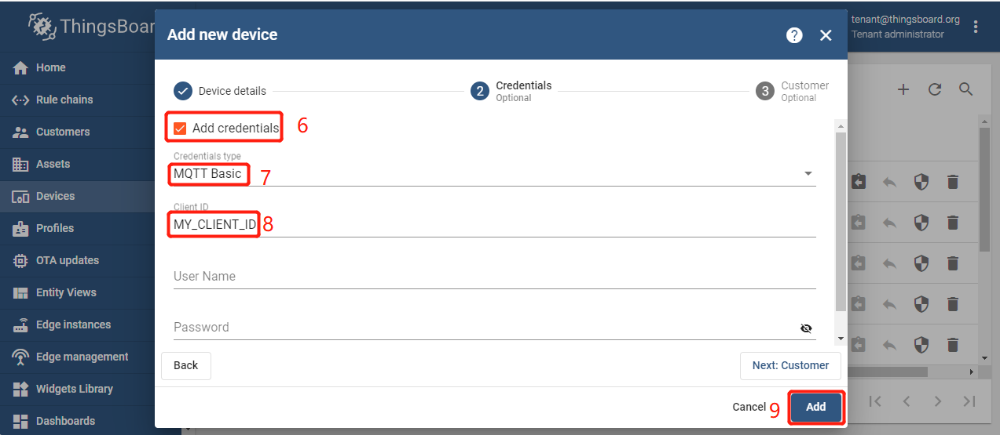

# Pre-provisioning device with basic MQTT credentials -  Client ID

1. `Login in ThingsBoard CE/PE` --> `Device` --> `+` --> `Add new device` --> Input *device name* --> Select *my device profile* --> `Credentials Options`.
     

1. Checked `Add credentials` --> Select `MQTT Basic` --> Input *my client id* --> `Add`.
    

