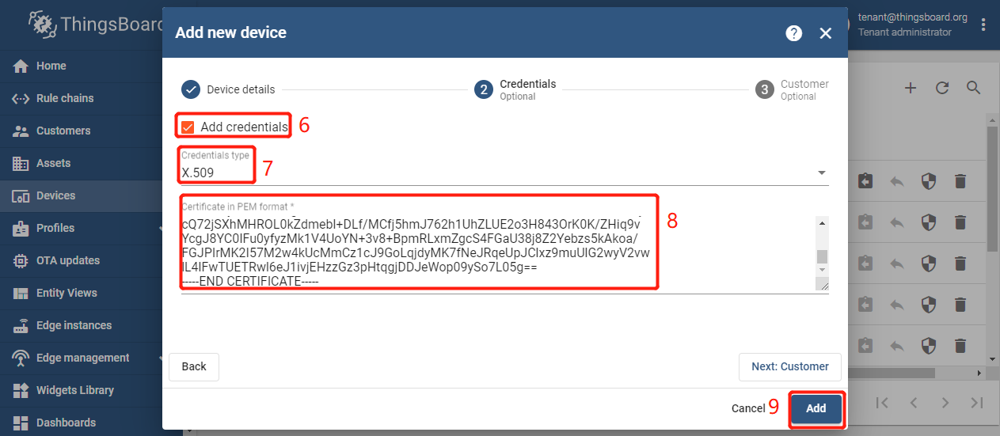

# Pre-provisioning device with X.509 Certificate

1. `Login in ThingsBoard CE/PE as tenant` --> `Device` --> `+` --> `Add new device` --> Input *device name* --> Select *my device profile* --> `Credentials Options`.
     

1. Checked `Add credentials` --> Select `X.509` --> Insert the contents of cert.pem file *my client certificate file（`cert.pem` or `client.crt`）* --> `Add`.
    
