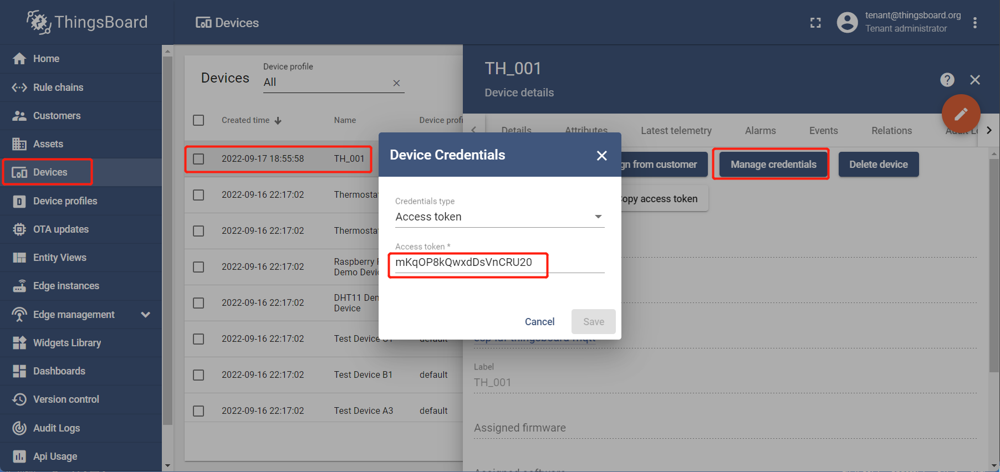

| Supported Targets | ESP32 | ESP32-C2 | ESP32-C3 | ESP32-H2 | ESP32-S3 |
| ----------------- | ----- | -------- | -------- | -------- | -------- |

# Access Token based authentication - Plain MQTT (without SSL)

* [中文版](./README_CN.md)

This example is based on [`$ESP-IDF\examples\protocols\mqtt\tcp`](https://github.com/espressif/esp-idf/tree/master/examples/protocols/mqtt/tcp).

This example implements some functions:

* Access Token based authentication - Plain MQTT (without SSL)
* Publish telemetry: temprature, humidity

## Hardware Required

* A development board with ESP32/ESP32-C3/ESP32-H2/ESP32-C2/ESP32-S3 SoC (e.g., ESP32-DevKitC, ESP-WROVER-KIT, etc.)
* A USB cable for Power supply and programming

See [Development Boards](https://www.espressif.com/en/products/devkits) for more information about it.

## How to Use Example

1. Get a device token

   `Login in ThingsBoard CE/PE` --> `Devices` --> Click my device --> `Details` --> `Copy Access Token`.

   

2. set-targe (optional)

   Before project configuration and build, be sure to set the correct chip target using:

   ```bash
   idf.py set-target <chip_name>
   ```

3. menuconfig

   Then project configuration:

   ```bash
   idf.py menuconfig
   ```

   Configuration: ThingsBoard MQTT URI, access token, Wi-Fi SSID, password:

   ```menuconfig
   Example Configuration  --->
       (mqtt://MyThingsboardServerIP) Broker URL
       (MyDeviceToken) Access Token 
   Example Connection Configuration  --->
       [*] connect using WiFi interface
       (MySSID) WiFi SSID 
       (MyPassword) WiFi Password                  
   ```

4. build, flash and monitor

   Run `idf.py -p PORT flash monitor` to build, flash and monitor the project.

   (To exit the serial monitor, type ``Ctrl-]``.)

   See the [Getting Started Guide](https://idf.espressif.com/) for full steps to configure and use ESP-IDF to build projects.

5. Check out the latest Telemetry data on ThingsBoard

   * `Login in ThingsBoard CE/PE` --> `Devices` --> click my device --> `Latest telemetry` --> Check out the latest Telemetry data.

   

## Example Output

```none
...
0x400811a8: call_start_cpu1 at C:/Espressif/frameworks/esp-idf-v4.4.3/components/esp_system/port/cpu_start.c:148

I (0) cpu_start: App cpu up.
I (466) cpu_start: Pro cpu start user code
I (466) cpu_start: cpu freq: 160000000
I (466) cpu_start: Application information:
I (470) cpu_start: Project name:     access_token_wo_ssl
I (476) cpu_start: App version:      db2324c-dirty
I (482) cpu_start: Compile time:     Dec 31 2022 14:50:57
I (488) cpu_start: ELF file SHA256:  98f90413d6210556...
I (494) cpu_start: ESP-IDF:          v4.4.3-dirty
I (499) heap_init: Initializing. RAM available for dynamic allocation:
I (506) heap_init: At 3FFAE6E0 len 00001920 (6 KiB): DRAM
I (512) heap_init: At 3FFB7650 len 000289B0 (162 KiB): DRAM
I (519) heap_init: At 3FFE0440 len 00003AE0 (14 KiB): D/IRAM
I (525) heap_init: At 3FFE4350 len 0001BCB0 (111 KiB): D/IRAM
I (532) heap_init: At 40094A04 len 0000B5FC (45 KiB): IRAM
I (539) spi_flash: detected chip: generic
I (542) spi_flash: flash io: dio
W (546) spi_flash: Detected size(4096k) larger than the size in the binary image header(2048k). Using the size in the binary image header.
I (560) cpu_start: Starting scheduler on PRO CPU.
I (0) cpu_start: Starting scheduler on APP CPU.
I (570) EXAM_ACCESS_TOKEN_WO_SSL: [APP] Startup..
I (580) EXAM_ACCESS_TOKEN_WO_SSL: [APP] Free memory: 275980 bytes
I (580) EXAM_ACCESS_TOKEN_WO_SSL: [APP] IDF version: v4.4.3-dirty
I (620) wifi:wifi driver task: 3ffbffcc, prio:23, stack:6656, core=0
I (620) system_api: Base MAC address is not set
I (620) system_api: read default base MAC address from EFUSE
I (630) wifi:wifi firmware version: 8cb87ff
I (630) wifi:wifi certification version: v7.0
I (630) wifi:config NVS flash: enabled
I (630) wifi:config nano formating: disabled
I (640) wifi:Init data frame dynamic rx buffer num: 32
I (640) wifi:Init management frame dynamic rx buffer num: 32
I (650) wifi:Init management short buffer num: 32
I (650) wifi:Init dynamic tx buffer num: 32
I (660) wifi:Init static rx buffer size: 1600
I (660) wifi:Init static rx buffer num: 10
I (660) wifi:Init dynamic rx buffer num: 32
I (670) wifi_init: rx ba win: 6
I (670) wifi_init: tcpip mbox: 32
I (680) wifi_init: udp mbox: 6
I (680) wifi_init: tcp mbox: 6
I (680) wifi_init: tcp tx win: 5744
I (690) wifi_init: tcp rx win: 5744
I (690) wifi_init: tcp mss: 1440
I (700) wifi_init: WiFi IRAM OP enabled
I (700) wifi_init: WiFi RX IRAM OP enabled
I (710) example_connect: Connecting to Duoman...
I (710) phy_init: phy_version 4670,719f9f6,Feb 18 2021,17:07:07
I (820) wifi:mode : sta (bc:dd:c2:d1:be:b0)
I (820) wifi:enable tsf
I (820) example_connect: Waiting for IP(s)
I (3230) wifi:new:<2,0>, old:<1,0>, ap:<255,255>, sta:<2,0>, prof:1
I (3970) wifi:state: init -> auth (b0)
I (3980) wifi:state: auth -> assoc (0)
I (3990) wifi:state: assoc -> run (10)
W (4000) wifi:<ba-add>idx:0 (ifx:0, d8:0d:17:00:5b:13), tid:0, ssn:0, winSize:64
I (4020) wifi:connected with Duoman, aid = 4, channel 2, BW20, bssid = d8:0d:17:00:5b:13
I (4020) wifi:security: WPA2-PSK, phy: bgn, rssi: -50
I (4020) wifi:pm start, type: 1

I (4080) wifi:AP's beacon interval = 102400 us, DTIM period = 1
I (5610) example_connect: Got IPv6 event: Interface "example_connect: sta" address: fe80:0000:0000:0000:bedd:c2ff:fed1:beb0, type: ESP_IP6_ADDR_IS_LINK_LOCAL
I (6110) esp_netif_handlers: example_connect: sta ip: 192.168.0.124, mask: 255.255.255.0, gw: 192.168.0.1
I (6110) example_connect: Got IPv4 event: Interface "example_connect: sta" address: 192.168.0.124
I (6120) example_connect: Connected to example_connect: sta
I (6120) example_connect: - IPv4 address: 192.168.0.124
I (6130) example_connect: - IPv6 address: fe80:0000:0000:0000:bedd:c2ff:fed1:beb0, type: ESP_IP6_ADDR_IS_LINK_LOCAL
I (6140) EXAM_ACCESS_TOKEN_WO_SSL: Init tbcmh ...
I (6150) EXAM_ACCESS_TOKEN_WO_SSL: Connect tbcmh ...
I (6150) tb_mqtt_client_helper: connecting to mqtt://192.168.0.187:1883 ...
I (6160) EXAM_ACCESS_TOKEN_WO_SSL: connect tbcmh ...
I (6170) tb_mqtt_client_helper: TBCM_EVENT_BEFORE_CONNECT, msg_id=64319
I (6170) EXAM_ACCESS_TOKEN_WO_SSL: Still NOT connected to server!
I (7180) tb_mqtt_client_helper: TBCM_EVENT_CONNECTED
I (7180) tb_mqtt_client_helper: client->tbmqttclient = 0x3ffc5d04
I (7180) tb_mqtt_client_helper: Connected to thingsboard MQTT server!
I (7180) tb_mqtt_client_helper: before call on_connected()...
I (7190) EXAM_ACCESS_TOKEN_WO_SSL: Connected to thingsboard server!
I (7200) tb_mqtt_client_helper: after call on_connected()
I (10500) EXAM_ACCESS_TOKEN_WO_SSL: Send telemetry: temprature, humidity
I (10500) EXAM_ACCESS_TOKEN_WO_SSL: Get temperature (a time-series data)
I (10500) EXAM_ACCESS_TOKEN_WO_SSL: Get humidity (a time-series data)
I (10510) tb_mqtt_wapper: [Telemetry][Tx] {"temprature":25,"humidity":26}
I (11520) tb_mqtt_client_helper: TBCM_EVENT_PUBLISHED, msg_id=58310
I (15920) EXAM_ACCESS_TOKEN_WO_SSL: Send telemetry: temprature, humidity
I (15920) EXAM_ACCESS_TOKEN_WO_SSL: Get temperature (a time-series data)
I (15920) EXAM_ACCESS_TOKEN_WO_SSL: Get humidity (a time-series data)
I (15930) tb_mqtt_wapper: [Telemetry][Tx] {"temprature":25.5,"humidity":27}
I (16940) tb_mqtt_client_helper: TBCM_EVENT_PUBLISHED, msg_id=26897
I (21340) EXAM_ACCESS_TOKEN_WO_SSL: Send telemetry: temprature, humidity
I (21340) EXAM_ACCESS_TOKEN_WO_SSL: Get temperature (a time-series data)
I (21340) EXAM_ACCESS_TOKEN_WO_SSL: Get humidity (a time-series data)
I (21350) tb_mqtt_wapper: [Telemetry][Tx] {"temprature":26,"humidity":28}
I (22360) tb_mqtt_client_helper: TBCM_EVENT_PUBLISHED, msg_id=36705
I (26760) EXAM_ACCESS_TOKEN_WO_SSL: Send telemetry: temprature, humidity
I (26760) EXAM_ACCESS_TOKEN_WO_SSL: Get temperature (a time-series data)
I (26760) EXAM_ACCESS_TOKEN_WO_SSL: Get humidity (a time-series data)
I (26770) tb_mqtt_wapper: [Telemetry][Tx] {"temprature":26.5,"humidity":29}
I (27780) EXAM_ACCESS_TOKEN_WO_SSL: Disconnect tbcmh ...
I (27780) tb_mqtt_client_helper: disconnecting from mqtt://192.168.0.187:1883 ...
I (27780) tb_mqtt_client_helper: TBCM_EVENT_PUBLISHED, msg_id=12086
I (27890) tb_mqtt_wapper: tbcm_disconnect(): call esp_mqtt_client_stop()...
I (27900) tb_mqtt_wapper: tbcm_disconnect(): call esp_mqtt_client_destroy()...
W (27900) MQTT_CLIENT: Client asked to stop, but was not started
I (28000) EXAM_ACCESS_TOKEN_WO_SSL: Destroy tbcmh ...
I (28000) tb_mqtt_client_helper: It already disconnected from thingsboard MQTT server!
```

## ThingsBoard Data

* `Login in ThingsBoard CE/PE` --> `Devices` --> Click my device --> `Attributes` --> `Latest tememetry`, your can find `humidity` and `temprature`. Their values change over time.

## Troubleshooting

For any technical queries, please open an [issue](https://github.com/liang-zhu-zi/esp32-thingsboard-mqtt-client/issues) on GitHub. We will get back to you soon.
