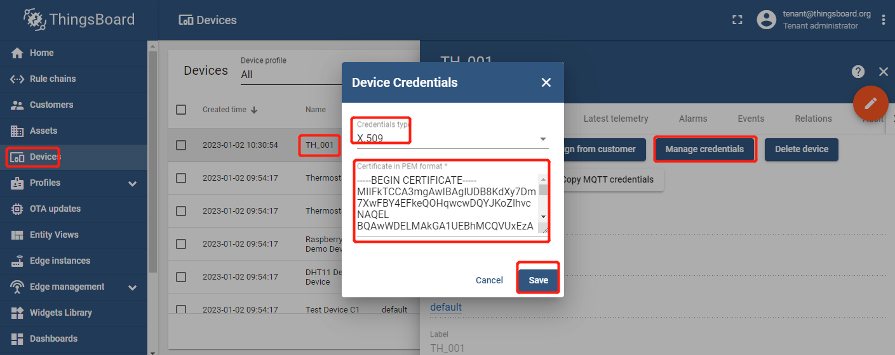
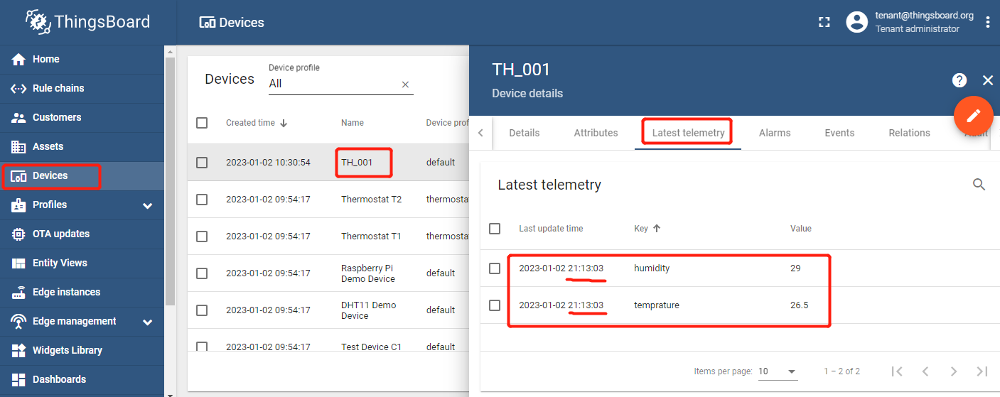

| Supported Targets | ESP32 | ESP32-C2 | ESP32-C3 | ESP32-H2 | ESP32-S3 |
| ----------------- | ----- | -------- | -------- | -------- | -------- |

# 基于 X.509 证书的认证

* [English Version](./README.md)

本示例基于 [`$ESP-IDF\examples\protocols\mqtt\tcp`](https://github.com/espressif/esp-idf/tree/master/examples/protocols/mqtt/tcp).

本示例实现了以下功能：

* 基于 X.509 证书的认证 - 相互认证
* 发送 telemetry: temprature, humidity

参考 [这里](https://thingsboard.io/docs/user-guide/certificates/).

## 硬件需求

* 一个载有 ESP32/ESP32-C3/ESP32-H2/ESP32-C2/ESP32-S3 SoC 的开发板(例如, ESP32-DevKitC, ESP-WROVER-KIT 等等)
* 一条用于供电与编程的 USB 线

参考 [Development Boards](https://www.espressif.com/en/products/devkits) 获得更多信息.

## 如何使用例子

1. ThingsBoard CE/PE SSL configuration using PEM certificates file
   Refer [here](https://thingsboard.io/docs/user-guide/mqtt-over-ssl/#ssl-configuration-using-pem-certificates-file)

   Configure the following environment variables via [configuration](https://thingsboard.io/docs/user-guide/install/config/) file, docker-compose or kubernetes scripts. We will use thingsboard.conf for example:

   If ThingsBoard is installed on Linux as a monolithic application, you may specify the environment variables in the thingsboard.conf file:

   ```bash
   sudo nano /usr/share/thingsboard/conf/thingsboard.conf
   ```

   ```bash
   ...
   export MQTT_SSL_ENABLED=true
   export MQTT_SSL_CREDENTIALS_TYPE=PEM
   export MQTT_SSL_PEM_CERT=server.pem
   export MQTT_SSL_PEM_KEY=server_key.pem
   export MQTT_SSL_PEM_KEY_PASSWORD=secret
   ...
   ```

   where:

   * MQTT_SSL_ENABLED - Enable/disable SSL support;
   * MQTT_SSL_CREDENTIALS_TYPE - Server credentials type. PEM - pem certificate file; KEYSTORE - java keystore;
   * MQTT_SSL_PEM_CERT - Path to the server certificate file. Holds server certificate or certificate chain, may also include server private key;
   * MQTT_SSL_PEM_KEY - Path to the server certificate private key file. Optional by default. Required if the private key is not present in server certificate file;
   * MQTT_SSL_PEM_KEY_PASSWORD - Optional server certificate private key password.
   * After completing the setup, start or restart the ThingsBoard server.

1. Self-signed certificates generation - PEM certificate file

   See [PEM certificate file](https://thingsboard.io/docs/user-guide/mqtt-over-ssl/#pem-certificate-file)

   Use instructions below to generate your own certificate files. Useful for tests, but time consuming and not recommended for production.

   Note This step requires Linux based OS with openssl installed.

   To generate a server self-signed PEM certificate and private key, use the following command:

   ```bash
   openssl ecparam -out server_key.pem -name secp256r1 -genkey
   openssl req -new -key server_key.pem -x509 -nodes -days 365 -out server.pem 
   ```

   You can also add -nodes (short for no DES) if you don’t want to protect your private key with a passphrase. Otherwise, it will prompt you for “at least a 4 character” password.

   The **days** parameter (365) you can replace with any number to affect the expiration date. It will then prompt you for things like “Country Name”, but you can just hit Enter and accept the defaults.

   Add -subj `/CN=localhost` to suppress questions about the contents of the certificate (replace localhost with your desired domain).

   Self-signed certificates are not validated with any third party unless you import them to the browsers previously. If you need more security, you should use a certificate signed by a certificate authority (CA).

   Make sure the certificate files are reachable by ThingsBoard process:

   * Linux: use `/etc/thingsboard/conf` folder. Make sure the files - server_key.pem & server.pem have same permissions as thingsboard.conf; Use relative file path, e.g. keystore.p12;

1. 复制 `server.pem` 并重命名为 `main\mqtt_thingsboard_server_cert.pem`;

1. Generate Client certificate

   Use the following command to generate the self-signed private key and x509 certificate. The command is based on the openssl tool which is most likely already installed on your workstation:

   To generate the RSA based key and certificate, use:

   ```bash
   openssl req -x509 -newkey rsa:4096 -keyout key.pem -out cert.pem -sha256 -days 365 -nodes
   ```

   The output of the command will be a private key file `key.pem` and a public certificate `cert.pem`. We will use them in next steps.

1. Rename `cert.pem` to `client.crt`; Copy it to `main\client.crt`;

1. Rename `key.pem` to `client.key`; Copy it to `main\client.key`;

1. Provision Client Public Key as Device Credentials
   
   `Login in ThingsBoard CE/PE` --> `Devices` --> Click my device --> `Details` --> `Manage credentials`.

   Select X.509 Certificate device credentials, insert the contents of cert.pem file and click save. 

   

1. 设定 Target (optional)

   在项目 configuration 与 build 之前, 请务必使用设置正确的芯片目标:

   ```bash
   idf.py set-target <chip_name>
   ```

1. 编译配置 menuconfig

   项目 configuration:

   ```bash
   idf.py menuconfig
   ```

   配置以下选项 ThingsBoard MQTT URI, access token, Wi-Fi SSID, password:

   ```menuconfig
   Example Configuration  --->
      (mqtt://MyThingsboardServerIP) Broker URL
      (8883) Port
      [*] Skip any validation of server certificate CN field
   Example Connection Configuration  --->
       [*] connect using WiFi interface
       (MySSID) WiFi SSID 
       (MyPassword) WiFi Password                  
   ```

1. 编译与运行 build, flash and monitor

   运行 `idf.py -p PORT flash monitor` 来编译、烧录、监控项目.

   (如果要退出串口监控，请输入 ``Ctrl-]``.)

   有关配置和使用 ESP-IDF 构建项目的完整步骤，请参阅 [入门指南](https://idf.espressif.com/)。

1. 在 ThingsBoard 上查看最新的 telemetry data

   * `Login in ThingsBoard CE/PE` --> `Devices` --> 单击并选择我的设备 --> `Latest telemetry` --> 查看最新的 Telemetry data.

   

## 日志输出

```none
...
0x400811a8: call_start_cpu1 at C:/Espressif/frameworks/esp-idf-v4.4.3/components/esp_system/port/cpu_start.c:148

I (0) cpu_start: App cpu up.
I (470) cpu_start: Pro cpu start user code
I (470) cpu_start: cpu freq: 160000000
I (470) cpu_start: Application information:
I (475) cpu_start: Project name:     x.509_ceritificate_w_twowayssl
I (482) cpu_start: App version:      59f50fb-dirty
I (487) cpu_start: Compile time:     Jan  2 2023 20:58:59
I (493) cpu_start: ELF file SHA256:  6e3b6e191d852d27...
I (499) cpu_start: ESP-IDF:          v4.4.3-dirty
I (505) heap_init: Initializing. RAM available for dynamic allocation:
I (512) heap_init: At 3FFAE6E0 len 00001920 (6 KiB): DRAM
I (518) heap_init: At 3FFB7650 len 000289B0 (162 KiB): DRAM
I (524) heap_init: At 3FFE0440 len 00003AE0 (14 KiB): D/IRAM
I (530) heap_init: At 3FFE4350 len 0001BCB0 (111 KiB): D/IRAM
I (537) heap_init: At 40094A04 len 0000B5FC (45 KiB): IRAM
I (544) spi_flash: detected chip: generic
I (548) spi_flash: flash io: dio
W (552) spi_flash: Detected size(4096k) larger than the size in the binary image header(2048k). Using the size in the binary image header.
I (566) cpu_start: Starting scheduler on PRO CPU.
I (0) cpu_start: Starting scheduler on APP CPU.
I (576) EXAM_X509_W_TWOWAYSSL: [APP] Startup..
I (586) EXAM_X509_W_TWOWAYSSL: [APP] Free memory: 275980 bytes
I (586) EXAM_X509_W_TWOWAYSSL: [APP] IDF version: v4.4.3-dirty
I (626) wifi:wifi driver task: 3ffbffc8, prio:23, stack:6656, core=0
I (626) system_api: Base MAC address is not set
I (626) system_api: read default base MAC address from EFUSE
I (636) wifi:wifi firmware version: 8cb87ff
I (636) wifi:wifi certification version: v7.0
I (636) wifi:config NVS flash: enabled
I (636) wifi:config nano formating: disabled
I (646) wifi:Init data frame dynamic rx buffer num: 32
I (646) wifi:Init management frame dynamic rx buffer num: 32
I (656) wifi:Init management short buffer num: 32
I (656) wifi:Init dynamic tx buffer num: 32
I (666) wifi:Init static rx buffer size: 1600
I (666) wifi:Init static rx buffer num: 10
I (666) wifi:Init dynamic rx buffer num: 32
I (676) wifi_init: rx ba win: 6
I (676) wifi_init: tcpip mbox: 32
I (686) wifi_init: udp mbox: 6
I (686) wifi_init: tcp mbox: 6
I (686) wifi_init: tcp tx win: 5744
I (696) wifi_init: tcp rx win: 5744
I (696) wifi_init: tcp mss: 1440
I (706) wifi_init: WiFi IRAM OP enabled
I (706) wifi_init: WiFi RX IRAM OP enabled
I (716) example_connect: Connecting to Duoman...
I (716) phy_init: phy_version 4670,719f9f6,Feb 18 2021,17:07:07
I (826) wifi:mode : sta (bc:dd:c2:d1:be:b0)
I (826) wifi:enable tsf
I (826) example_connect: Waiting for IP(s)
I (3236) wifi:new:<2,0>, old:<1,0>, ap:<255,255>, sta:<2,0>, prof:1
I (3986) wifi:state: init -> auth (b0)
I (3986) wifi:state: auth -> assoc (0)
I (3986) wifi:state: assoc -> run (10)
W (3996) wifi:<ba-add>idx:0 (ifx:0, d8:0d:17:00:5b:13), tid:0, ssn:0, winSize:64
I (4016) wifi:connected with Duoman, aid = 4, channel 2, BW20, bssid = d8:0d:17:00:5b:13
I (4026) wifi:security: WPA2-PSK, phy: bgn, rssi: -41
I (4026) wifi:pm start, type: 1

I (4076) wifi:AP's beacon interval = 102400 us, DTIM period = 1
I (5616) example_connect: Got IPv6 event: Interface "example_connect: sta" address: fe80:0000:0000:0000:bedd:c2ff:fed1:beb0, type: ESP_IP6_ADDR_IS_LINK_LOCAL
I (6116) esp_netif_handlers: example_connect: sta ip: 192.168.0.124, mask: 255.255.255.0, gw: 192.168.0.1
I (6116) example_connect: Got IPv4 event: Interface "example_connect: sta" address: 192.168.0.124
I (6126) example_connect: Connected to example_connect: sta
I (6126) example_connect: - IPv4 address: 192.168.0.124
I (6136) example_connect: - IPv6 address: fe80:0000:0000:0000:bedd:c2ff:fed1:beb0, type: ESP_IP6_ADDR_IS_LINK_LOCAL
I (6146) EXAM_X509_W_TWOWAYSSL: Init tbcmh ...
I (6156) EXAM_X509_W_TWOWAYSSL: Connect tbcmh ...
I (6156) tb_mqtt_client_helper: connecting to mqtts://192.168.0.210:8883 ...
I (6166) tb_mqtt_wapper: src_event->event_id=7
I (6166) EXAM_X509_W_TWOWAYSSL: connect tbcmh ...
I (6176) tb_mqtt_client_helper: TBCM_EVENT_BEFORE_CONNECT, msg_id=64319
I (6186) EXAM_X509_W_TWOWAYSSL: Still NOT connected to server!
I (7346) EXAM_X509_W_TWOWAYSSL: Still NOT connected to server!
I (8686) EXAM_X509_W_TWOWAYSSL: Still NOT connected to server!
I (10906) EXAM_X509_W_TWOWAYSSL: Still NOT connected to server!
I (11906) tb_mqtt_client_helper: TBCM_EVENT_CONNECTED
I (11906) tb_mqtt_client_helper: client->tbmqttclient = 0x3ffc5d00
I (11906) tb_mqtt_client_helper: Connected to thingsboard MQTT server!
I (11906) tb_mqtt_client_helper: before call on_connected()...
I (11916) EXAM_X509_W_TWOWAYSSL: Connected to thingsboard server!
I (11926) tb_mqtt_client_helper: after call on_connected()
I (11926) EXAM_X509_W_TWOWAYSSL: Send telemetry: temprature, humidity
I (11936) EXAM_X509_W_TWOWAYSSL: Get temperature (a time-series data)
I (11946) EXAM_X509_W_TWOWAYSSL: Get humidity (a time-series data)
I (11956) tb_mqtt_wapper: [Telemetry][Tx] {"temprature":25,"humidity":26}
I (11976) tb_mqtt_wapper: src_event->event_id=5
I (12966) tb_mqtt_client_helper: TBCM_EVENT_PUBLISHED, msg_id=32736
I (17366) EXAM_X509_W_TWOWAYSSL: Send telemetry: temprature, humidity
I (17366) EXAM_X509_W_TWOWAYSSL: Get temperature (a time-series data)
I (17366) EXAM_X509_W_TWOWAYSSL: Get humidity (a time-series data)
I (17376) tb_mqtt_wapper: [Telemetry][Tx] {"temprature":25.5,"humidity":27}
I (17406) tb_mqtt_wapper: src_event->event_id=5
I (18386) tb_mqtt_client_helper: TBCM_EVENT_PUBLISHED, msg_id=5492
I (22786) EXAM_X509_W_TWOWAYSSL: Send telemetry: temprature, humidity
I (22786) EXAM_X509_W_TWOWAYSSL: Get temperature (a time-series data)
I (22786) EXAM_X509_W_TWOWAYSSL: Get humidity (a time-series data)
I (22796) tb_mqtt_wapper: [Telemetry][Tx] {"temprature":26,"humidity":28}
I (22816) tb_mqtt_wapper: src_event->event_id=5
I (23806) tb_mqtt_client_helper: TBCM_EVENT_PUBLISHED, msg_id=14116
I (28206) EXAM_X509_W_TWOWAYSSL: Send telemetry: temprature, humidity
I (28206) EXAM_X509_W_TWOWAYSSL: Get temperature (a time-series data)
I (28206) EXAM_X509_W_TWOWAYSSL: Get humidity (a time-series data)
I (28216) tb_mqtt_wapper: [Telemetry][Tx] {"temprature":26.5,"humidity":29}
I (28236) tb_mqtt_wapper: src_event->event_id=5
I (29226) EXAM_X509_W_TWOWAYSSL: Disconnect tbcmh ...
I (29226) tb_mqtt_client_helper: disconnecting from mqtts://192.168.0.210:8883 ...
I (29226) tb_mqtt_client_helper: TBCM_EVENT_PUBLISHED, msg_id=49552
I (29336) tb_mqtt_wapper: tbcm_disconnect(): call esp_mqtt_client_stop()...
I (29346) tb_mqtt_wapper: tbcm_disconnect(): call esp_mqtt_client_destroy()...
W (29346) MQTT_CLIENT: Client asked to stop, but was not started
I (29456) EXAM_X509_W_TWOWAYSSL: Destroy tbcmh ...
I (29456) tb_mqtt_client_helper: It already disconnected from thingsboard MQTT server!
```

## ThingsBoard 输出

* Login in ThingsBoard CE/PE --> `Devices` --> 单击选择我的设备 --> `Attributes` --> `Latest tememetry`, 你能发现 `humidity` 和 `temprature`. 在本示例运行时，这两个值会随时变化。

## 故障排除

如有任何技术问题，请打开 [issue](https://github.com/liang-zhu-zi/esp32-thingsboard-mqtt-client/issues)。 我们会尽快回复您。
