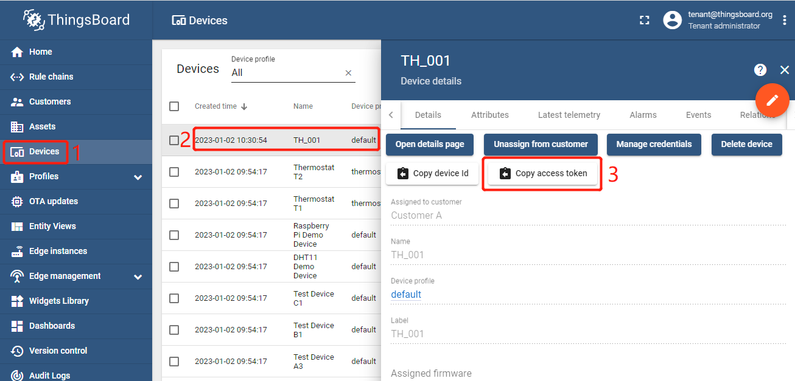

| Supported Targets | ESP32 | ESP32-C2 | ESP32-C3 | ESP32-H2 | ESP32-S3 |
| ----------------- | ----- | -------- | -------- | -------- | -------- |

# 发送 Time-series data - ThingsBoard MQTT Client Example

* [English Version](./README.md)

本示例实现了 time-series data 相关功能：

* 发送 time-series data: temprature, humidity

## 硬件需求

* 一个载有 ESP32/ESP32-C3/ESP32-H2/ESP32-C2/ESP32-S3 SoC 的开发板(例如, ESP32-DevKitC, ESP-WROVER-KIT 等等)
* 一条用于供电与编程的 USB 线

参考 [Development Boards](https://www.espressif.com/en/products/devkits) 获得更多信息.

## 如何使用例子

1. 获取 Access token

   `Login in ThingsBoard CE/PE as tenant` --> `Devices` --> 单击选择我的设备 --> `Copy access token`.

   

2. 设定 Target (optional)

   在项目 configuration 与 build 之前, 请务必使用设置正确的芯片目标:

   ```bash
   idf.py set-target <chip_name>
   ```

3. 编译配置 menuconfig

   项目 configuration:

   ```bash
   idf.py menuconfig
   ```

   配置以下选项 ThingsBoard MQTT URI, access token, Wi-Fi SSID, password:

   ```menuconfig
   Example Configuration  --->
       (mqtt://MyThingsboardServerIP) Broker URL
       (MyDeviceToken) Access Token 
   Example Connection Configuration  --->
       [*] connect using WiFi interface
       (MySSID) WiFi SSID 
       (MyPassword) WiFi Password                  
   ```

4. 编译与运行 build, flash and monitor

   运行 `idf.py -p PORT flash monitor` 来编译、烧录、监控项目.

   (如果要退出串口监控，请输入 ``Ctrl-]``.)

   有关配置和使用 ESP-IDF 构建项目的完整步骤，请参阅 [入门指南](https://idf.espressif.com/)。

## 日志输出

```none
...
0x40081188: call_start_cpu1 at C:/Espressif/frameworks/esp-idf-v4.4.1/components/esp_system/port/cpu_start.c:160

I (0) cpu_start: App cpu up.
I (464) cpu_start: Pro cpu start user code
I (464) cpu_start: cpu freq: 160000000
I (465) cpu_start: Application information:
I (469) cpu_start: Project name:     timeseries_data
I (475) cpu_start: App version:      731074c-dirty
I (480) cpu_start: Compile time:     Dec 11 2022 17:15:09
I (486) cpu_start: ELF file SHA256:  3654bdeeeb9acbc1...
I (492) cpu_start: ESP-IDF:          v4.4.1-dirty
I (498) heap_init: Initializing. RAM available for dynamic allocation:
I (505) heap_init: At 3FFAE6E0 len 00001920 (6 KiB): DRAM
I (511) heap_init: At 3FFB7620 len 000289E0 (162 KiB): DRAM
I (517) heap_init: At 3FFE0440 len 00003AE0 (14 KiB): D/IRAM
I (523) heap_init: At 3FFE4350 len 0001BCB0 (111 KiB): D/IRAM
I (530) heap_init: At 4009449C len 0000BB64 (46 KiB): IRAM
I (537) spi_flash: detected chip: generic
I (541) spi_flash: flash io: dio
W (545) spi_flash: Detected size(4096k) larger than the size in the binary image header(2048k). Using the size in the binary image header.
I (559) cpu_start: Starting scheduler on PRO CPU.
I (0) cpu_start: Starting scheduler on APP CPU.
I (569) TIMESERIES_DATA_MAIN: [APP] Startup..
I (579) TIMESERIES_DATA_MAIN: [APP] Free memory: 276368 bytes
I (579) TIMESERIES_DATA_MAIN: [APP] IDF version: v4.4.1-dirty
I (619) wifi:wifi driver task: 3ffbff0c, prio:23, stack:6656, core=0
I (619) system_api: Base MAC address is not set
I (619) system_api: read default base MAC address from EFUSE
I (629) wifi:wifi firmware version: 63017e0
I (629) wifi:wifi certification version: v7.0
I (629) wifi:config NVS flash: enabled
I (629) wifi:config nano formating: disabled
I (639) wifi:Init data frame dynamic rx buffer num: 32
I (639) wifi:Init management frame dynamic rx buffer num: 32
I (649) wifi:Init management short buffer num: 32
I (649) wifi:Init dynamic tx buffer num: 32
I (659) wifi:Init static rx buffer size: 1600
I (659) wifi:Init static rx buffer num: 10
I (659) wifi:Init dynamic rx buffer num: 32
I (669) wifi_init: rx ba win: 6
I (669) wifi_init: tcpip mbox: 32
I (679) wifi_init: udp mbox: 6
I (679) wifi_init: tcp mbox: 6
I (679) wifi_init: tcp tx win: 5744
I (689) wifi_init: tcp rx win: 5744
I (689) wifi_init: tcp mss: 1440
I (699) wifi_init: WiFi IRAM OP enabled
I (699) wifi_init: WiFi RX IRAM OP enabled
I (709) example_connect: Connecting to MySSID...
I (709) phy_init: phy_version 4670,719f9f6,Feb 18 2021,17:07:07
I (819) wifi:mode : sta (bc:dd:c2:d1:be:b0)
I (819) wifi:enable tsf
I (819) example_connect: Waiting for IP(s)
I (2869) wifi:new:<2,0>, old:<1,0>, ap:<255,255>, sta:<2,0>, prof:1
I (3609) wifi:state: init -> auth (b0)
I (3619) wifi:state: auth -> assoc (0)
I (3619) wifi:state: assoc -> run (10)
W (3629) wifi:<ba-add>idx:0 (ifx:0, d8:0d:17:00:5b:13), tid:0, ssn:0, winSize:64
I (3649) wifi:connected with MySSID, aid = 5, channel 2, BW20, bssid = d8:0d:17:00:5b:13
I (3649) wifi:security: WPA2-PSK, phy: bgn, rssi: -41
I (3659) wifi:pm start, type: 1

I (3689) wifi:AP's beacon interval = 102400 us, DTIM period = 1
I (5609) example_connect: Got IPv6 event: Interface "example_connect: sta" address: fe80:0000:0000:0000:bedd:c2ff:fed1:beb0, type: ESP_IP6_ADDR_IS_LINK_LOCAL
I (6109) esp_netif_handlers: example_connect: sta ip: 192.168.0.126, mask: 255.255.255.0, gw: 192.168.0.1
I (6109) example_connect: Got IPv4 event: Interface "example_connect: sta" address: 192.168.0.126
I (6119) example_connect: Connected to example_connect: sta
I (6119) example_connect: - IPv4 address: 192.168.0.126
I (6129) example_connect: - IPv6 address: fe80:0000:0000:0000:bedd:c2ff:fed1:beb0, type: ESP_IP6_ADDR_IS_LINK_LOCAL
I (6139) TIMESERIES_DATA_MAIN: Init tbcmh ...
I (6149) TIMESERIES_DATA_MAIN: Create time-series data set...
I (6149) TIMESERIES_DATA_MAIN: Register time-series data: temprature...
I (6159) TIMESERIES_DATA_MAIN: Register time-series data: humidity...
I (6169) TIMESERIES_DATA_MAIN: Connect tbcmh ...
I (6169) tb_mqtt_client_helper: connecting to mqtt://192.168.0.187:1883 ...
I (6179) TIMESERIES_DATA_MAIN: connect tbcmh ...
I (6179) tb_mqtt_client_helper: TBCM_EVENT_BEFORE_CONNECT, msg_id=0
I (6189) TIMESERIES_DATA_MAIN: Still NOT connected to server!
I (7199) tb_mqtt_client_helper: TBCM_EVENT_CONNECTED
I (7199) tb_mqtt_client_helper: client->tbmqttclient = 0x3ffc5bec
I (7199) tb_mqtt_client_helper: Connected to thingsboard MQTT server!
I (7199) tb_mqtt_client_helper: before call on_connected()...
I (7209) TIMESERIES_DATA_MAIN: Connected to thingsboard server!
I (7219) tb_mqtt_client_helper: after call on_connected()
I (10519) TIMESERIES_DATA_MAIN: Send telemetry: temprature, humidity
I (10519) TIMESERIES_DATA_MAIN: Get temperature (a time-series data)
I (10519) TIMESERIES_DATA_MAIN: Get humidity (a time-series data)
I (10529) tb_mqtt_wapper: [Telemetry][Tx] {"temprature":25,"humidity":26}
I (11539) tb_mqtt_client_helper: TBCM_EVENT_PUBLISHED, msg_id=44635
I (15939) TIMESERIES_DATA_MAIN: Send telemetry: temprature, humidity
I (15939) TIMESERIES_DATA_MAIN: Get temperature (a time-series data)
I (15939) TIMESERIES_DATA_MAIN: Get humidity (a time-series data)
I (15949) tb_mqtt_wapper: [Telemetry][Tx] {"temprature":25.5,"humidity":27}
I (16959) tb_mqtt_client_helper: TBCM_EVENT_PUBLISHED, msg_id=64872
I (21359) TIMESERIES_DATA_MAIN: Send telemetry: temprature, humidity
I (21359) TIMESERIES_DATA_MAIN: Get temperature (a time-series data)
I (21359) TIMESERIES_DATA_MAIN: Get humidity (a time-series data)
I (21369) tb_mqtt_wapper: [Telemetry][Tx] {"temprature":26,"humidity":28}
I (22379) tb_mqtt_client_helper: TBCM_EVENT_PUBLISHED, msg_id=46914
I (26779) TIMESERIES_DATA_MAIN: Send telemetry: temprature, humidity
I (26779) TIMESERIES_DATA_MAIN: Get temperature (a time-series data)
I (26779) TIMESERIES_DATA_MAIN: Get humidity (a time-series data)
I (26789) tb_mqtt_wapper: [Telemetry][Tx] {"temprature":26.5,"humidity":29}
I (27799) TIMESERIES_DATA_MAIN: Disconnect tbcmh ...
I (27799) tb_mqtt_client_helper: disconnecting from mqtt://192.168.0.187:1883 ...
I (27799) tb_mqtt_client_helper: TBCM_EVENT_PUBLISHED, msg_id=28320
I (27909) tb_mqtt_wapper: tbcm_disconnect(): call esp_mqtt_client_stop()...
I (27909) tb_mqtt_wapper: tbcm_disconnect(): call esp_mqtt_client_destroy()...
W (27909) MQTT_CLIENT: Client asked to stop, but was not started
I (28019) TIMESERIES_DATA_MAIN: Unregister time-series data: humidity!
I (28019) TIMESERIES_DATA_MAIN: Unregister time-series data: humidity!
I (28019) TIMESERIES_DATA_MAIN: Destroy time-series data set!
I (28029) TIMESERIES_DATA_MAIN: Destroy tbcmh ...
I (28029) tb_mqtt_client_helper: It already disconnected from thingsboard MQTT server!
```

## ThingsBoard 输出

* 在 ThingsBoard 上查看最新的 telemetry data.

   Login in ThingsBoard CE/PE --> `Devices` --> 单击选择我的设备 --> `Latest tememetry`, 你能发现 `humidity` 和 `temprature`. 在本示例运行时，这两个值会随时变化。

   

## 故障排除

如有任何技术问题，请打开 [issue](https://github.com/liang-zhu-zi/esp32-thingsboard-mqtt-client/issues)。 我们会尽快回复您。
