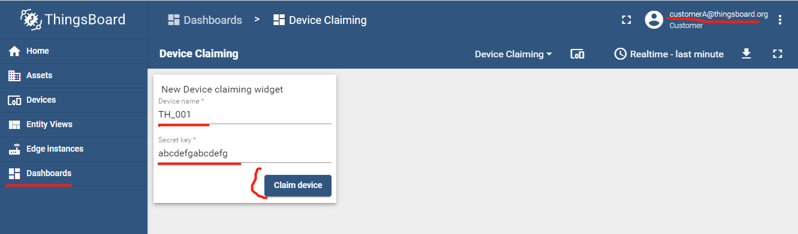

| Supported Targets | ESP32 | ESP32-C2 | ESP32-C3 | ESP32-H2 | ESP32-S3 |
| ----------------- | ----- | -------- | -------- | -------- | -------- |

# Claiming Device - ThingsBoard MQTT Client 示例

* [English Version](./README.md)

本示例基于 [`$ESP-IDF\examples\protocols\mqtt\tcp`](https://github.com/espressif/esp-idf/tree/master/examples/protocols/mqtt/tcp).

本示例实现了 认领设备 相关功能：

* 发送认领设备消息到服务器:
  * Topic: `v1/devices/me/claim`
  * Payload: `{"secretKey":"value", "durationMs":60000}`

**注意**: 参考 [Claiming devices API](https://thingsboard.io/docs/reference/mqtt-api/#claiming-devices)

## 硬件需求

* 一个载有 ESP32/ESP32-C3/ESP32-H2/ESP32-C2/ESP32-S3 SoC 的开发板(例如, ESP32-DevKitC, ESP-WROVER-KIT 等等)
* 一条用于供电与编程的 USB 线

参考 [Development Boards](https://www.espressif.com/en/products/devkits) 获得更多信息.

## 如何使用例子

1. 在 ThingsBoard 上为认领设备而创建一个 dashboard

   参考 [这里](https://thingsboard.io/docs/user-guide/claiming-devices/#device-claiming-widget).

   * 创建一个 dashboard: `Dashboards` --> `+` Add Dashboard --> `Create new dashboard` --> Title: `Device Claiming` --> `Add`.

   * 添加认领设备控件: `Dashboards` --> Click `Device Claiming` --> `Open dashboard` --> `Enter edit mode` --> `Add new widget` --> `Input widgets` --> `Device Claiming widget` --> `Add` --> `Apply Changes`.

      

1. Assign this dashboard to `Customer A`:

    * `Dashboards` --> Click icon: `Managment assigned customers` --> Select `Customer A` --> `Update`.

      


1. 获取 Access token

   `Login in ThingsBoard CE/PE` --> `Devices` --> 单击选择我的设备 --> `Details` --> `Copy Access Token`.

1. 取消分配给客户的设备

   `Login in ThingsBoard CE/PE` --> `Devices` --> 在我的设备行单击 `Unassign from cusotmer` 图标.

    


1. 设定 Target (optional)

   在项目 configuration 与 build 之前, 请务必使用设置正确的芯片目标:

   ```bash
   idf.py set-target <chip_name>
   ```

1. 编译配置 menuconfig

   项目 configuration:

   ```bash
   idf.py menuconfig
   ```

   配置以下选项 ThingsBoard MQTT URI, access token, Wi-Fi SSID, password:

   ```menuconfig
   Example Configuration  --->
       (mqtt://MyThingsboardServerIP) Broker URL
       (MyDeviceToken) Access Token 
   Example Connection Configuration  --->
       [*] connect using WiFi interface
       (MySSID) WiFi SSID 
       (MyPassword) WiFi Password                  
   ```

1. 编译与运行 build, flash and monitor

   运行 `idf.py -p PORT flash monitor` 来编译、烧录、监控项目.

   (如果要退出串口监控，请输入 ``Ctrl-]``.)

   有关配置和使用 ESP-IDF 构建项目的完整步骤，请参阅 [入门指南](https://idf.espressif.com/)。

1. 以`Customer A`身份认领设备:

    * `Login in ThingsBoard CE/PE` as  `Customer A`

    * `Dashboards` --> Click `Device Claiming` --> Input `device name` and `secret key` --> `Claim device`.

      

    * 现在, customerA 认领的设备出现在设备列表中:

      

## 日志输出

```none
...
0x40081188: call_start_cpu1 at C:/Espressif/frameworks/esp-idf-v4.4.1/components/esp_system/port/cpu_start.c:160

I (0) cpu_start: App cpu up.
I (463) cpu_start: Pro cpu start user code
I (464) cpu_start: cpu freq: 160000000
I (464) cpu_start: Application information:
I (468) cpu_start: Project name:     claiming_device
I (474) cpu_start: App version:      09fb810-dirty
I (479) cpu_start: Compile time:     Dec 17 2022 10:47:24
I (485) cpu_start: ELF file SHA256:  b918bce675a2a618...
I (491) cpu_start: ESP-IDF:          v4.4.1-dirty
I (497) heap_init: Initializing. RAM available for dynamic allocation:
I (504) heap_init: At 3FFAE6E0 len 00001920 (6 KiB): DRAM
I (510) heap_init: At 3FFB7618 len 000289E8 (162 KiB): DRAM
I (516) heap_init: At 3FFE0440 len 00003AE0 (14 KiB): D/IRAM
I (522) heap_init: At 3FFE4350 len 0001BCB0 (111 KiB): D/IRAM
I (529) heap_init: At 4009449C len 0000BB64 (46 KiB): IRAM
I (536) spi_flash: detected chip: generic
I (540) spi_flash: flash io: dio
W (544) spi_flash: Detected size(4096k) larger than the size in the binary image header(2048k). Using the size in the binary image header.
I (558) cpu_start: Starting scheduler on PRO CPU.
I (0) cpu_start: Starting scheduler on APP CPU.
I (568) CLAIMING_DEVICE_EXAMPLE: [APP] Startup..
I (578) CLAIMING_DEVICE_EXAMPLE: [APP] Free memory: 276376 bytes
I (578) CLAIMING_DEVICE_EXAMPLE: [APP] IDF version: v4.4.1-dirty
I (618) wifi:wifi driver task: 3ffbff08, prio:23, stack:6656, core=0
I (618) system_api: Base MAC address is not set
I (618) system_api: read default base MAC address from EFUSE
I (628) wifi:wifi firmware version: 63017e0
I (628) wifi:wifi certification version: v7.0
I (628) wifi:config NVS flash: enabled
I (628) wifi:config nano formating: disabled
I (638) wifi:Init data frame dynamic rx buffer num: 32
I (638) wifi:Init management frame dynamic rx buffer num: 32
I (648) wifi:Init management short buffer num: 32
I (648) wifi:Init dynamic tx buffer num: 32
I (658) wifi:Init static rx buffer size: 1600
I (658) wifi:Init static rx buffer num: 10
I (658) wifi:Init dynamic rx buffer num: 32
I (668) wifi_init: rx ba win: 6
I (668) wifi_init: tcpip mbox: 32
I (678) wifi_init: udp mbox: 6
I (678) wifi_init: tcp mbox: 6
I (678) wifi_init: tcp tx win: 5744
I (688) wifi_init: tcp rx win: 5744
I (688) wifi_init: tcp mss: 1440
I (698) wifi_init: WiFi IRAM OP enabled
I (698) wifi_init: WiFi RX IRAM OP enabled
I (708) example_connect: Connecting to Duoman...
I (708) phy_init: phy_version 4670,719f9f6,Feb 18 2021,17:07:07
I (818) wifi:mode : sta (bc:dd:c2:d1:be:b0)
I (818) wifi:enable tsf
I (818) example_connect: Waiting for IP(s)
I (2868) wifi:new:<2,0>, old:<1,0>, ap:<255,255>, sta:<2,0>, prof:1
I (3608) wifi:state: init -> auth (b0)
I (3618) wifi:state: auth -> assoc (0)
I (3618) wifi:state: assoc -> run (10)
W (3628) wifi:<ba-add>idx:0 (ifx:0, d8:0d:17:00:5b:13), tid:0, ssn:0, winSize:64
I (3638) wifi:connected with Duoman, aid = 3, channel 2, BW20, bssid = d8:0d:17:00:5b:13
I (3638) wifi:security: WPA2-PSK, phy: bgn, rssi: -37
I (3638) wifi:pm start, type: 1

I (3648) wifi:AP's beacon interval = 102400 us, DTIM period = 1
I (5608) example_connect: Got IPv6 event: Interface "example_connect: sta" address: fe80:0000:0000:0000:bedd:c2ff:fed1:beb0, type: ESP_IP6_ADDR_IS_LINK_LOCAL
I (6108) esp_netif_handlers: example_connect: sta ip: 192.168.0.124, mask: 255.255.255.0, gw: 192.168.0.1
I (6108) example_connect: Got IPv4 event: Interface "example_connect: sta" address: 192.168.0.124
I (6118) example_connect: Connected to example_connect: sta
I (6118) example_connect: - IPv4 address: 192.168.0.124
I (6128) example_connect: - IPv6 address: fe80:0000:0000:0000:bedd:c2ff:fed1:beb0, type: ESP_IP6_ADDR_IS_LINK_LOCAL
I (6138) CLAIMING_DEVICE_EXAMPLE: Init tbcmh ...
I (6148) CLAIMING_DEVICE_EXAMPLE: Connect tbcmh ...
I (6148) tb_mqtt_client_helper: connecting to mqtt://192.168.0.186:1883 ...
I (6158) CLAIMING_DEVICE_EXAMPLE: connect tbcmh ...
I (6158) tb_mqtt_client_helper: TBCM_EVENT_BEFORE_CONNECT, msg_id=0
I (6168) CLAIMING_DEVICE_EXAMPLE: Still NOT connected to server!
I (7178) tb_mqtt_client_helper: TBCM_EVENT_CONNECTED
I (7178) tb_mqtt_client_helper: client->tbmqttclient = 0x3ffc5bfc
I (7178) tb_mqtt_client_helper: Connected to thingsboard MQTT server!
I (7178) tb_mqtt_client_helper: before call on_connected()...
I (7188) CLAIMING_DEVICE_EXAMPLE: Connected to thingsboard server!
I (7198) CLAIMING_DEVICE_EXAMPLE: Claiming device using device-side key... secretKey=abcdefgabcdefg, durationMs=60000
I (7208) tb_mqtt_client: [Claiming][Tx] {"secretKey":"abcdefgabcdefg","durationMs":60000}
I (7218) tb_mqtt_client_helper: after call on_connected()
I (8218) tb_mqtt_client_helper: TBCM_EVENT_PUBLISHED, msg_id=40552
I (71718) CLAIMING_DEVICE_EXAMPLE: Disconnect tbcmh ...
I (71718) tb_mqtt_client_helper: disconnecting from mqtt://192.168.0.186:1883 ...
I (71818) tb_mqtt_client: tbcm_disconnect(): call esp_mqtt_client_stop()...
I (71828) tb_mqtt_client: tbcm_disconnect(): call esp_mqtt_client_destroy()...
W (71828) MQTT_CLIENT: Client asked to stop, but was not started
I (71928) CLAIMING_DEVICE_EXAMPLE: Destroy tbcmh ...
I (71928) tb_mqtt_client_helper: It already disconnected from thingsboard MQTT server!

```

## 故障排除

如有任何技术问题，请打开 [issue](https://github.com/liang-zhu-zi/esp32-thingsboard-mqtt-client/issues)。 我们会尽快回复您。
