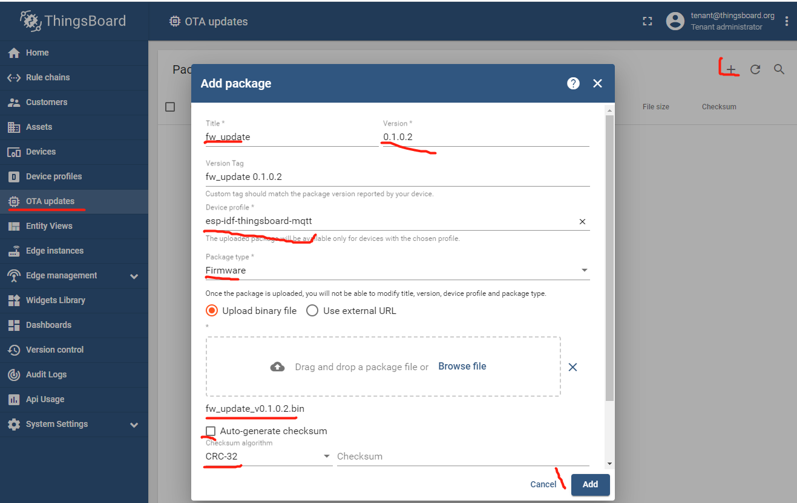
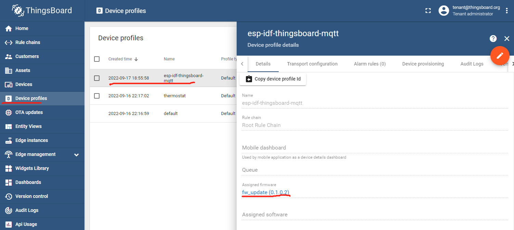
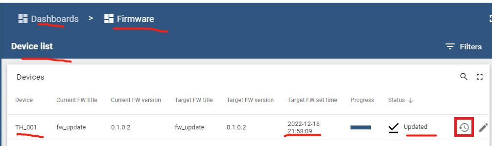

| Supported Targets | ESP32 | ESP32-C2 | ESP32-C3 | ESP32-H2 | ESP32-S3 |
| ----------------- | ----- | -------- | -------- | -------- | -------- |

# F/W OTA Update - ThingsBoard MQTT Client Example

* [中文版](./README_CN.md)

This example implements F/W OTA update related functions:

* Send attributes request of F/W info:
  * Topic: `v1/devices/me/attributes/request/{request_id}`
  * Payload: `{"sharedKeys": "fw_checksum,fw_checksum_algorithm,fw_size,fw_title,fw_version"}`

* Subscirbe to and process attributes response of F/W info:
  * Topic: `v1/devices/me/attributes/response/{request_id}`
  * Payload: `{"fw_title":"fw_update","fw_version":"0.1.0.2","fw_tag":"fw_update 0.1.0.2","fw_size":849888,"fw_checksum_algorithm":"CRC32","fw_checksum":"15ccae65"}`

* Subscirbe to and process shared attributes of F/W info:
  * Topic: `v1/devices/me/attributes`
  * Payload: `{"shared":{"fw_checksum":"15ccae65","fw_size":849888,"fw_title":"fw_update","fw_checksum_algorithm":"CRC32","fw_version":"0.1.0.2"}}`

* Send F/W request for getting next chunk:
  * Topic: `v2/fw/request/{request_id}/chunk/{chunk_id}`
  * Payload: `chunk_size`

     Replace `{chunk_id}` with your chunk_id from `0`, then incremen.

     Replace `chunk_size` with your chunk size, eg: `8192`，`16384`

* Subscirbe to and process F/W response of F/W chunk:
  * Topic: ``v2/fw/response/{request_id}/chunk/{chunk_id}``
  * Payload: `...F/W chunk...`

* Send telemetry about current firmware info:
  * Topic: `v1/devices/me/telemetry`
  * Payload: `{"current_fw_title":"Initial","current_fw_version":"v0"}`

      Replace `Initial` and `v0` with your F/W title and version. eg: `{"current_fw_title":"fw_update","current_fw_version":"0.1.0.1"}`, or `{"current_fw_title":"fw_update","current_fw_version":"0.1.0.1","fw_state":"DOWNLOADING"}`, or `{"current_fw_title":"fw_update","current_fw_version":"0.1.0.1","fw_state":"DOWNLOADED"}`, or `{"current_fw_title":"fw_update","current_fw_version":"0.1.0.1","fw_state":"VERIFIED"}`, or `{"current_fw_title":"fw_update","current_fw_version":"0.1.0.1","fw_state":"UPDATING"}`, or `{"current_fw_title":"fw_update","current_fw_version":"0.1.0.2","fw_state":"UPDATED"}`, or `{"fw_state":"FAILED","fw_error":"..."}`.

## Hardware Required

* A development board with ESP32/ESP32-C3/ESP32-H2/ESP32-C2/ESP32-S3 SoC (e.g., ESP32-DevKitC, ESP-WROVER-KIT, etc.)
* A USB cable for Power supply and programming

See [Development Boards](https://www.espressif.com/en/products/devkits) for more information about it.

## How to Use Example

1. Get a device access token

   `Login in ThingsBoard CE/PE as tenant` --> `Devices` --> Click on *my device* --> `Details` --> Copy *my Access Token*.

1. set-targe (optional)

   Before project configuration and build, be sure to set the correct chip target using:

   ```bash
   idf.py set-target <chip_name>
   ```

1. menuconfig

   Then project configuration:

   ```bash
   idf.py menuconfig
   ```

   Configuration: Partition table, ThingsBoard MQTT URI, access token, Wi-Fi SSID, password:

   ```menuconfig
   Serial flasher config  --->
       Flash size (4 MB)  --->
           (X) 4 MB 
   Partition Table  --->
       Partition Table --->
           (X) Factory app, two OTA definitions 
   Example Configuration  --->
       (mqtt://MyThingsboardServerIP) Broker URL
       (MyDeviceToken) Access Token 
   Example Connection Configuration  --->
       [*] connect using WiFi interface
       (MySSID) WiFi SSID 
       (MyPassword) WiFi Password                  
   ```

   **Note**: The corresponding partition table of "Factory app, two OTA definitions" is [$ESP-IDF\components\partition_table\partitions_two_ota.csv](https://github.com/espressif/esp-idf/blob/master/components/partition_table/partitions_two_ota.csv).

1. build OTA F/W

   Modify `CMakeLists.txt`

   ```CMake
   ...
   set(PROJECT_VER "0.1.0.2")

   include($ENV{IDF_PATH}/tools/cmake/project.cmake)
   project(fw_update)
   ```

   **Note:** `fw_update` is your F/W title, `0.1.0.2` is your F/W version.

   Run `idf.py build` to build the project, backup `build\fw_update.bin` to your directory.

   Now you have a versions of `fw_update`: `0.1.0.2`.

1. build, flash and monitor

   Modify `CMakeLists.txt`

   ```CMake
   ...
   set(PROJECT_VER "0.1.0.1")

   include($ENV{IDF_PATH}/tools/cmake/project.cmake)
   project(fw_update)
   ```

   Run `idf.py -p PORT flash monitor` to build, flash and monitor the project.

   (To exit the serial monitor, type ``Ctrl-]``.)

   See the [Getting Started Guide](https://idf.espressif.com/) for full steps to configure and use ESP-IDF to build projects.

1. `OTA updates` in ThingsBoard. Refer to [OTA updates](https://thingsboard.io/docs/user-guide/ota-updates/).

   * Add package: upload a F/W binary file: `Login in ThingsBoard CE/PE as tenant` --> `OTA updates` --> `+` Add package --> Fill in the F/W information of `0.1.0.2` version below (**Note**: Checksum algorithm MUST be `CRC32`) --> `Add`.

      

      

   * Assign firmware: `Login in ThingsBoard CE/PE as tenant` --> `Device profiles` --> Click on *your ESP32 device's profile* --> `Toggle Edit Mode` icon ---> Assigned firmware `0.1.0.2` --> `Apply changes` icon.

      

1. Start your ESP32 device.

## Example Output

```none
...
0x40081194: call_start_cpu1 at C:/Espressif/frameworks/esp-idf-v4.4.1/components/esp_system/port/cpu_start.c:160

I (0) cpu_start: App cpu up.
I (496) cpu_start: Pro cpu start user code
I (496) cpu_start: cpu freq: 160000000
I (496) cpu_start: Application information:
I (500) cpu_start: Project name:     fw_update
I (506) cpu_start: App version:      0.1.0.1
I (511) cpu_start: Compile time:     Dec 18 2022 21:56:51
I (517) cpu_start: ELF file SHA256:  abfbdb6d3ef20fae...
I (523) cpu_start: ESP-IDF:          v4.4.1-dirty
I (528) heap_init: Initializing. RAM available for dynamic allocation:
I (535) heap_init: At 3FFAE6E0 len 00001920 (6 KiB): DRAM
I (541) heap_init: At 3FFB76C0 len 00028940 (162 KiB): DRAM
I (548) heap_init: At 3FFE0440 len 00003AE0 (14 KiB): D/IRAM
I (554) heap_init: At 3FFE4350 len 0001BCB0 (111 KiB): D/IRAM
I (560) heap_init: At 400945C4 len 0000BA3C (46 KiB): IRAM
I (568) spi_flash: detected chip: generic
I (571) spi_flash: flash io: dio
I (576) cpu_start: Starting scheduler on PRO CPU.
I (0) cpu_start: Starting scheduler on APP CPU.
I (586) OTA_UPDATE_EXAMPLE: [APP] Startup..
I (596) OTA_UPDATE_EXAMPLE: [APP] Free memory: 276208 bytes
I (596) OTA_UPDATE_EXAMPLE: [APP] IDF version: v4.4.1-dirty
I (636) wifi:wifi driver task: 3ffbff9c, prio:23, stack:6656, core=0
I (636) system_api: Base MAC address is not set
I (636) system_api: read default base MAC address from EFUSE
I (646) wifi:wifi firmware version: 63017e0
I (646) wifi:wifi certification version: v7.0
I (646) wifi:config NVS flash: enabled
I (646) wifi:config nano formating: disabled
I (656) wifi:Init data frame dynamic rx buffer num: 32
I (656) wifi:Init management frame dynamic rx buffer num: 32
I (666) wifi:Init management short buffer num: 32
I (666) wifi:Init dynamic tx buffer num: 32
I (676) wifi:Init static rx buffer size: 1600
I (676) wifi:Init static rx buffer num: 10
I (676) wifi:Init dynamic rx buffer num: 32
I (686) wifi_init: rx ba win: 6
I (686) wifi_init: tcpip mbox: 32
I (696) wifi_init: udp mbox: 6
I (696) wifi_init: tcp mbox: 6
I (696) wifi_init: tcp tx win: 5744
I (706) wifi_init: tcp rx win: 5744
I (706) wifi_init: tcp mss: 1440
I (716) wifi_init: WiFi IRAM OP enabled
I (716) wifi_init: WiFi RX IRAM OP enabled
I (726) example_connect: Connecting to MySSID...
I (726) phy_init: phy_version 4670,719f9f6,Feb 18 2021,17:07:07
I (836) wifi:mode : sta (bc:dd:c2:d1:be:b0)
I (836) wifi:enable tsf
I (836) example_connect: Waiting for IP(s)
I (2886) wifi:new:<2,0>, old:<1,0>, ap:<255,255>, sta:<2,0>, prof:1
I (3626) wifi:state: init -> auth (b0)
I (3636) wifi:state: auth -> assoc (0)
I (3636) wifi:state: assoc -> run (10)
W (3646) wifi:<ba-add>idx:0 (ifx:0, d8:0d:17:00:5b:13), tid:0, ssn:0, winSize:64
I (3666) wifi:connected with MySSID, aid = 1, channel 2, BW20, bssid = d8:0d:17:00:5b:13
I (3666) wifi:security: WPA2-PSK, phy: bgn, rssi: -41
I (3666) wifi:pm start, type: 1

I (3706) wifi:AP's beacon interval = 102400 us, DTIM period = 1
I (5616) example_connect: Got IPv6 event: Interface "example_connect: sta" address: fe80:0000:0000:0000:bedd:c2ff:fed1:beb0, type: ESP_IP6_ADDR_IS_LINK_LOCAL
I (6116) esp_netif_handlers: example_connect: sta ip: 192.168.0.126, mask: 255.255.255.0, gw: 192.168.0.1
I (6116) example_connect: Got IPv4 event: Interface "example_connect: sta" address: 192.168.0.126
I (6126) example_connect: Connected to example_connect: sta
I (6126) example_connect: - IPv4 address: 192.168.0.126
I (6136) example_connect: - IPv6 address: fe80:0000:0000:0000:bedd:c2ff:fed1:beb0, type: ESP_IP6_ADDR_IS_LINK_LOCAL
I (6146) OTA_UPDATE_EXAMPLE: Init tbcmh ...
I (6146) OTA_UPDATE_EXAMPLE: Append F/W OTA Update...
I (6156) OTA_FWUPDATE: Current running F/W version: 0.1.0.1
I (6166) OTA_FWUPDATE: Running partition type 0 subtype 0 (offset 0x00010000)
I (6166) OTA_FWUPDATE: Update partition type 0 subtype 16 (offset 0x00110000)
I (6176) OTA_UPDATE_EXAMPLE: Connect tbcmh ...
I (6186) tb_mqtt_client_helper: connecting to mqtt://192.168.0.187:1883 ...
I (6196) tb_mqtt_client_helper: TBCM_EVENT_BEFORE_CONNECT, msg_id=0
I (6196) OTA_UPDATE_EXAMPLE: Still NOT connected to server!
I (7206) tb_mqtt_client_helper: TBCM_EVENT_CONNECTED
I (7206) tb_mqtt_client_helper: client->tbmqttclient = 0x3ffc5c7c
I (7206) tb_mqtt_client_helper: Connected to thingsboard MQTT server!
I (7206) OTA_UPDATE_EXAMPLE: Current running F/W title: fw_update
I (7216) OTA_UPDATE_EXAMPLE: Current running F/W version: 0.1.0.1
I (7226) tb_mqtt_wapper: [Telemetry][Tx] {"current_fw_title":"fw_update","current_fw_version":"0.1.0.1"}
I (7246) ATTRIBUTES_SUBSCRIBE: sent subscribe successful, msg_id=34391, topic=v1/devices/me/attributes
I (7256) attributesrequest: sent subscribe successful, msg_id=20344, topic=v1/devices/me/attributes/response/+
I (7256) tb_mqtt_wapper: [Attributes Request][Tx] request_id=1, {"sharedKeys":"fw_title,fw_version,fw_size,fw_checksum,fw_checksum_algorithm"}
I (7276) tb_mqtt_client_helper: before call on_connected()...
I (7276) OTA_UPDATE_EXAMPLE: Connected to thingsboard server!
I (7276) tb_mqtt_client_helper: after call on_connected()
I (7286) tb_mqtt_client_helper: TBCM_EVENT_PUBLISHED, msg_id=45786
I (7296) tb_mqtt_client_helper: TBCM_EVENT_SUBSCRIBED, msg_id=34391
I (7296) tb_mqtt_client_helper: TBCM_EVENT_SUBSCRIBED, msg_id=20344
I (7306) tb_mqtt_client_helper: TBCM_EVENT_PUBLISHED, msg_id=26586
I (7316) tb_mqtt_wapper: [Attributes Request][Rx] request_id=1 {}
I (8316) tb_mqtt_client_helper: TBCM_EVENT_DATA
I (8316) attributesrequest: sent unsubscribe successful, msg_id=9050, topic=v1/devices/me/attributes/response/+
W (8316) otaupdate: shared_attributes is NULL! _otaupdate_on_fw_attributesrequest_response() 954
I (8326) tb_mqtt_client_helper: TBCM_EVENT_UNSUBSCRIBED, msg_id=9050
I (19996) tb_mqtt_wapper: [Subscribe Shared Attributes][Rx] {"deleted":["fw_url"]}
I (19996) tb_mqtt_wapper: [Subscribe Shared Attributes][Rx] {"fw_title":"fw_update","fw_version":"0.1.0.2","fw_tag":"fw_update 0.1.0.2","fw_size":859904,"fw_checksum_algorithm":"CRC32","fw_checksum":"e7f68ed7"}
I (20336) tb_mqtt_client_helper: TBCM_EVENT_DATA
I (20336) tb_mqtt_client_helper: TBCM_EVENT_DATA
I (20336) OTA_UPDATE_EXAMPLE: Current running F/W title: fw_update
I (20336) OTA_UPDATE_EXAMPLE: Current running F/W title: fw_update
I (20346) OTA_UPDATE_EXAMPLE: Current running F/W version: 0.1.0.1
I (20356) OTA_FWUPDATE: Receving F/W shared attributes: fw_title=fw_update, fw_version=0.1.0.2, fw_size=859904, fw_checksum=e7f68ed7, fw_checksum_algorithm=CRC32
I (20376) otaupdate: sent subscribe successful, msg_id=39619, topic=v2/fw/response/+/chunk/+
I (20376) OTA_UPDATE_EXAMPLE: Current running F/W title: fw_update
I (20386) OTA_UPDATE_EXAMPLE: Current running F/W version: 0.1.0.1
I (20386) tb_mqtt_wapper: [Telemetry][Tx] {"current_fw_title":"fw_update","current_fw_version":"0.1.0.1","fw_state":"DOWNLOADING"}
I (20406) tb_mqtt_wapper: [FW update][Tx] request_id=2 chunk_id=0 payload=16384
I (20416) tb_mqtt_client_helper: TBCM_EVENT_SUBSCRIBED, msg_id=39619
I (20556) tb_mqtt_wapper: [FW update][Rx] request_id=2, chunk_id=0, payload_len=16384
I (21416) tb_mqtt_client_helper: TBCM_EVENT_PUBLISHED, msg_id=61041
I (21416) tb_mqtt_client_helper: TBCM_EVENT_PUBLISHED, msg_id=9914
I (21416) tb_mqtt_client_helper: TBCM_EVENT_DATA
I (21416) OTA_FWUPDATE: Receving F/W response: fw_data=0x3ffcf694, data_read=16384
I (21426) OTA_FWUPDATE: New firmware version: 0.1.0.2
I (21436) OTA_FWUPDATE: Running firmware version: 0.1.0.1
I (21436) OTA_FWUPDATE: esp_ota_begin succeeded
I (21746) tb_mqtt_wapper: [FW update][Tx] request_id=2 chunk_id=1 payload=16384
I (21796) tb_mqtt_wapper: [FW update][Rx] request_id=2, chunk_id=1, payload_len=16384
I (22756) tb_mqtt_client_helper: TBCM_EVENT_PUBLISHED, msg_id=62519
I (22756) tb_mqtt_client_helper: TBCM_EVENT_DATA
I (22756) OTA_FWUPDATE: Receving F/W response: fw_data=0x3ffcfb54, data_read=16384
I (23056) tb_mqtt_wapper: [FW update][Tx] request_id=2 chunk_id=2 payload=16384
I (23106) tb_mqtt_wapper: [FW update][Rx] request_id=2, chunk_id=2, payload_len=16384
I (24066) tb_mqtt_client_helper: TBCM_EVENT_PUBLISHED, msg_id=17600
I (24066) tb_mqtt_client_helper: TBCM_EVENT_DATA
I (24066) OTA_FWUPDATE: Receving F/W response: fw_data=0x3ffcf54c, data_read=16384
I (24366) tb_mqtt_wapper: [FW update][Tx] request_id=2 chunk_id=3 payload=16384
I (24426) tb_mqtt_wapper: [FW update][Rx] request_id=2, chunk_id=3, payload_len=16384
I (25366) tb_mqtt_client_helper: TBCM_EVENT_PUBLISHED, msg_id=21770
I (25366) tb_mqtt_client_helper: TBCM_EVENT_DATA
I (25366) OTA_FWUPDATE: Receving F/W response: fw_data=0x3ffcf60c, data_read=16384
I (25656) tb_mqtt_wapper: [FW update][Tx] request_id=2 chunk_id=4 payload=16384
I (25716) tb_mqtt_wapper: [FW update][Rx] request_id=2, chunk_id=4, payload_len=16384
I (26666) tb_mqtt_client_helper: TBCM_EVENT_PUBLISHED, msg_id=514
I (26666) tb_mqtt_client_helper: TBCM_EVENT_DATA
I (26666) OTA_FWUPDATE: Receving F/W response: fw_data=0x3ffcf60c, data_read=16384
I (26956) tb_mqtt_wapper: [FW update][Tx] request_id=2 chunk_id=5 payload=16384
I (27016) tb_mqtt_wapper: [FW update][Rx] request_id=2, chunk_id=5, payload_len=16384
I (27966) tb_mqtt_client_helper: TBCM_EVENT_PUBLISHED, msg_id=44792
I (27966) tb_mqtt_client_helper: TBCM_EVENT_DATA
I (27966) OTA_FWUPDATE: Receving F/W response: fw_data=0x3ffcf60c, data_read=16384
I (28256) tb_mqtt_wapper: [FW update][Tx] request_id=2 chunk_id=6 payload=16384
I (28306) tb_mqtt_wapper: [FW update][Rx] request_id=2, chunk_id=6, payload_len=16384
I (29266) tb_mqtt_client_helper: TBCM_EVENT_PUBLISHED, msg_id=64262
I (29266) tb_mqtt_client_helper: TBCM_EVENT_DATA
I (29266) OTA_FWUPDATE: Receving F/W response: fw_data=0x3ffcf60c, data_read=16384
I (29556) tb_mqtt_wapper: [FW update][Tx] request_id=2 chunk_id=7 payload=16384
I (29606) tb_mqtt_wapper: [FW update][Rx] request_id=2, chunk_id=7, payload_len=16384
I (30566) tb_mqtt_client_helper: TBCM_EVENT_PUBLISHED, msg_id=49638
I (30566) tb_mqtt_client_helper: TBCM_EVENT_DATA
I (30566) OTA_FWUPDATE: Receving F/W response: fw_data=0x3ffcf60c, data_read=16384
I (30866) tb_mqtt_wapper: [FW update][Tx] request_id=2 chunk_id=8 payload=16384
I (30916) tb_mqtt_wapper: [FW update][Rx] request_id=2, chunk_id=8, payload_len=16384
I (31876) tb_mqtt_client_helper: TBCM_EVENT_PUBLISHED, msg_id=27041
I (31876) tb_mqtt_client_helper: TBCM_EVENT_DATA
I (31876) OTA_FWUPDATE: Receving F/W response: fw_data=0x3ffcfb54, data_read=16384
I (32166) tb_mqtt_wapper: [FW update][Tx] request_id=2 chunk_id=9 payload=16384
I (32226) tb_mqtt_wapper: [FW update][Rx] request_id=2, chunk_id=9, payload_len=16384
I (33176) tb_mqtt_client_helper: TBCM_EVENT_PUBLISHED, msg_id=8509
I (33176) tb_mqtt_client_helper: TBCM_EVENT_DATA
I (33176) OTA_FWUPDATE: Receving F/W response: fw_data=0x3ffcf60c, data_read=16384
I (33466) tb_mqtt_wapper: [FW update][Tx] request_id=2 chunk_id=10 payload=16384
I (33526) tb_mqtt_wapper: [FW update][Rx] request_id=2, chunk_id=10, payload_len=16384
I (34476) tb_mqtt_client_helper: TBCM_EVENT_PUBLISHED, msg_id=20663
I (34476) tb_mqtt_client_helper: TBCM_EVENT_DATA
I (34476) OTA_FWUPDATE: Receving F/W response: fw_data=0x3ffcf54c, data_read=16384
I (34766) tb_mqtt_wapper: [FW update][Tx] request_id=2 chunk_id=11 payload=16384
I (34816) tb_mqtt_wapper: [FW update][Rx] request_id=2, chunk_id=11, payload_len=16384
I (35776) tb_mqtt_client_helper: TBCM_EVENT_PUBLISHED, msg_id=10362
I (35776) tb_mqtt_client_helper: TBCM_EVENT_DATA
I (35776) OTA_FWUPDATE: Receving F/W response: fw_data=0x3ffcf54c, data_read=16384
I (36066) tb_mqtt_wapper: [FW update][Tx] request_id=2 chunk_id=12 payload=16384
I (36126) tb_mqtt_wapper: [FW update][Rx] request_id=2, chunk_id=12, payload_len=16384
I (37076) tb_mqtt_client_helper: TBCM_EVENT_PUBLISHED, msg_id=50965
I (37076) tb_mqtt_client_helper: TBCM_EVENT_DATA
I (37076) OTA_FWUPDATE: Receving F/W response: fw_data=0x3ffcf60c, data_read=16384
I (37366) tb_mqtt_wapper: [FW update][Tx] request_id=2 chunk_id=13 payload=16384
I (37426) tb_mqtt_wapper: [FW update][Rx] request_id=2, chunk_id=13, payload_len=16384
I (38376) tb_mqtt_client_helper: TBCM_EVENT_PUBLISHED, msg_id=38100
I (38376) tb_mqtt_client_helper: TBCM_EVENT_DATA
I (38376) OTA_FWUPDATE: Receving F/W response: fw_data=0x3ffcf60c, data_read=16384
I (38666) tb_mqtt_wapper: [FW update][Tx] request_id=2 chunk_id=14 payload=16384
I (38716) tb_mqtt_wapper: [FW update][Rx] request_id=2, chunk_id=14, payload_len=16384
I (39676) tb_mqtt_client_helper: TBCM_EVENT_PUBLISHED, msg_id=32586
I (39676) tb_mqtt_client_helper: TBCM_EVENT_DATA
I (39676) OTA_FWUPDATE: Receving F/W response: fw_data=0x3ffcf54c, data_read=16384
I (39966) tb_mqtt_wapper: [FW update][Tx] request_id=2 chunk_id=15 payload=16384
I (40026) tb_mqtt_wapper: [FW update][Rx] request_id=2, chunk_id=15, payload_len=16384
I (40976) tb_mqtt_client_helper: TBCM_EVENT_PUBLISHED, msg_id=14884
I (40976) tb_mqtt_client_helper: TBCM_EVENT_DATA
I (40976) OTA_FWUPDATE: Receving F/W response: fw_data=0x3ffcf54c, data_read=16384
I (41266) tb_mqtt_wapper: [FW update][Tx] request_id=2 chunk_id=16 payload=16384
I (41326) tb_mqtt_wapper: [FW update][Rx] request_id=2, chunk_id=16, payload_len=16384
I (42276) tb_mqtt_client_helper: TBCM_EVENT_PUBLISHED, msg_id=5618
I (42276) tb_mqtt_client_helper: TBCM_EVENT_DATA
I (42276) OTA_FWUPDATE: Receving F/W response: fw_data=0x3ffcf60c, data_read=16384
I (42566) tb_mqtt_wapper: [FW update][Tx] request_id=2 chunk_id=17 payload=16384
I (42626) tb_mqtt_wapper: [FW update][Rx] request_id=2, chunk_id=17, payload_len=16384
I (43576) tb_mqtt_client_helper: TBCM_EVENT_PUBLISHED, msg_id=8249
I (43576) tb_mqtt_client_helper: TBCM_EVENT_DATA
I (43576) OTA_FWUPDATE: Receving F/W response: fw_data=0x3ffcf60c, data_read=16384
I (43866) tb_mqtt_wapper: [FW update][Tx] request_id=2 chunk_id=18 payload=16384
I (43926) tb_mqtt_wapper: [FW update][Rx] request_id=2, chunk_id=18, payload_len=16384
I (44876) tb_mqtt_client_helper: TBCM_EVENT_PUBLISHED, msg_id=34037
I (44876) tb_mqtt_client_helper: TBCM_EVENT_DATA
I (44876) OTA_FWUPDATE: Receving F/W response: fw_data=0x3ffcf60c, data_read=16384
I (45186) tb_mqtt_wapper: [FW update][Tx] request_id=2 chunk_id=19 payload=16384
I (45246) tb_mqtt_wapper: [FW update][Rx] request_id=2, chunk_id=19, payload_len=16384
I (46196) tb_mqtt_client_helper: TBCM_EVENT_PUBLISHED, msg_id=34989
I (46196) tb_mqtt_client_helper: TBCM_EVENT_DATA
I (46196) OTA_FWUPDATE: Receving F/W response: fw_data=0x3ffcf54c, data_read=16384
I (46486) tb_mqtt_wapper: [FW update][Tx] request_id=2 chunk_id=20 payload=16384
I (46536) tb_mqtt_wapper: [FW update][Rx] request_id=2, chunk_id=20, payload_len=16384
I (47486) tb_mqtt_client_helper: TBCM_EVENT_PUBLISHED, msg_id=53482
I (47486) tb_mqtt_client_helper: TBCM_EVENT_DATA
I (47486) OTA_FWUPDATE: Receving F/W response: fw_data=0x3ffcf60c, data_read=16384
I (47786) tb_mqtt_wapper: [FW update][Tx] request_id=2 chunk_id=21 payload=16384
I (47836) tb_mqtt_wapper: [FW update][Rx] request_id=2, chunk_id=21, payload_len=16384
I (48786) tb_mqtt_client_helper: TBCM_EVENT_PUBLISHED, msg_id=34163
I (48786) tb_mqtt_client_helper: TBCM_EVENT_DATA
I (48786) OTA_FWUPDATE: Receving F/W response: fw_data=0x3ffcf60c, data_read=16384
I (49096) tb_mqtt_wapper: [FW update][Tx] request_id=2 chunk_id=22 payload=16384
I (49146) tb_mqtt_wapper: [FW update][Rx] request_id=2, chunk_id=22, payload_len=16384
I (50106) tb_mqtt_client_helper: TBCM_EVENT_PUBLISHED, msg_id=62230
I (50106) tb_mqtt_client_helper: TBCM_EVENT_DATA
I (50106) OTA_FWUPDATE: Receving F/W response: fw_data=0x3ffcf60c, data_read=16384
I (50406) tb_mqtt_wapper: [FW update][Tx] request_id=2 chunk_id=23 payload=16384
I (50456) tb_mqtt_wapper: [FW update][Rx] request_id=2, chunk_id=23, payload_len=16384
I (51416) tb_mqtt_client_helper: TBCM_EVENT_PUBLISHED, msg_id=57376
I (51416) tb_mqtt_client_helper: TBCM_EVENT_DATA
I (51416) OTA_FWUPDATE: Receving F/W response: fw_data=0x3ffcf60c, data_read=16384
I (51706) tb_mqtt_wapper: [FW update][Tx] request_id=2 chunk_id=24 payload=16384
I (51766) tb_mqtt_wapper: [FW update][Rx] request_id=2, chunk_id=24, payload_len=16384
I (52706) tb_mqtt_client_helper: TBCM_EVENT_PUBLISHED, msg_id=31985
I (52706) tb_mqtt_client_helper: TBCM_EVENT_DATA
I (52706) OTA_FWUPDATE: Receving F/W response: fw_data=0x3ffcf60c, data_read=16384
I (52996) tb_mqtt_wapper: [FW update][Tx] request_id=2 chunk_id=25 payload=16384
I (53046) tb_mqtt_wapper: [FW update][Rx] request_id=2, chunk_id=25, payload_len=16384
I (54006) tb_mqtt_client_helper: TBCM_EVENT_PUBLISHED, msg_id=55399
I (54006) tb_mqtt_client_helper: TBCM_EVENT_DATA
I (54006) OTA_FWUPDATE: Receving F/W response: fw_data=0x3ffcf60c, data_read=16384
I (54316) tb_mqtt_wapper: [FW update][Tx] request_id=2 chunk_id=26 payload=16384
I (54366) tb_mqtt_wapper: [FW update][Rx] request_id=2, chunk_id=26, payload_len=16384
I (55326) tb_mqtt_client_helper: TBCM_EVENT_PUBLISHED, msg_id=499
I (55326) tb_mqtt_client_helper: TBCM_EVENT_DATA
I (55326) OTA_FWUPDATE: Receving F/W response: fw_data=0x3ffcf60c, data_read=16384
I (55626) tb_mqtt_wapper: [FW update][Tx] request_id=2 chunk_id=27 payload=16384
I (55676) tb_mqtt_wapper: [FW update][Rx] request_id=2, chunk_id=27, payload_len=16384
I (56636) tb_mqtt_client_helper: TBCM_EVENT_PUBLISHED, msg_id=60511
I (56636) tb_mqtt_client_helper: TBCM_EVENT_DATA
I (56636) OTA_FWUPDATE: Receving F/W response: fw_data=0x3ffcfb54, data_read=16384
I (56956) tb_mqtt_wapper: [FW update][Tx] request_id=2 chunk_id=28 payload=16384
I (57006) tb_mqtt_wapper: [FW update][Rx] request_id=2, chunk_id=28, payload_len=16384
I (57966) tb_mqtt_client_helper: TBCM_EVENT_PUBLISHED, msg_id=29107
I (57966) tb_mqtt_client_helper: TBCM_EVENT_DATA
I (57966) OTA_FWUPDATE: Receving F/W response: fw_data=0x3ffcf60c, data_read=16384
I (58256) tb_mqtt_wapper: [FW update][Tx] request_id=2 chunk_id=29 payload=16384
I (58316) tb_mqtt_wapper: [FW update][Rx] request_id=2, chunk_id=29, payload_len=16384
I (59266) tb_mqtt_client_helper: TBCM_EVENT_PUBLISHED, msg_id=61330
I (59266) tb_mqtt_client_helper: TBCM_EVENT_DATA
I (59266) OTA_FWUPDATE: Receving F/W response: fw_data=0x3ffcf60c, data_read=16384
I (59556) tb_mqtt_wapper: [FW update][Tx] request_id=2 chunk_id=30 payload=16384
I (59616) tb_mqtt_wapper: [FW update][Rx] request_id=2, chunk_id=30, payload_len=16384
I (60566) tb_mqtt_client_helper: TBCM_EVENT_PUBLISHED, msg_id=13193
I (60566) tb_mqtt_client_helper: TBCM_EVENT_DATA
I (60566) OTA_FWUPDATE: Receving F/W response: fw_data=0x3ffcf54c, data_read=16384
I (60866) tb_mqtt_wapper: [FW update][Tx] request_id=2 chunk_id=31 payload=16384
I (60916) tb_mqtt_wapper: [FW update][Rx] request_id=2, chunk_id=31, payload_len=16384
I (61876) tb_mqtt_client_helper: TBCM_EVENT_PUBLISHED, msg_id=61409
I (61876) tb_mqtt_client_helper: TBCM_EVENT_DATA
I (61876) OTA_FWUPDATE: Receving F/W response: fw_data=0x3ffcf60c, data_read=16384
I (62176) tb_mqtt_wapper: [FW update][Tx] request_id=2 chunk_id=32 payload=16384
I (62236) tb_mqtt_wapper: [FW update][Rx] request_id=2, chunk_id=32, payload_len=16384
I (63186) tb_mqtt_client_helper: TBCM_EVENT_PUBLISHED, msg_id=25413
I (63186) tb_mqtt_client_helper: TBCM_EVENT_DATA
I (63186) OTA_FWUPDATE: Receving F/W response: fw_data=0x3ffcf54c, data_read=16384
I (63476) tb_mqtt_wapper: [FW update][Tx] request_id=2 chunk_id=33 payload=16384
I (63526) tb_mqtt_wapper: [FW update][Rx] request_id=2, chunk_id=33, payload_len=16384
I (64486) tb_mqtt_client_helper: TBCM_EVENT_PUBLISHED, msg_id=49657
I (64486) tb_mqtt_client_helper: TBCM_EVENT_DATA
I (64486) OTA_FWUPDATE: Receving F/W response: fw_data=0x3ffcf54c, data_read=16384
I (64776) tb_mqtt_wapper: [FW update][Tx] request_id=2 chunk_id=34 payload=16384
I (64826) tb_mqtt_wapper: [FW update][Rx] request_id=2, chunk_id=34, payload_len=16384
I (65786) tb_mqtt_client_helper: TBCM_EVENT_PUBLISHED, msg_id=17822
I (65786) tb_mqtt_client_helper: TBCM_EVENT_DATA
I (65786) OTA_FWUPDATE: Receving F/W response: fw_data=0x3ffcf54c, data_read=16384
I (66076) tb_mqtt_wapper: [FW update][Tx] request_id=2 chunk_id=35 payload=16384
I (66126) tb_mqtt_wapper: [FW update][Rx] request_id=2, chunk_id=35, payload_len=16384
I (67086) tb_mqtt_client_helper: TBCM_EVENT_PUBLISHED, msg_id=1890
I (67086) tb_mqtt_client_helper: TBCM_EVENT_DATA
I (67086) OTA_FWUPDATE: Receving F/W response: fw_data=0x3ffcf60c, data_read=16384
I (67376) tb_mqtt_wapper: [FW update][Tx] request_id=2 chunk_id=36 payload=16384
I (67436) tb_mqtt_wapper: [FW update][Rx] request_id=2, chunk_id=36, payload_len=16384
I (68386) tb_mqtt_client_helper: TBCM_EVENT_PUBLISHED, msg_id=24197
I (68386) tb_mqtt_client_helper: TBCM_EVENT_DATA
I (68386) OTA_FWUPDATE: Receving F/W response: fw_data=0x3ffcf54c, data_read=16384
I (68676) tb_mqtt_wapper: [FW update][Tx] request_id=2 chunk_id=37 payload=16384
I (68736) tb_mqtt_wapper: [FW update][Rx] request_id=2, chunk_id=37, payload_len=16384
I (69676) tb_mqtt_client_helper: TBCM_EVENT_PUBLISHED, msg_id=63901
I (69676) tb_mqtt_client_helper: TBCM_EVENT_DATA
I (69676) OTA_FWUPDATE: Receving F/W response: fw_data=0x3ffcf54c, data_read=16384
I (69966) tb_mqtt_wapper: [FW update][Tx] request_id=2 chunk_id=38 payload=16384
I (70016) tb_mqtt_wapper: [FW update][Rx] request_id=2, chunk_id=38, payload_len=16384
I (70976) tb_mqtt_client_helper: TBCM_EVENT_PUBLISHED, msg_id=22903
I (70976) tb_mqtt_client_helper: TBCM_EVENT_DATA
I (70976) OTA_FWUPDATE: Receving F/W response: fw_data=0x3ffcf54c, data_read=16384
I (71276) tb_mqtt_wapper: [FW update][Tx] request_id=2 chunk_id=39 payload=16384
I (71326) tb_mqtt_wapper: [FW update][Rx] request_id=2, chunk_id=39, payload_len=16384
I (72276) tb_mqtt_client_helper: TBCM_EVENT_PUBLISHED, msg_id=12858
I (72276) tb_mqtt_client_helper: TBCM_EVENT_DATA
I (72276) OTA_FWUPDATE: Receving F/W response: fw_data=0x3ffcf54c, data_read=16384
I (72566) tb_mqtt_wapper: [FW update][Tx] request_id=2 chunk_id=40 payload=16384
I (72616) tb_mqtt_wapper: [FW update][Rx] request_id=2, chunk_id=40, payload_len=16384
I (73566) tb_mqtt_client_helper: TBCM_EVENT_PUBLISHED, msg_id=16770
I (73566) tb_mqtt_client_helper: TBCM_EVENT_DATA
I (73566) OTA_FWUPDATE: Receving F/W response: fw_data=0x3ffcf60c, data_read=16384
I (73866) tb_mqtt_wapper: [FW update][Tx] request_id=2 chunk_id=41 payload=16384
I (73916) tb_mqtt_wapper: [FW update][Rx] request_id=2, chunk_id=41, payload_len=16384
I (74876) tb_mqtt_client_helper: TBCM_EVENT_PUBLISHED, msg_id=51962
I (74876) tb_mqtt_client_helper: TBCM_EVENT_DATA
I (74876) OTA_FWUPDATE: Receving F/W response: fw_data=0x3ffcf60c, data_read=16384
I (75166) tb_mqtt_wapper: [FW update][Tx] request_id=2 chunk_id=42 payload=16384
I (75216) tb_mqtt_wapper: [FW update][Rx] request_id=2, chunk_id=42, payload_len=16384
I (76176) tb_mqtt_client_helper: TBCM_EVENT_PUBLISHED, msg_id=40495
I (76176) tb_mqtt_client_helper: TBCM_EVENT_DATA
I (76176) OTA_FWUPDATE: Receving F/W response: fw_data=0x3ffcf54c, data_read=16384
I (76466) tb_mqtt_wapper: [FW update][Tx] request_id=2 chunk_id=43 payload=16384
I (76516) tb_mqtt_wapper: [FW update][Rx] request_id=2, chunk_id=43, payload_len=16384
I (77476) tb_mqtt_client_helper: TBCM_EVENT_PUBLISHED, msg_id=60820
I (77476) tb_mqtt_client_helper: TBCM_EVENT_DATA
I (77476) OTA_FWUPDATE: Receving F/W response: fw_data=0x3ffcf54c, data_read=16384
I (77776) tb_mqtt_wapper: [FW update][Tx] request_id=2 chunk_id=44 payload=16384
I (77836) tb_mqtt_wapper: [FW update][Rx] request_id=2, chunk_id=44, payload_len=16384
I (78786) tb_mqtt_client_helper: TBCM_EVENT_PUBLISHED, msg_id=3787
I (78786) tb_mqtt_client_helper: TBCM_EVENT_DATA
I (78786) OTA_FWUPDATE: Receving F/W response: fw_data=0x3ffcf60c, data_read=16384
I (79086) tb_mqtt_wapper: [FW update][Tx] request_id=2 chunk_id=45 payload=16384
I (79146) tb_mqtt_wapper: [FW update][Rx] request_id=2, chunk_id=45, payload_len=16384
I (80096) tb_mqtt_client_helper: TBCM_EVENT_PUBLISHED, msg_id=24547
I (80096) tb_mqtt_client_helper: TBCM_EVENT_DATA
I (80096) OTA_FWUPDATE: Receving F/W response: fw_data=0x3ffcf60c, data_read=16384
I (80396) tb_mqtt_wapper: [FW update][Tx] request_id=2 chunk_id=46 payload=16384
I (80446) tb_mqtt_wapper: [FW update][Rx] request_id=2, chunk_id=46, payload_len=16384
I (81406) tb_mqtt_client_helper: TBCM_EVENT_PUBLISHED, msg_id=49141
I (81406) tb_mqtt_client_helper: TBCM_EVENT_DATA
I (81406) OTA_FWUPDATE: Receving F/W response: fw_data=0x3ffcf60c, data_read=16384
I (81696) tb_mqtt_wapper: [FW update][Tx] request_id=2 chunk_id=47 payload=16384
I (81756) tb_mqtt_wapper: [FW update][Rx] request_id=2, chunk_id=47, payload_len=16384
I (82706) tb_mqtt_client_helper: TBCM_EVENT_PUBLISHED, msg_id=43770
I (82706) tb_mqtt_client_helper: TBCM_EVENT_DATA
I (82706) OTA_FWUPDATE: Receving F/W response: fw_data=0x3ffcf54c, data_read=16384
I (82996) tb_mqtt_wapper: [FW update][Tx] request_id=2 chunk_id=48 payload=16384
I (83056) tb_mqtt_wapper: [FW update][Rx] request_id=2, chunk_id=48, payload_len=16384
I (84006) tb_mqtt_client_helper: TBCM_EVENT_PUBLISHED, msg_id=20076
I (84006) tb_mqtt_client_helper: TBCM_EVENT_DATA
I (84006) OTA_FWUPDATE: Receving F/W response: fw_data=0x3ffcf60c, data_read=16384
I (84306) tb_mqtt_wapper: [FW update][Tx] request_id=2 chunk_id=49 payload=16384
I (84366) tb_mqtt_wapper: [FW update][Rx] request_id=2, chunk_id=49, payload_len=16384
I (85316) tb_mqtt_client_helper: TBCM_EVENT_PUBLISHED, msg_id=30674
I (85316) tb_mqtt_client_helper: TBCM_EVENT_DATA
I (85316) OTA_FWUPDATE: Receving F/W response: fw_data=0x3ffcf60c, data_read=16384
I (85626) tb_mqtt_wapper: [FW update][Tx] request_id=2 chunk_id=50 payload=16384
I (85676) tb_mqtt_wapper: [FW update][Rx] request_id=2, chunk_id=50, payload_len=16384
I (86636) tb_mqtt_client_helper: TBCM_EVENT_PUBLISHED, msg_id=50501
I (86636) tb_mqtt_client_helper: TBCM_EVENT_DATA
I (86636) OTA_FWUPDATE: Receving F/W response: fw_data=0x3ffcf54c, data_read=16384
I (86936) tb_mqtt_wapper: [FW update][Tx] request_id=2 chunk_id=51 payload=16384
I (86996) tb_mqtt_wapper: [FW update][Rx] request_id=2, chunk_id=51, payload_len=16384
I (87946) tb_mqtt_client_helper: TBCM_EVENT_PUBLISHED, msg_id=60878
I (87946) tb_mqtt_client_helper: TBCM_EVENT_DATA
I (87946) OTA_FWUPDATE: Receving F/W response: fw_data=0x3ffcf60c, data_read=16384
I (88256) tb_mqtt_wapper: [FW update][Tx] request_id=2 chunk_id=52 payload=16384
I (88286) tb_mqtt_wapper: [FW update][Rx] request_id=2, chunk_id=52, payload_len=7936
I (89266) tb_mqtt_client_helper: TBCM_EVENT_PUBLISHED, msg_id=42257
I (89266) tb_mqtt_client_helper: TBCM_EVENT_DATA
I (89266) OTA_FWUPDATE: Receving F/W response: fw_data=0x3ffcd50c, data_read=7936
I (89386) OTA_UPDATE_EXAMPLE: Current running F/W title: fw_update
I (89386) OTA_UPDATE_EXAMPLE: Current running F/W version: 0.1.0.1
I (89396) tb_mqtt_wapper: [Telemetry][Tx] {"current_fw_title":"fw_update","current_fw_version":"0.1.0.1","fw_state":"DOWNLOADED"}
I (89406) OTA_UPDATE_EXAMPLE: Current running F/W title: fw_update
I (89406) OTA_UPDATE_EXAMPLE: Current running F/W version: 0.1.0.1
I (89416) tb_mqtt_wapper: [Telemetry][Tx] {"current_fw_title":"fw_update","current_fw_version":"0.1.0.1","fw_state":"VERIFIED"}
I (89436) OTA_UPDATE_EXAMPLE: Current running F/W title: fw_update
I (89436) OTA_UPDATE_EXAMPLE: Current running F/W version: 0.1.0.1
I (89446) tb_mqtt_wapper: [Telemetry][Tx] {"current_fw_title":"fw_update","current_fw_version":"0.1.0.1","fw_state":"UPDATING"}
I (89456) OTA_FWUPDATE: F/W update success & end
I (89456) esp_image: segment 0: paddr=00110020 vaddr=3f400020 size=1fe84h (130692) map
I (89516) esp_image: segment 1: paddr=0012feac vaddr=3ffb0000 size=0016ch (   364)
I (89516) esp_image: segment 2: paddr=00130020 vaddr=400d0020 size=9a1e8h (631272) map
I (89736) esp_image: segment 3: paddr=001ca210 vaddr=3ffb016c size=036e4h ( 14052)
I (89736) esp_image: segment 4: paddr=001cd8fc vaddr=40080000 size=145c4h ( 83396)
I (89766) esp_image: segment 5: paddr=001e1ec8 vaddr=50000000 size=00010h (    16)
I (89776) esp_image: segment 0: paddr=00110020 vaddr=3f400020 size=1fe84h (130692) map
I (89816) esp_image: segment 1: paddr=0012feac vaddr=3ffb0000 size=0016ch (   364)
I (89826) esp_image: segment 2: paddr=00130020 vaddr=400d0020 size=9a1e8h (631272) map
I (90036) esp_image: segment 3: paddr=001ca210 vaddr=3ffb016c size=036e4h ( 14052)
I (90046) esp_image: segment 4: paddr=001cd8fc vaddr=40080000 size=145c4h ( 83396)
I (90066) esp_image: segment 5: paddr=001e1ec8 vaddr=50000000 size=00010h (    16)
I (90136) tb_mqtt_wapper: [Telemetry][Tx] {"current_fw_title":"fw_update","current_fw_version":"0.1.0.2","fw_state":"UPDATED"}
I (90636) otaupdate: sent unsubscribe successful, msg_id=34354, topic=v2/fw/response/+/chunk/+
I (90636) tb_mqtt_client_helper: TBCM_EVENT_PUBLISHED, msg_id=45208
I (90646) tb_mqtt_client_helper: TBCM_EVENT_PUBLISHED, msg_id=58473
I (90646) tb_mqtt_client_helper: TBCM_EVENT_PUBLISHED, msg_id=16321
I (90656) tb_mqtt_client_helper: TBCM_EVENT_PUBLISHED, msg_id=63784
I (90666) tb_mqtt_client_helper: TBCM_EVENT_UNSUBSCRIBED, msg_id=34354
I (91666) OTA_UPDATE_EXAMPLE: Disconnect tbcmh ...
I (91666) tb_mqtt_client_helper: disconnecting from mqtt://192.168.0.187:1883 ...
I (91766) tb_mqtt_wapper: tbcm_disconnect(): call esp_mqtt_client_stop()...
I (91776) tb_mqtt_wapper: tbcm_disconnect(): call esp_mqtt_client_destroy()...
W (91776) MQTT_CLIENT: Client asked to stop, but was not started
I (91876) OTA_UPDATE_EXAMPLE: Destroy tbcmh ...
I (91876) tb_mqtt_client_helper: It already disconnected from thingsboard MQTT server!
I (91876) OTA_UPDATE_EXAMPLE: Prepare to restart system!

...

0x40081194: call_start_cpu1 at C:/Espressif/frameworks/esp-idf-v4.4.1/components/esp_system/port/cpu_start.c:160

I (464) cpu_start: App cpu up.
I (491) cpu_start: Pro cpu start user code
I (491) cpu_start: cpu freq: 160000000
I (491) cpu_start: Application information:
I (496) cpu_start: Project name:     fw_update
I (501) cpu_start: App version:      0.1.0.2
I (506) cpu_start: Compile time:     Dec 18 2022 21:51:16
I (512) cpu_start: ELF file SHA256:  9d7c65fba21ba0c4...
I (518) cpu_start: ESP-IDF:          v4.4.1-dirty
I (523) heap_init: Initializing. RAM available for dynamic allocation:
I (530) heap_init: At 3FFAE6E0 len 00001920 (6 KiB): DRAM
I (536) heap_init: At 3FFB76C0 len 00028940 (162 KiB): DRAM
I (543) heap_init: At 3FFE0440 len 00003AE0 (14 KiB): D/IRAM
I (549) heap_init: At 3FFE4350 len 0001BCB0 (111 KiB): D/IRAM
I (555) heap_init: At 400945C4 len 0000BA3C (46 KiB): IRAM
I (563) spi_flash: detected chip: generic
I (566) spi_flash: flash io: dio
I (572) cpu_start: Starting scheduler on PRO CPU.
I (0) cpu_start: Starting scheduler on APP CPU.
I (581) OTA_UPDATE_EXAMPLE: [APP] Startup..
I (591) OTA_UPDATE_EXAMPLE: [APP] Free memory: 276208 bytes
I (591) OTA_UPDATE_EXAMPLE: [APP] IDF version: v4.4.1-dirty
I (631) wifi:wifi driver task: 3ffbff9c, prio:23, stack:6656, core=0
I (631) system_api: Base MAC address is not set
I (631) system_api: read default base MAC address from EFUSE
I (641) wifi:wifi firmware version: 63017e0
I (641) wifi:wifi certification version: v7.0
I (641) wifi:config NVS flash: enabled
I (641) wifi:config nano formating: disabled
I (651) wifi:Init data frame dynamic rx buffer num: 32
I (651) wifi:Init management frame dynamic rx buffer num: 32
I (661) wifi:Init management short buffer num: 32
I (661) wifi:Init dynamic tx buffer num: 32
I (671) wifi:Init static rx buffer size: 1600
I (671) wifi:Init static rx buffer num: 10
I (671) wifi:Init dynamic rx buffer num: 32
I (681) wifi_init: rx ba win: 6
I (681) wifi_init: tcpip mbox: 32
I (691) wifi_init: udp mbox: 6
I (691) wifi_init: tcp mbox: 6
I (691) wifi_init: tcp tx win: 5744
I (701) wifi_init: tcp rx win: 5744
I (701) wifi_init: tcp mss: 1440
I (711) wifi_init: WiFi IRAM OP enabled
I (711) wifi_init: WiFi RX IRAM OP enabled
I (721) example_connect: Connecting to MySSID...
I (721) phy_init: phy_version 4670,719f9f6,Feb 18 2021,17:07:07
I (831) wifi:mode : sta (bc:dd:c2:d1:be:b0)
I (831) wifi:enable tsf
I (831) example_connect: Waiting for IP(s)
I (2881) wifi:new:<2,0>, old:<1,0>, ap:<255,255>, sta:<2,0>, prof:1
I (3621) wifi:state: init -> auth (b0)
I (3631) wifi:state: auth -> assoc (0)
I (3631) wifi:state: assoc -> run (10)
W (3651) wifi:<ba-add>idx:0 (ifx:0, d8:0d:17:00:5b:13), tid:0, ssn:0, winSize:64
I (3671) wifi:connected with MySSID, aid = 1, channel 2, BW20, bssid = d8:0d:17:00:5b:13
I (3671) wifi:security: WPA2-PSK, phy: bgn, rssi: -37
I (3671) wifi:pm start, type: 1

I (3681) wifi:AP's beacon interval = 102400 us, DTIM period = 1
I (5611) example_connect: Got IPv6 event: Interface "example_connect: sta" address: fe80:0000:0000:0000:bedd:c2ff:fed1:beb0, type: ESP_IP6_ADDR_IS_LINK_LOCAL
I (6111) esp_netif_handlers: example_connect: sta ip: 192.168.0.126, mask: 255.255.255.0, gw: 192.168.0.1
I (6111) example_connect: Got IPv4 event: Interface "example_connect: sta" address: 192.168.0.126
I (6121) example_connect: Connected to example_connect: sta
I (6121) example_connect: - IPv4 address: 192.168.0.126
I (6131) example_connect: - IPv6 address: fe80:0000:0000:0000:bedd:c2ff:fed1:beb0, type: ESP_IP6_ADDR_IS_LINK_LOCAL
I (6141) OTA_UPDATE_EXAMPLE: Init tbcmh ...
I (6151) OTA_UPDATE_EXAMPLE: Append F/W OTA Update...
I (6151) OTA_FWUPDATE: Current running F/W version: 0.1.0.2
I (6161) OTA_FWUPDATE: Running partition type 0 subtype 16 (offset 0x00110000)
I (6161) OTA_FWUPDATE: Update partition type 0 subtype 17 (offset 0x00210000)
I (6171) OTA_UPDATE_EXAMPLE: Connect tbcmh ...
I (6181) tb_mqtt_client_helper: connecting to mqtt://192.168.0.187:1883 ...
I (6191) tb_mqtt_client_helper: TBCM_EVENT_BEFORE_CONNECT, msg_id=0
I (6191) OTA_UPDATE_EXAMPLE: Still NOT connected to server!
I (7201) tb_mqtt_client_helper: TBCM_EVENT_CONNECTED
I (7201) tb_mqtt_client_helper: client->tbmqttclient = 0x3ffc5c7c
I (7201) tb_mqtt_client_helper: Connected to thingsboard MQTT server!
I (7201) OTA_UPDATE_EXAMPLE: Current running F/W title: fw_update
I (7211) OTA_UPDATE_EXAMPLE: Current running F/W version: 0.1.0.2
I (7221) tb_mqtt_wapper: [Telemetry][Tx] {"current_fw_title":"fw_update","current_fw_version":"0.1.0.2"}
I (7241) ATTRIBUTES_SUBSCRIBE: sent subscribe successful, msg_id=24294, topic=v1/devices/me/attributes
I (7241) attributesrequest: sent subscribe successful, msg_id=35747, topic=v1/devices/me/attributes/response/+
I (7251) tb_mqtt_wapper: [Attributes Request][Tx] request_id=1, {"sharedKeys":"fw_title,fw_version,fw_size,fw_checksum,fw_checksum_algorithm"}
I (7271) tb_mqtt_client_helper: before call on_connected()...
I (7271) OTA_UPDATE_EXAMPLE: Connected to thingsboard server!
I (7271) tb_mqtt_client_helper: after call on_connected()
I (7281) tb_mqtt_client_helper: TBCM_EVENT_PUBLISHED, msg_id=16586
I (7291) tb_mqtt_client_helper: TBCM_EVENT_SUBSCRIBED, msg_id=24294
I (7291) tb_mqtt_client_helper: TBCM_EVENT_SUBSCRIBED, msg_id=35747
I (7301) tb_mqtt_client_helper: TBCM_EVENT_PUBLISHED, msg_id=52412
I (7321) tb_mqtt_wapper: [Attributes Request][Rx] request_id=1 {"shared":{"fw_title":"fw_update","fw_version":"0.1.0.2","fw_size":859904,"fw_checksum_algorithm":"CRC32","fw_checksum":"e7f68ed7"}}
I (8311) tb_mqtt_client_helper: TBCM_EVENT_DATA
I (8311) attributesrequest: sent unsubscribe successful, msg_id=24277, topic=v1/devices/me/attributes/response/+
I (8311) OTA_UPDATE_EXAMPLE: Current running F/W title: fw_update
I (8321) OTA_UPDATE_EXAMPLE: Current running F/W title: fw_update
I (8331) OTA_UPDATE_EXAMPLE: Current running F/W version: 0.1.0.2
I (8331) OTA_FWUPDATE: Receving F/W shared attributes: fw_title=fw_update, fw_version=0.1.0.2, fw_size=859904, fw_checksum=e7f68ed7, fw_checksum_algorithm=CRC32
I (8351) OTA_FWUPDATE: New F/W version(0.1.0.2) is equal to current F/W version(0.1.0.2)
I (8361) tb_mqtt_client_helper: TBCM_EVENT_UNSUBSCRIBED, msg_id=24277
I (335101) OTA_UPDATE_EXAMPLE: Disconnect tbcmh ...
I (335101) tb_mqtt_client_helper: disconnecting from mqtt://192.168.0.187:1883 ...
I (335201) tb_mqtt_wapper: tbcm_disconnect(): call esp_mqtt_client_stop()...
I (335261) tb_mqtt_wapper: tbcm_disconnect(): call esp_mqtt_client_destroy()...
W (335261) MQTT_CLIENT: Client asked to stop, but was not started
I (335361) OTA_UPDATE_EXAMPLE: Destroy tbcmh ...
I (335361) tb_mqtt_client_helper: It already disconnected from thingsboard MQTT server!
...
```

## ThingsBoard Data

* `Login in ThingsBoard CE/PE as tenant` --> `Dashboards` --> Click on `Firmware` --> `Open dashboard` ---> Look at OTA F/W status about your ESP32 device --> Click `History firmware update` icon on your ESP32 device --> Your device firmware history.

   

   

## Troubleshooting

For any technical queries, please open an [issue](https://github.com/liang-zhu-zi/esp32-thingsboard-mqtt-client/issues) on GitHub. We will get back to you soon.
