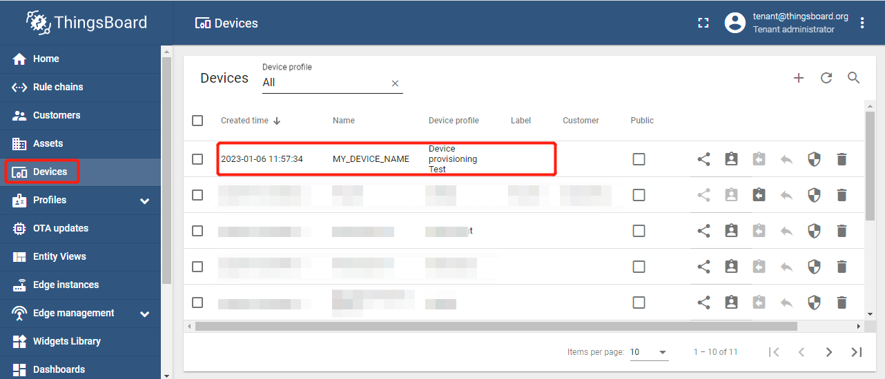
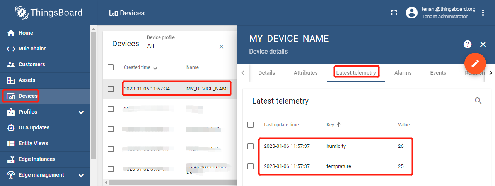
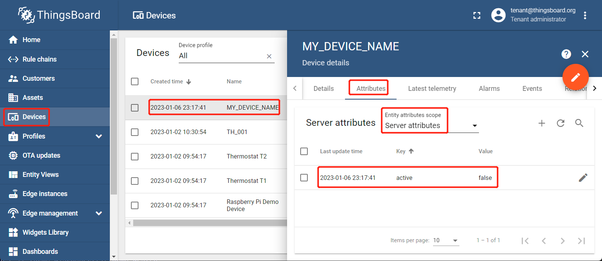
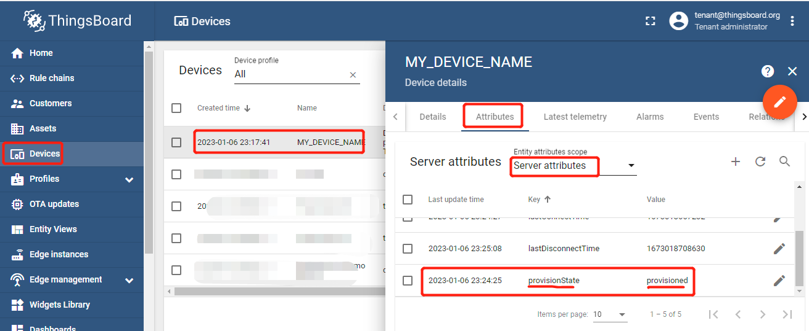
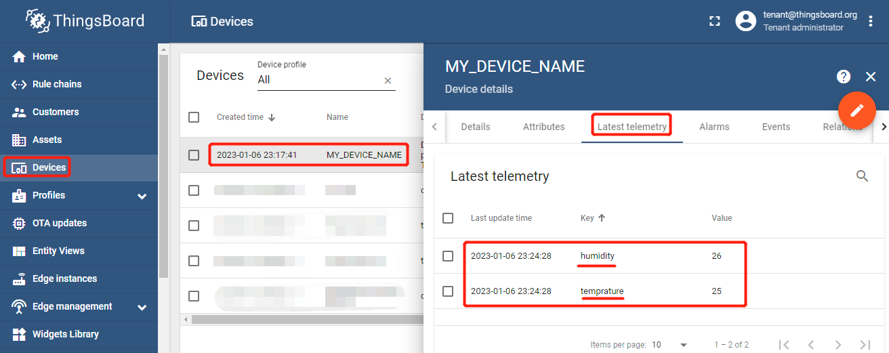
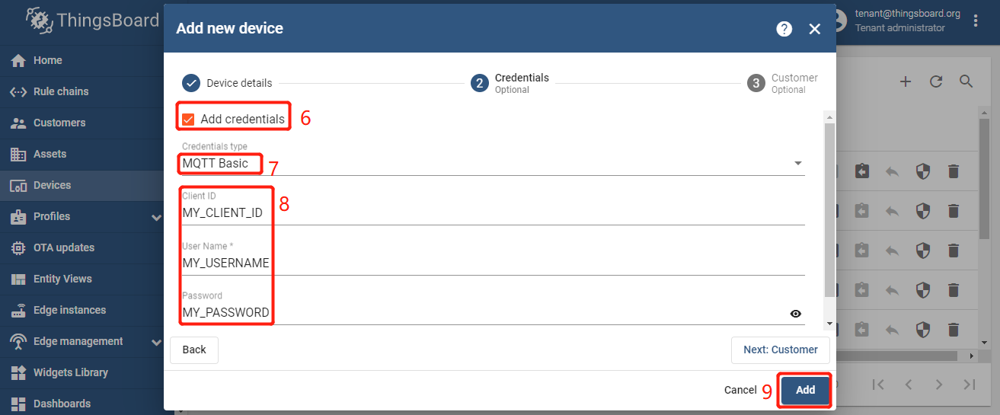

| Supported Targets | ESP32 | ESP32-C2 | ESP32-C3 | ESP32-H2 | ESP32-S3 |
| ----------------- | ----- | -------- | -------- | -------- | -------- |

# Device provisioning - Credentials generated by the ThingsBoard server - Plain MQTT (without SSL)

* [中文版](./README_CN.md)

- [Device provisioning - Credentials generated by the ThingsBoard server - Plain MQTT (without SSL)](#device-provisioning---credentials-generated-by-the-thingsboard-server---plain-mqtt-without-ssl)
  - [Hardware Required](#hardware-required)
  - [Allowing creating new devices with **device name**](#allowing-creating-new-devices-with-device-name)
    - [User Case PSA11: server\_generate\_access\_token\_without\_ssl](#user-case-psa11-server_generate_access_token_without_ssl)
      - [How to Use Example](#how-to-use-example)
      - [Example Output](#example-output)
      - [ThingsBoard Data](#thingsboard-data)
  - [Checking pre-provisioned devices with **device name**](#checking-pre-provisioned-devices-with-device-name)
    - [User Case PSC11：server\_generate\_access\_token\_without\_ssl](#user-case-psc11server_generate_access_token_without_ssl)
      - [How to Use Example](#how-to-use-example-1)
      - [Example Output](#example-output-1)
      - [ThingsBoard Data](#thingsboard-data-1)
    - [User Case PSC23: server\_generate\_basic\_mqtt\_credential\_c\_u\_p\_without\_ssl](#user-case-psc23-server_generate_basic_mqtt_credential_c_u_p_without_ssl)
      - [How to Use Example](#how-to-use-example-2)
      - [Example Output](#example-output-2)
      - [ThingsBoard Data](#thingsboard-data-2)
  - [Troubleshooting](#troubleshooting)


This example implements the flollowing functions:

* Device provisioning - Credentials generated by the ThingsBoard server - Plain MQTT (without SSL)
  * Allowing creating new devices with **device name**  - (Users cannot control the server to automatically generate credentials for new devices)
     * [User Case PSA11: server\_generate\_access\_token\_without\_ssl](#user-case-psa11-server_generate_access_token_without_ssl)
     * ~~User Case PSA21: server_generate_basic_mqtt_credential_c_without_ssl~~
     * ~~User Case PSA22: server_generate_basic_mqtt_credential_u_p_without_ssl~~
     * ~~User Case PSA23: server_generate_basic_mqtt_credential_c_u_p_without_ssl~~
  * Checking pre-provisioned devices with **device name** - (The user manually generates the credential certificate of the new device on the server)
     * [User Case PSC11：server\_generate\_access\_token\_without\_ssl](#user-case-psc11server_generate_access_token_without_ssl)
     * User Case PSC21：server_generate_basic_mqtt_credential_c_without_ssl
     * User Case PSC22：server_generate_basic_mqtt_credential_u_p_without_ssl （only for ESP-IDF-v5.x)
     * [User Case PSC23: server\_generate\_basic\_mqtt\_credential\_c\_u\_p\_without\_ssl](#user-case-psc23-server_generate_basic_mqtt_credential_c_u_p_without_ssl)
* Publish telemetry: temprature, humidity
  * Publish: `{"temprature":25,"humidity":26}`

Refer [here](https://thingsboard.io/docs/user-guide/device-provisioning/).

## Hardware Required

* A development board with ESP32/ESP32-C3/ESP32-H2/ESP32-C2/ESP32-S3 SoC (e.g., ESP32-DevKitC, ESP-WROVER-KIT, etc.)
* A USB cable for Power supply and programming

See [Development Boards](https://www.espressif.com/en/products/devkits) for more information about it.

## Allowing creating new devices with **device name**

### User Case PSA11: server_generate_access_token_without_ssl

#### How to Use Example

1. Add device profile:

   * `Login in ThingsBoard CE/PE` --> `Devices` -->`Device profiles` --> `+`  --> `Create new device profiles` --> Input **Device Profile Name** --> `Device provisioning Optional`.
      

   * `Allow to create new devices` --> Input `Provision device key` & `Provision device secret`, copy to a safe place --> `Add`.
      
  
   * Now my device profile should be listed first, since the table sort devices using the time of the creation by default..
      

1. set-targe (optional)

   Before project configuration and build, be sure to set the correct chip target using:

   ```bash
   idf.py set-target <chip_name>
   ```

1. menuconfig

   Then project configuration:

   ```bash
   idf.py menuconfig
   ```

   Configuration: ThingsBoard MQTT URI, access token, Wi-Fi SSID, password:

   ```menuconfig
   Example ThingsBoard MQTT Configuration  ---> 
      Transport server address  --->
         (MyThingsboardServerIP) Hostname, to set ipv4 pass it as string
         (1883) Port
      Provisioning config  --->
         (MY_DEVICE_NAME) Device name (Optional)
         (MY_PROVISION_KEY) Device key
         (MY_PROVISION_SECRET) Device secret
   Example Connection Configuration  --->
      [*] connect using WiFi interface
      (MySSID) WiFi SSID 
      (MyPassword) WiFi Password                  
   ```

1. build, flash and monitor

   Run `idf.py -p PORT flash monitor` to build, flash and monitor the project.

   (To exit the serial monitor, type ``Ctrl-]``.)

   See the [Getting Started Guide](https://idf.espressif.com/) for full steps to configure and use ESP-IDF to build projects.

#### Example Output

* The first time

   ```none
   ...
   0x400811a8: call_start_cpu1 at C:/Espressif/frameworks/esp-idf-v4.4.3/components/esp_system/port/cpu_start.c:148

   I (0) cpu_start: App cpu up.
   I (470) cpu_start: Pro cpu start user code
   I (470) cpu_start: cpu freq: 160000000
   I (470) cpu_start: Application information:
   I (475) cpu_start: Project name:     srv_gen_credentials_wo_ssl
   I (481) cpu_start: App version:      d9466f8-dirty
   I (487) cpu_start: Compile time:     Jan  6 2023 10:45:57
   I (493) cpu_start: ELF file SHA256:  3c197478b2973133...
   I (499) cpu_start: ESP-IDF:          v4.4.3-dirty
   I (504) heap_init: Initializing. RAM available for dynamic allocation:
   I (511) heap_init: At 3FFAE6E0 len 00001920 (6 KiB): DRAM
   I (517) heap_init: At 3FFB76A0 len 00028960 (162 KiB): DRAM
   I (524) heap_init: At 3FFE0440 len 00003AE0 (14 KiB): D/IRAM
   I (530) heap_init: At 3FFE4350 len 0001BCB0 (111 KiB): D/IRAM
   I (536) heap_init: At 40094A04 len 0000B5FC (45 KiB): IRAM
   I (544) spi_flash: detected chip: generic
   I (547) spi_flash: flash io: dio
   W (551) spi_flash: Detected size(4096k) larger than the size in the binary image header(2048k). Using the size in the binary image header.
   I (565) cpu_start: Starting scheduler on PRO CPU.
   I (0) cpu_start: Starting scheduler on APP CPU.
   I (575) SRV_GEN_CREDENTIALS_WO_SSL: [APP] Startup..
   I (585) SRV_GEN_CREDENTIALS_WO_SSL: [APP] Free memory: 275900 bytes
   I (585) SRV_GEN_CREDENTIALS_WO_SSL: [APP] IDF version: v4.4.3-dirty
   I (625) wifi:wifi driver task: 3ffc001c, prio:23, stack:6656, core=0
   I (625) system_api: Base MAC address is not set
   I (625) system_api: read default base MAC address from EFUSE
   I (635) wifi:wifi firmware version: 8cb87ff
   I (635) wifi:wifi certification version: v7.0
   I (635) wifi:config NVS flash: enabled
   I (635) wifi:config nano formating: disabled
   I (645) wifi:Init data frame dynamic rx buffer num: 32
   I (645) wifi:Init management frame dynamic rx buffer num: 32
   I (655) wifi:Init management short buffer num: 32
   I (655) wifi:Init dynamic tx buffer num: 32
   I (665) wifi:Init static rx buffer size: 1600
   I (665) wifi:Init static rx buffer num: 10
   I (665) wifi:Init dynamic rx buffer num: 32
   I (675) wifi_init: rx ba win: 6
   I (675) wifi_init: tcpip mbox: 32
   I (685) wifi_init: udp mbox: 6
   I (685) wifi_init: tcp mbox: 6
   I (685) wifi_init: tcp tx win: 5744
   I (695) wifi_init: tcp rx win: 5744
   I (695) wifi_init: tcp mss: 1440
   I (705) wifi_init: WiFi IRAM OP enabled
   I (705) wifi_init: WiFi RX IRAM OP enabled
   I (715) example_connect: Connecting to Duoman...
   I (715) phy_init: phy_version 4670,719f9f6,Feb 18 2021,17:07:07
   I (825) wifi:mode : sta (bc:dd:c2:d1:be:b0)
   I (825) wifi:enable tsf
   I (825) example_connect: Waiting for IP(s)
   I (3235) wifi:new:<2,0>, old:<1,0>, ap:<255,255>, sta:<2,0>, prof:1
   I (3975) wifi:state: init -> auth (b0)
   I (3985) wifi:state: auth -> assoc (0)
   I (3985) wifi:state: assoc -> run (10)
   W (3995) wifi:<ba-add>idx:0 (ifx:0, d8:0d:17:00:5b:13), tid:0, ssn:0, winSize:64
   I (4015) wifi:connected with Duoman, aid = 6, channel 2, BW20, bssid = d8:0d:17:00:5b:13
   I (4015) wifi:security: WPA2-PSK, phy: bgn, rssi: -36
   I (4015) wifi:pm start, type: 1

   I (4115) wifi:AP's beacon interval = 102400 us, DTIM period = 1
   I (5615) example_connect: Got IPv6 event: Interface "example_connect: sta" address: fe80:0000:0000:0000:bedd:c2ff:fed1:beb0, type: ESP_IP6_ADDR_IS_LINK_LOCAL
   I (6115) esp_netif_handlers: example_connect: sta ip: 192.168.0.124, mask: 255.255.255.0, gw: 192.168.0.1
   I (6115) example_connect: Got IPv4 event: Interface "example_connect: sta" address: 192.168.0.124
   I (6125) example_connect: Connected to example_connect: sta
   I (6125) example_connect: - IPv4 address: 192.168.0.124
   I (6135) example_connect: - IPv6 address: fe80:0000:0000:0000:bedd:c2ff:fed1:beb0, type: ESP_IP6_ADDR_IS_LINK_LOCAL
   I (6145) FRONT-CONN: Init tbcmh ...
   I (6145) FRONT-CONN: Connect tbcmh ...
   I (6155) tb_mqtt_client_helper: connecting to mqtt://192.168.0.210:1883 ...
   I (6165) tb_mqtt_wapper: src_event->event_id=7
   I (6165) tb_mqtt_client_helper: TBCM_EVENT_BEFORE_CONNECT, msg_id=64319
   I (6175) SRV_GEN_CREDENTIALS_WO_SSL: Still NOT connected to server!
   I (7185) tb_mqtt_client_helper: TBCM_EVENT_CONNECTED
   I (7185) tb_mqtt_client_helper: client->tbmqttclient = 0x3ffc5d70
   I (7185) tb_mqtt_client_helper: Connected to thingsboard MQTT server!
   I (7185) tb_mqtt_client_helper: before call on_connected()...
   I (7195) FRONT-CONN: Connected to thingsboard server!
   I (8205) provision: sent subscribe successful, msg_id=17013, topic=/provision/response
   I (8205) tb_mqtt_wapper: [Provision][Tx] request_id=1 {"deviceName":"MY_DEVICE_NAME","provisionDeviceKey":"MY_PROVISION_KEY","provisionDeviceSecret":"MY_PROVISION_SECRET"}
   I (8225) tb_mqtt_client_helper: after call on_connected()
   I (8415) tb_mqtt_wapper: src_event->event_id=5
   I (8425) tb_mqtt_wapper: [Provision][Rx] topic_type=6, payload_len=95 {"credentialsValue":"zNM6UzOnTvXYDpDKm34E","credentialsType":"ACCESS_TOKEN","status":"SUCCESS"}
   I (9225) tb_mqtt_client_helper: TBCM_EVENT_PUBLISHED, msg_id=36365
   I (9225) tb_mqtt_client_helper: TBCM_EVENT_DATA
   I (9225) provision: sent unsubscribe successful, msg_id=33244, topic=/provision/response
   I (9235) FRONT-CONN: Provision successful and the device will work!
   I (9235) tb_mqtt_client_helper: disconnecting from mqtt://192.168.0.210:1883 ...
   I (9345) tb_mqtt_wapper: tbcm_disconnect(): call esp_mqtt_client_stop()...
   I (9355) tb_mqtt_wapper: tbcm_disconnect(): call esp_mqtt_client_destroy()...
   W (9355) MQTT_CLIENT: Client asked to stop, but was not started
   I (9455) tb_mqtt_client_helper: It already disconnected from thingsboard MQTT server!
   I (9455) NORMAL-CONN: Init tbcmh ...
   I (9455) NORMAL-CONN: Connect tbcmh ...
   I (9455) tb_mqtt_client_helper: connecting to mqtt://192.168.0.210:1883 ...
   I (9465) SRV_GEN_CREDENTIALS_WO_SSL: Still NOT connected to server!
   I (9465) tb_mqtt_wapper: src_event->event_id=7
   I (10485) tb_mqtt_client_helper: TBCM_EVENT_BEFORE_CONNECT, msg_id=64319
   I (10485) tb_mqtt_client_helper: TBCM_EVENT_CONNECTED
   I (10485) tb_mqtt_client_helper: client->tbmqttclient = 0x3ffc9b0c
   I (10485) tb_mqtt_client_helper: Connected to thingsboard MQTT server!
   I (10495) tb_mqtt_client_helper: before call on_connected()...
   I (10505) NORMAL-CONN: Connected to thingsboard server!
   I (10505) NORMAL-CONN: Send telemetry: temprature, humidity
   I (10515) NORMAL-CONN: Get temperature (a time-series data)
   I (10525) NORMAL-CONN: Get humidity (a time-series data)
   I (10525) tb_mqtt_wapper: [Telemetry][Tx] {"temprature":25,"humidity":26}
   I (10545) tb_mqtt_client_helper: after call on_connected()
   I (10545) tb_mqtt_wapper: src_event->event_id=5
   I (11545) tb_mqtt_client_helper: TBCM_EVENT_PUBLISHED, msg_id=56935
   I (50945) SRV_GEN_CREDENTIALS_WO_SSL: Disconnect tbcmh ...
   I (50945) tb_mqtt_client_helper: disconnecting from mqtt://192.168.0.210:1883 ...
   I (51045) tb_mqtt_wapper: tbcm_disconnect(): call esp_mqtt_client_stop()...
   I (51055) tb_mqtt_wapper: tbcm_disconnect(): call esp_mqtt_client_destroy()...
   W (51055) MQTT_CLIENT: Client asked to stop, but was not started
   I (51155) SRV_GEN_CREDENTIALS_WO_SSL: Destroy tbcmh ...
   I (51155) tb_mqtt_client_helper: It already disconnected from thingsboard MQTT server!
   ```

* The second time

   *If you execute this test case again, the execution fails - Provisioning cannot be repeated.*

   ```none
   ...
   I (454) cpu_start: Starting app cpu, entry point is 0x400811a8
   0x400811a8: call_start_cpu1 at C:/Espressif/frameworks/esp-idf-v4.4.3/components/esp_system/port/cpu_start.c:148

   I (0) cpu_start: App cpu up.
   I (470) cpu_start: Pro cpu start user code
   I (470) cpu_start: cpu freq: 160000000
   I (470) cpu_start: Application information:
   I (475) cpu_start: Project name:     srv_gen_credentials_wo_ssl
   I (481) cpu_start: App version:      d9466f8-dirty
   I (487) cpu_start: Compile time:     Jan  6 2023 10:45:57
   I (493) cpu_start: ELF file SHA256:  3c197478b2973133...
   I (499) cpu_start: ESP-IDF:          v4.4.3-dirty
   I (504) heap_init: Initializing. RAM available for dynamic allocation:
   I (511) heap_init: At 3FFAE6E0 len 00001920 (6 KiB): DRAM
   I (517) heap_init: At 3FFB76A0 len 00028960 (162 KiB): DRAM
   I (524) heap_init: At 3FFE0440 len 00003AE0 (14 KiB): D/IRAM
   I (530) heap_init: At 3FFE4350 len 0001BCB0 (111 KiB): D/IRAM
   I (536) heap_init: At 40094A04 len 0000B5FC (45 KiB): IRAM
   I (544) spi_flash: detected chip: generic
   I (547) spi_flash: flash io: dio
   W (551) spi_flash: Detected size(4096k) larger than the size in the binary image header(2048k). Using the size in the binary image header.
   I (565) cpu_start: Starting scheduler on PRO CPU.
   I (0) cpu_start: Starting scheduler on APP CPU.
   I (575) SRV_GEN_CREDENTIALS_WO_SSL: [APP] Startup..
   I (585) SRV_GEN_CREDENTIALS_WO_SSL: [APP] Free memory: 275900 bytes
   I (585) SRV_GEN_CREDENTIALS_WO_SSL: [APP] IDF version: v4.4.3-dirty
   I (625) wifi:wifi driver task: 3ffc001c, prio:23, stack:6656, core=0
   I (625) system_api: Base MAC address is not set
   I (625) system_api: read default base MAC address from EFUSE
   I (635) wifi:wifi firmware version: 8cb87ff
   I (635) wifi:wifi certification version: v7.0
   I (635) wifi:config NVS flash: enabled
   I (635) wifi:config nano formating: disabled
   I (645) wifi:Init data frame dynamic rx buffer num: 32
   I (645) wifi:Init management frame dynamic rx buffer num: 32
   I (655) wifi:Init management short buffer num: 32
   I (655) wifi:Init dynamic tx buffer num: 32
   I (665) wifi:Init static rx buffer size: 1600
   I (665) wifi:Init static rx buffer num: 10
   I (665) wifi:Init dynamic rx buffer num: 32
   I (675) wifi_init: rx ba win: 6
   I (675) wifi_init: tcpip mbox: 32
   I (685) wifi_init: udp mbox: 6
   I (685) wifi_init: tcp mbox: 6
   I (685) wifi_init: tcp tx win: 5744
   I (695) wifi_init: tcp rx win: 5744
   I (695) wifi_init: tcp mss: 1440
   I (705) wifi_init: WiFi IRAM OP enabled
   I (705) wifi_init: WiFi RX IRAM OP enabled
   I (715) example_connect: Connecting to Duoman...
   I (715) phy_init: phy_version 4670,719f9f6,Feb 18 2021,17:07:07
   I (825) wifi:mode : sta (bc:dd:c2:d1:be:b0)
   I (825) wifi:enable tsf
   I (825) example_connect: Waiting for IP(s)
   I (3235) wifi:new:<2,0>, old:<1,0>, ap:<255,255>, sta:<2,0>, prof:1
   I (3985) wifi:state: init -> auth (b0)
   I (3985) wifi:state: auth -> assoc (0)
   I (3985) wifi:state: assoc -> run (10)
   W (4005) wifi:<ba-add>idx:0 (ifx:0, d8:0d:17:00:5b:13), tid:0, ssn:0, winSize:64
   I (4025) wifi:connected with Duoman, aid = 6, channel 2, BW20, bssid = d8:0d:17:00:5b:13
   I (4025) wifi:security: WPA2-PSK, phy: bgn, rssi: -34
   I (4025) wifi:pm start, type: 1

   I (4045) wifi:AP's beacon interval = 102400 us, DTIM period = 1
   I (5615) example_connect: Got IPv6 event: Interface "example_connect: sta" address: fe80:0000:0000:0000:bedd:c2ff:fed1:beb0, type: ESP_IP6_ADDR_IS_LINK_LOCAL
   I (6115) esp_netif_handlers: example_connect: sta ip: 192.168.0.124, mask: 255.255.255.0, gw: 192.168.0.1
   I (6115) example_connect: Got IPv4 event: Interface "example_connect: sta" address: 192.168.0.124
   I (6125) example_connect: Connected to example_connect: sta
   I (6125) example_connect: - IPv4 address: 192.168.0.124
   I (6135) example_connect: - IPv6 address: fe80:0000:0000:0000:bedd:c2ff:fed1:beb0, type: ESP_IP6_ADDR_IS_LINK_LOCAL
   I (6145) FRONT-CONN: Init tbcmh ...
   I (6145) FRONT-CONN: Connect tbcmh ...
   I (6155) tb_mqtt_client_helper: connecting to mqtt://192.168.0.210:1883 ...
   I (6165) tb_mqtt_wapper: src_event->event_id=7
   I (6165) tb_mqtt_client_helper: TBCM_EVENT_BEFORE_CONNECT, msg_id=64319
   I (6175) SRV_GEN_CREDENTIALS_WO_SSL: Still NOT connected to server!
   I (7185) tb_mqtt_client_helper: TBCM_EVENT_CONNECTED
   I (7185) tb_mqtt_client_helper: client->tbmqttclient = 0x3ffc5d54
   I (7185) tb_mqtt_client_helper: Connected to thingsboard MQTT server!
   I (7185) tb_mqtt_client_helper: before call on_connected()...
   I (7195) FRONT-CONN: Connected to thingsboard server!
   I (8205) provision: sent subscribe successful, msg_id=43836, topic=/provision/response
   I (8205) tb_mqtt_wapper: [Provision][Tx] request_id=1 {"deviceName":"MY_DEVICE_NAME","provisionDeviceKey":"MY_PROVISION_KEY","provisionDeviceSecret":"MY_PROVISION_SECRET"}
   I (8225) tb_mqtt_client_helper: after call on_connected()
   I (8305) tb_mqtt_wapper: src_event->event_id=5
   I (8315) tb_mqtt_wapper: [Provision][Rx] topic_type=6, payload_len=61 {"errorMsg":"Failed to provision device!","status":"FAILURE"}
   I (9225) tb_mqtt_client_helper: TBCM_EVENT_PUBLISHED, msg_id=4571
   I (9225) tb_mqtt_client_helper: TBCM_EVENT_DATA
   I (9225) provision: sent unsubscribe successful, msg_id=41723, topic=/provision/response
   W (9235) provision: provision response is failure! {"errorMsg":"Failed to provision device!","status":"FAILURE"}
   E (9245) FRONT-CONN: Provision timeout and the device will not work!
   I (50845) SRV_GEN_CREDENTIALS_WO_SSL: Disconnect tbcmh ...
   I (50845) tb_mqtt_client_helper: disconnecting from mqtt://192.168.0.210:1883 ...
   I (50945) tb_mqtt_wapper: tbcm_disconnect(): call esp_mqtt_client_stop()...
   I (50955) tb_mqtt_wapper: tbcm_disconnect(): call esp_mqtt_client_destroy()...
   W (50955) MQTT_CLIENT: Client asked to stop, but was not started
   I (51055) SRV_GEN_CREDENTIALS_WO_SSL: Destroy tbcmh ...
   I (51055) tb_mqtt_client_helper: It already disconnected from thingsboard MQTT server!
   ```

#### ThingsBoard Data

1. Provisiong Result

   * Now my new device should be listed first.
      
   *  The value of the service-side attribute `provisionState` is `provisioned`.
      
   *  Successfully connected to the server with new credentials and uploaded new time-series data.
      

2. Delete new device. 

   In order to ensure that the example runs successfully next time, the newly added device needs to be deleted.

   * `Device` --> Click *my new device* --> `Delete device`.
      

   * `Yes`.
      

## Checking pre-provisioned devices with **device name** 

### User Case PSC11：server_generate_access_token_without_ssl

#### How to Use Example

1. Modify device profile （or add device profile):

   * `Login in ThingsBoard CE/PE` --> `Device profiles` --> click *my testing device profiles*  --> `Device provisioning` --> `Toggle edit mode` (red icon).
      

   * `Check for pre-provisoned devices` --> Input `Provision device key` & `Provision device secret`, copy to a safe place --> `Apply changes` (red icon).
      
  
1. Pre-provisoned device

   * `Login in ThingsBoard CE/PE` --> `Device` --> `+` --> `Add new device` --> Input *device name* --> Select *my device profile* --> `Credentials Options`.
       

   * Checked `Add credentials` --> Select `Access token` --> Input *my access token* --> `Add`.
       

   * Now my pre-provisioned device should be listed first, since the table sort devices using the time of the creation by default.
      

      

      

2. set-targe (optional)

   Before project configuration and build, be sure to set the correct chip target using:

   ```bash
   idf.py set-target <chip_name>
   ```

3. menuconfig

   Then project configuration:

   ```bash
   idf.py menuconfig
   ```

   Configuration: ThingsBoard MQTT URI, access token, Wi-Fi SSID, password:

   ```menuconfig
   Example ThingsBoard MQTT Configuration  ---> 
      Transport server address  --->
         (MyThingsboardServerIP) Hostname, to set ipv4 pass it as string
         (1883) Port
      Provisioning config  --->
         (MY_DEVICE_NAME) Device name (Optional)
         (MY_PROVISION_KEY) Device key
         (MY_PROVISION_SECRET) Device secret
   Example Connection Configuration  --->
      [*] connect using WiFi interface
      (MySSID) WiFi SSID 
      (MyPassword) WiFi Password                  
   ```

4. build, flash and monitor

   Run `idf.py -p PORT flash monitor` to build, flash and monitor the project.

   (To exit the serial monitor, type ``Ctrl-]``.)

   See the [Getting Started Guide](https://idf.espressif.com/) for full steps to configure and use ESP-IDF to build projects.

#### Example Output

```none
...
0x400811a8: call_start_cpu1 at C:/Espressif/frameworks/esp-idf-v4.4.3/components/esp_system/port/cpu_start.c:148

I (0) cpu_start: App cpu up.
I (470) cpu_start: Pro cpu start user code
I (470) cpu_start: cpu freq: 160000000
I (470) cpu_start: Application information:
I (475) cpu_start: Project name:     srv_gen_credentials_wo_ssl
I (481) cpu_start: App version:      d9466f8-dirty
I (487) cpu_start: Compile time:     Jan  6 2023 10:45:57
I (493) cpu_start: ELF file SHA256:  3c197478b2973133...
I (499) cpu_start: ESP-IDF:          v4.4.3-dirty
I (504) heap_init: Initializing. RAM available for dynamic allocation:
I (511) heap_init: At 3FFAE6E0 len 00001920 (6 KiB): DRAM
I (517) heap_init: At 3FFB76A0 len 00028960 (162 KiB): DRAM
I (524) heap_init: At 3FFE0440 len 00003AE0 (14 KiB): D/IRAM
I (530) heap_init: At 3FFE4350 len 0001BCB0 (111 KiB): D/IRAM
I (536) heap_init: At 40094A04 len 0000B5FC (45 KiB): IRAM
I (544) spi_flash: detected chip: generic
I (547) spi_flash: flash io: dio
W (551) spi_flash: Detected size(4096k) larger than the size in the binary image header(2048k). Using the size in the binary image header.
I (565) cpu_start: Starting scheduler on PRO CPU.
I (0) cpu_start: Starting scheduler on APP CPU.
I (575) SRV_GEN_CREDENTIALS_WO_SSL: [APP] Startup..
I (585) SRV_GEN_CREDENTIALS_WO_SSL: [APP] Free memory: 275900 bytes
I (585) SRV_GEN_CREDENTIALS_WO_SSL: [APP] IDF version: v4.4.3-dirty
I (625) wifi:wifi driver task: 3ffc001c, prio:23, stack:6656, core=0
I (625) system_api: Base MAC address is not set
I (625) system_api: read default base MAC address from EFUSE
I (635) wifi:wifi firmware version: 8cb87ff
I (635) wifi:wifi certification version: v7.0
I (635) wifi:config NVS flash: enabled
I (635) wifi:config nano formating: disabled
I (645) wifi:Init data frame dynamic rx buffer num: 32
I (645) wifi:Init management frame dynamic rx buffer num: 32
I (655) wifi:Init management short buffer num: 32
I (655) wifi:Init dynamic tx buffer num: 32
I (665) wifi:Init static rx buffer size: 1600
I (665) wifi:Init static rx buffer num: 10
I (665) wifi:Init dynamic rx buffer num: 32
I (675) wifi_init: rx ba win: 6
I (675) wifi_init: tcpip mbox: 32
I (685) wifi_init: udp mbox: 6
I (685) wifi_init: tcp mbox: 6
I (685) wifi_init: tcp tx win: 5744
I (695) wifi_init: tcp rx win: 5744
I (695) wifi_init: tcp mss: 1440
I (705) wifi_init: WiFi IRAM OP enabled
I (705) wifi_init: WiFi RX IRAM OP enabled
I (715) example_connect: Connecting to Duoman...
I (715) phy_init: phy_version 4670,719f9f6,Feb 18 2021,17:07:07
I (825) wifi:mode : sta (bc:dd:c2:d1:be:b0)
I (825) wifi:enable tsf
I (825) example_connect: Waiting for IP(s)
I (3235) wifi:new:<2,0>, old:<1,0>, ap:<255,255>, sta:<2,0>, prof:1
I (3975) wifi:state: init -> auth (b0)
I (3985) wifi:state: auth -> assoc (0)
I (3995) wifi:state: assoc -> run (10)
W (3995) wifi:<ba-add>idx:0 (ifx:0, d8:0d:17:00:5b:13), tid:0, ssn:0, winSize:64
I (4015) wifi:connected with Duoman, aid = 6, channel 2, BW20, bssid = d8:0d:17:00:5b:13
I (4015) wifi:security: WPA2-PSK, phy: bgn, rssi: -29
I (4015) wifi:pm start, type: 1

I (4055) wifi:AP's beacon interval = 102400 us, DTIM period = 1
I (5615) example_connect: Got IPv6 event: Interface "example_connect: sta" address: fe80:0000:0000:0000:bedd:c2ff:fed1:beb0, type: ESP_IP6_ADDR_IS_LINK_LOCAL
I (6115) esp_netif_handlers: example_connect: sta ip: 192.168.0.124, mask: 255.255.255.0, gw: 192.168.0.1
I (6115) example_connect: Got IPv4 event: Interface "example_connect: sta" address: 192.168.0.124
I (6125) example_connect: Connected to example_connect: sta
I (6125) example_connect: - IPv4 address: 192.168.0.124
I (6135) example_connect: - IPv6 address: fe80:0000:0000:0000:bedd:c2ff:fed1:beb0, type: ESP_IP6_ADDR_IS_LINK_LOCAL
I (6145) FRONT-CONN: Init tbcmh ...
I (6145) FRONT-CONN: Connect tbcmh ...
I (6155) tb_mqtt_client_helper: connecting to mqtt://192.168.0.210:1883 ...
I (6165) tb_mqtt_wapper: src_event->event_id=7
I (6165) tb_mqtt_client_helper: TBCM_EVENT_BEFORE_CONNECT, msg_id=64319
I (6175) SRV_GEN_CREDENTIALS_WO_SSL: Still NOT connected to server!
I (7185) tb_mqtt_client_helper: TBCM_EVENT_CONNECTED
I (7185) tb_mqtt_client_helper: client->tbmqttclient = 0x3ffc5d54
I (7185) tb_mqtt_client_helper: Connected to thingsboard MQTT server!
I (7185) tb_mqtt_client_helper: before call on_connected()...
I (7195) FRONT-CONN: Connected to thingsboard server!
I (8205) provision: sent subscribe successful, msg_id=14551, topic=/provision/response
I (8205) tb_mqtt_wapper: [Provision][Tx] request_id=1 {"deviceName":"MY_DEVICE_NAME","provisionDeviceKey":"MY_PROVISION_KEY","provisionDeviceSecret":"MY_PROVISION_SECRET"}
I (8225) tb_mqtt_client_helper: after call on_connected()
I (8615) tb_mqtt_wapper: src_event->event_id=5
I (8625) tb_mqtt_wapper: [Provision][Rx] topic_type=6, payload_len=90 {"credentialsValue":"MY_ACCESS_TOKEN","credentialsType":"ACCESS_TOKEN","status":"SUCCESS"}
I (9225) tb_mqtt_client_helper: TBCM_EVENT_PUBLISHED, msg_id=17855
I (9225) tb_mqtt_client_helper: TBCM_EVENT_DATA
I (9225) provision: sent unsubscribe successful, msg_id=60662, topic=/provision/response
I (9235) FRONT-CONN: Provision successful and the device will work!
I (9235) tb_mqtt_client_helper: disconnecting from mqtt://192.168.0.210:1883 ...
I (9345) tb_mqtt_wapper: tbcm_disconnect(): call esp_mqtt_client_stop()...
I (9355) tb_mqtt_wapper: tbcm_disconnect(): call esp_mqtt_client_destroy()...
W (9355) MQTT_CLIENT: Client asked to stop, but was not started
I (9455) tb_mqtt_client_helper: It already disconnected from thingsboard MQTT server!
I (9455) NORMAL-CONN: Init tbcmh ...
I (9455) NORMAL-CONN: Connect tbcmh ...
I (9455) tb_mqtt_client_helper: connecting to mqtt://192.168.0.210:1883 ...
I (9465) SRV_GEN_CREDENTIALS_WO_SSL: Still NOT connected to server!
I (9465) tb_mqtt_wapper: src_event->event_id=7
I (10485) tb_mqtt_client_helper: TBCM_EVENT_BEFORE_CONNECT, msg_id=64319
I (10485) tb_mqtt_client_helper: TBCM_EVENT_CONNECTED
I (10485) tb_mqtt_client_helper: client->tbmqttclient = 0x3ffc9f88
I (10485) tb_mqtt_client_helper: Connected to thingsboard MQTT server!
I (10495) tb_mqtt_client_helper: before call on_connected()...
I (10505) NORMAL-CONN: Connected to thingsboard server!
I (10505) NORMAL-CONN: Send telemetry: temprature, humidity
I (10515) NORMAL-CONN: Get temperature (a time-series data)
I (10525) NORMAL-CONN: Get humidity (a time-series data)
I (10525) tb_mqtt_wapper: [Telemetry][Tx] {"temprature":25,"humidity":26}
I (10545) tb_mqtt_client_helper: after call on_connected()
I (10555) tb_mqtt_wapper: src_event->event_id=5
I (11545) tb_mqtt_client_helper: TBCM_EVENT_PUBLISHED, msg_id=55539
I (50945) SRV_GEN_CREDENTIALS_WO_SSL: Disconnect tbcmh ...
I (50945) tb_mqtt_client_helper: disconnecting from mqtt://192.168.0.210:1883 ...
I (51045) tb_mqtt_wapper: tbcm_disconnect(): call esp_mqtt_client_stop()...
I (51055) tb_mqtt_wapper: tbcm_disconnect(): call esp_mqtt_client_destroy()...
W (51055) MQTT_CLIENT: Client asked to stop, but was not started
I (51155) SRV_GEN_CREDENTIALS_WO_SSL: Destroy tbcmh ...
I (51155) tb_mqtt_client_helper: It already disconnected from thingsboard MQTT server!
```

#### ThingsBoard Data

1. Provisiong Result

   *  The value of the service-side attribute `provisionState` is `provisioned`.
      
   *  Successfully connected to the server with new credentials and uploaded new time-series data.
      

2. Delete new device. 

   In order to ensure that the example runs successfully next time, the newly added device needs to be deleted.

   * `Device` --> Click *my new device* --> `Delete device`.
      

   * `Yes`.
      

### User Case PSC23: server_generate_basic_mqtt_credential_c_u_p_without_ssl

#### How to Use Example


1. Modify device profile （or add device profile):

   * `Login in ThingsBoard CE/PE` --> `Device profiles` --> click *my testing device profiles*  --> `Device provisioning` --> `Toggle edit mode` (red icon).
      

   * `Check for pre-provisoned devices` --> Input `Provision device key` & `Provision device secret`, copy to a safe place --> `Apply changes` (red icon).
      
  
1. Pre-provisoned device

   * `Login in ThingsBoard CE/PE` --> `Device` --> `+` --> `Add new device` --> Input *device name* --> Select *my device profile* --> `Credentials Options`.
       

   * Checked `Add credentials` --> Select `MQTT Basic` --> Input *my client id*, *my username* & *my password* --> `Add`.
       

   * Now my pre-provisioned device should be listed first, since the table sort devices using the time of the creation by default.
      

      

      


1. set-targe (optional)

   Before project configuration and build, be sure to set the correct chip target using:

   ```bash
   idf.py set-target <chip_name>
   ```

2. menuconfig

   Then project configuration:

   ```bash
   idf.py menuconfig
   ```

   Configuration: ThingsBoard MQTT URI, access token, Wi-Fi SSID, password:

   ```menuconfig
   Example ThingsBoard MQTT Configuration  ---> 
      Transport server address  --->
         (MyThingsboardServerIP) Hostname, to set ipv4 pass it as string
         (1883) Port
      Provisioning config  --->
         (MY_DEVICE_NAME) Device name (Optional)
         (MY_PROVISION_KEY) Device key
         (MY_PROVISION_SECRET) Device secret
   Example Connection Configuration  --->
      [*] connect using WiFi interface
      (MySSID) WiFi SSID 
      (MyPassword) WiFi Password                  
   ```

3. build, flash and monitor

   Run `idf.py -p PORT flash monitor` to build, flash and monitor the project.

   (To exit the serial monitor, type ``Ctrl-]``.)

   See the [Getting Started Guide](https://idf.espressif.com/) for full steps to configure and use ESP-IDF to build projects.

#### Example Output

```none
...
I (454) cpu_start: Starting app cpu, entry point is 0x400811a8
0x400811a8: call_start_cpu1 at C:/Espressif/frameworks/esp-idf-v4.4.3/components/esp_system/port/cpu_start.c:148

I (0) cpu_start: App cpu up.
I (470) cpu_start: Pro cpu start user code
I (470) cpu_start: cpu freq: 160000000
I (470) cpu_start: Application information:
I (474) cpu_start: Project name:     srv_gen_credentials_wo_ssl
I (481) cpu_start: App version:      d9466f8-dirty
I (487) cpu_start: Compile time:     Jan  6 2023 10:45:57
I (493) cpu_start: ELF file SHA256:  3c197478b2973133...
I (499) cpu_start: ESP-IDF:          v4.4.3-dirty
I (504) heap_init: Initializing. RAM available for dynamic allocation:
I (511) heap_init: At 3FFAE6E0 len 00001920 (6 KiB): DRAM
I (517) heap_init: At 3FFB76A0 len 00028960 (162 KiB): DRAM
I (524) heap_init: At 3FFE0440 len 00003AE0 (14 KiB): D/IRAM
I (530) heap_init: At 3FFE4350 len 0001BCB0 (111 KiB): D/IRAM
I (536) heap_init: At 40094A04 len 0000B5FC (45 KiB): IRAM
I (544) spi_flash: detected chip: generic
I (547) spi_flash: flash io: dio
W (551) spi_flash: Detected size(4096k) larger than the size in the binary image header(2048k). Using the size in the binary image header.
I (565) cpu_start: Starting scheduler on PRO CPU.
I (0) cpu_start: Starting scheduler on APP CPU.
I (575) SRV_GEN_CREDENTIALS_WO_SSL: [APP] Startup..
I (585) SRV_GEN_CREDENTIALS_WO_SSL: [APP] Free memory: 275900 bytes
I (585) SRV_GEN_CREDENTIALS_WO_SSL: [APP] IDF version: v4.4.3-dirty
I (625) wifi:wifi driver task: 3ffc001c, prio:23, stack:6656, core=0
I (625) system_api: Base MAC address is not set
I (625) system_api: read default base MAC address from EFUSE
I (635) wifi:wifi firmware version: 8cb87ff
I (635) wifi:wifi certification version: v7.0
I (635) wifi:config NVS flash: enabled
I (635) wifi:config nano formating: disabled
I (645) wifi:Init data frame dynamic rx buffer num: 32
I (645) wifi:Init management frame dynamic rx buffer num: 32
I (655) wifi:Init management short buffer num: 32
I (655) wifi:Init dynamic tx buffer num: 32
I (665) wifi:Init static rx buffer size: 1600
I (665) wifi:Init static rx buffer num: 10
I (665) wifi:Init dynamic rx buffer num: 32
I (675) wifi_init: rx ba win: 6
I (675) wifi_init: tcpip mbox: 32
I (685) wifi_init: udp mbox: 6
I (685) wifi_init: tcp mbox: 6
I (685) wifi_init: tcp tx win: 5744
I (695) wifi_init: tcp rx win: 5744
I (695) wifi_init: tcp mss: 1440
I (705) wifi_init: WiFi IRAM OP enabled
I (705) wifi_init: WiFi RX IRAM OP enabled
I (715) example_connect: Connecting to Duoman...
I (715) phy_init: phy_version 4670,719f9f6,Feb 18 2021,17:07:07
I (825) wifi:mode : sta (bc:dd:c2:d1:be:b0)
I (825) wifi:enable tsf
I (825) example_connect: Waiting for IP(s)
I (3235) wifi:new:<2,0>, old:<1,0>, ap:<255,255>, sta:<2,0>, prof:1
I (3975) wifi:state: init -> auth (b0)
I (3985) wifi:state: auth -> assoc (0)
I (3985) wifi:state: assoc -> run (10)
W (3995) wifi:<ba-add>idx:0 (ifx:0, d8:0d:17:00:5b:13), tid:0, ssn:0, winSize:64
I (4015) wifi:connected with Duoman, aid = 6, channel 2, BW20, bssid = d8:0d:17:00:5b:13
I (4015) wifi:security: WPA2-PSK, phy: bgn, rssi: -29
I (4015) wifi:pm start, type: 1

I (4035) wifi:AP's beacon interval = 102400 us, DTIM period = 1
I (5615) example_connect: Got IPv6 event: Interface "example_connect: sta" address: fe80:0000:0000:0000:bedd:c2ff:fed1:beb0, type: ESP_IP6_ADDR_IS_LINK_LOCAL
I (6115) esp_netif_handlers: example_connect: sta ip: 192.168.0.124, mask: 255.255.255.0, gw: 192.168.0.1
I (6115) example_connect: Got IPv4 event: Interface "example_connect: sta" address: 192.168.0.124
I (6125) example_connect: Connected to example_connect: sta
I (6125) example_connect: - IPv4 address: 192.168.0.124
I (6135) example_connect: - IPv6 address: fe80:0000:0000:0000:bedd:c2ff:fed1:beb0, type: ESP_IP6_ADDR_IS_LINK_LOCAL
I (6145) FRONT-CONN: Init tbcmh ...
I (6145) FRONT-CONN: Connect tbcmh ...
I (6155) tb_mqtt_client_helper: connecting to mqtt://192.168.0.210:1883 ...
I (6165) tb_mqtt_wapper: src_event->event_id=7
I (6165) tb_mqtt_client_helper: TBCM_EVENT_BEFORE_CONNECT, msg_id=64319
I (6175) SRV_GEN_CREDENTIALS_WO_SSL: Still NOT connected to server!
I (7185) tb_mqtt_client_helper: TBCM_EVENT_CONNECTED
I (7185) tb_mqtt_client_helper: client->tbmqttclient = 0x3ffc5d54
I (7185) tb_mqtt_client_helper: Connected to thingsboard MQTT server!
I (7185) tb_mqtt_client_helper: before call on_connected()...
I (7195) FRONT-CONN: Connected to thingsboard server!
I (8205) provision: sent subscribe successful, msg_id=50083, topic=/provision/response
I (8205) tb_mqtt_wapper: [Provision][Tx] request_id=1 {"deviceName":"MY_DEVICE_NAME","provisionDeviceKey":"MY_PROVISION_KEY","provisionDeviceSecret":"MY_PROVISION_SECRET"}
I (8225) tb_mqtt_client_helper: after call on_connected()
I (8335) tb_mqtt_wapper: src_event->event_id=5
I (8345) tb_mqtt_wapper: [Provision][Rx] topic_type=6, payload_len=148 {"credentialsValue":{"clientId":"MY_CLIENT_ID","userName":"MY_USERNAME","password":"MY_PASSWORD"},"credentialsType":"MQTT_BASIC","status":"SUCCESS"}
I (9225) tb_mqtt_client_helper: TBCM_EVENT_PUBLISHED, msg_id=41484
I (9225) tb_mqtt_client_helper: TBCM_EVENT_DATA
I (9225) provision: sent unsubscribe successful, msg_id=55451, topic=/provision/response
I (9235) FRONT-CONN: Provision successful and the device will work!
I (9235) tb_mqtt_client_helper: disconnecting from mqtt://192.168.0.210:1883 ...
I (9345) tb_mqtt_wapper: tbcm_disconnect(): call esp_mqtt_client_stop()...
I (9355) tb_mqtt_wapper: tbcm_disconnect(): call esp_mqtt_client_destroy()...
W (9355) MQTT_CLIENT: Client asked to stop, but was not started
I (9455) tb_mqtt_client_helper: It already disconnected from thingsboard MQTT server!
I (9455) NORMAL-CONN: Init tbcmh ...
I (9455) NORMAL-CONN: Connect tbcmh ...
I (9455) tb_mqtt_client_helper: connecting to mqtt://192.168.0.210:1883 ...
I (9465) SRV_GEN_CREDENTIALS_WO_SSL: Still NOT connected to server!
I (9465) tb_mqtt_wapper: src_event->event_id=7
I (10485) tb_mqtt_client_helper: TBCM_EVENT_BEFORE_CONNECT, msg_id=64319
I (10485) tb_mqtt_client_helper: TBCM_EVENT_CONNECTED
I (10485) tb_mqtt_client_helper: client->tbmqttclient = 0x3ffc9b78
I (10485) tb_mqtt_client_helper: Connected to thingsboard MQTT server!
I (10495) tb_mqtt_client_helper: before call on_connected()...
I (10505) NORMAL-CONN: Connected to thingsboard server!
I (10505) NORMAL-CONN: Send telemetry: temprature, humidity
I (10515) NORMAL-CONN: Get temperature (a time-series data)
I (10525) NORMAL-CONN: Get humidity (a time-series data)
I (10525) tb_mqtt_wapper: [Telemetry][Tx] {"temprature":25,"humidity":26}
I (10545) tb_mqtt_client_helper: after call on_connected()
I (10545) tb_mqtt_wapper: src_event->event_id=5
I (11545) tb_mqtt_client_helper: TBCM_EVENT_PUBLISHED, msg_id=53580
I (50945) SRV_GEN_CREDENTIALS_WO_SSL: Disconnect tbcmh ...
I (50945) tb_mqtt_client_helper: disconnecting from mqtt://192.168.0.210:1883 ...
I (51045) tb_mqtt_wapper: tbcm_disconnect(): call esp_mqtt_client_stop()...
I (51055) tb_mqtt_wapper: tbcm_disconnect(): call esp_mqtt_client_destroy()...
W (51055) MQTT_CLIENT: Client asked to stop, but was not started
I (51155) SRV_GEN_CREDENTIALS_WO_SSL: Destroy tbcmh ...
I (51155) tb_mqtt_client_helper: It already disconnected from thingsboard MQTT server!
```

#### ThingsBoard Data

1. Provisiong Result

   *  The value of the service-side attribute `provisionState` is `provisioned`.
      
   *  Successfully connected to the server with new credentials and uploaded new time-series data.
      

2. Delete new device. 

   In order to ensure that the example runs successfully next time, the newly added device needs to be deleted.

   * `Device` --> Click *my new device* --> `Delete device`.
      

   * `Yes`.
      


## Troubleshooting

For any technical queries, please open an [issue](https://github.com/liang-zhu-zi/esp32-thingsboard-mqtt-client/issues) on GitHub. We will get back to you soon.
