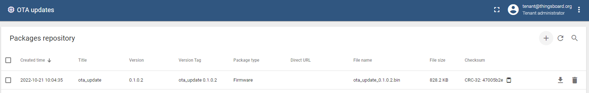
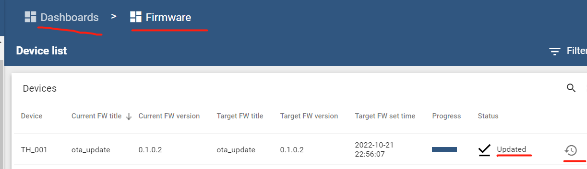

| Supported Targets | ESP32 | ESP32-C2 | ESP32-C3 | ESP32-H2 | ESP32-S3 |
| ----------------- | ----- | -------- | -------- | -------- | -------- |

# F/W OTA Update - ThingsBoard MQTT Client Example

* [中文版](./README_CN.md)

This example is based on [`$ESP-IDF\examples\protocols\mqtt\tcp`](https://github.com/espressif/esp-idf/tree/master/examples/protocols/mqtt/tcp).

This example implements F/W OTA update related functions:

* Send attributes request of F/W info:
  * Topic: `v1/devices/me/attributes/request/{request_id}`
  * Payload: `{"sharedKeys": "fw_checksum,fw_checksum_algorithm,fw_size,fw_title,fw_version"}`

* Subscirbe to and process attributes response of F/W info:
  * Topic: `v1/devices/me/attributes/response/{request_id}`
  * Payload: `{"fw_title":"ota_update","fw_version":"0.1.0.2","fw_tag":"ota_update 0.1.0.2","fw_size":849888,"fw_checksum_algorithm":"CRC32","fw_checksum":"15ccae65"}`

* Subscirbe to and process shared attributes of F/W info:
  * Topic: `v1/devices/me/attributes`
  * Payload: `{"shared":{"fw_checksum":"15ccae65","fw_size":849888,"fw_title":"ota_update","fw_checksum_algorithm":"CRC32","fw_version":"0.1.0.2"}}`

* Send F/W request for getting next chunk:
  * Topic: `v2/fw/request/{request_id}/chunk/{chunk_id}`
  * Payload: `chunk_size`

     Replace `{chunk_id}` with your chunk_id from `0`, then incremen.

     Replace `chunk_size` with your chunk size, eg: `16384`

* Subscirbe to and process F/W response of F/W chunk:
  * Topic: ``v2/fw/response/{request_id}/chunk/{chunk_id}``
  * Payload: `...F/W chunk...`

* Send telemetry about current firmware info:
  * Topic: `v1/devices/me/telemetry`
  * Payload: `{"current_fw_title":"Initial","current_fw_version":"v0"}`

      Replace `Initial` and `v0` with your F/W title and version. eg: `{"current_fw_title":"ota_update","current_fw_version":"0.1.0.1"}`, or `{"current_fw_title":"ota_update","current_fw_version":"0.1.0.1","fw_state":"DOWNLOADING"}`, or `{"current_fw_title":"ota_update","current_fw_version":"0.1.0.1","fw_state":"DOWNLOADED"}`, or `{"current_fw_title":"ota_update","current_fw_version":"0.1.0.1","fw_state":"VERIFIED"}`, or `{"current_fw_title":"ota_update","current_fw_version":"0.1.0.1","fw_state":"UPDATING"}`, or `{"current_fw_title":"ota_update","current_fw_version":"0.1.0.2","fw_state":"UPDATED"}`, or `{"fw_state":"FAILED","fw_error":"..."}`.

## Hardware Required

* A development board with ESP32/ESP32-C3/ESP32-H2/ESP32-C2/ESP32-S3 SoC (e.g., ESP32-DevKitC, ESP-WROVER-KIT, etc.)
* A USB cable for Power supply and programming

See [Development Boards](https://www.espressif.com/en/products/devkits) for more information about it.

## How to Use Example

1. Get a device access token

   `Login in ThingsBoard CE/PE` --> `Devices` --> Click my device --> `Details` --> `Copy Access Token`.

1. set-targe (optional)

   Before project configuration and build, be sure to set the correct chip target using:

   ```bash
   idf.py set-target <chip_name>
   ```

1. menuconfig

   Then project configuration:

   ```bash
   idf.py menuconfig
   ```

   Configuration: Partition table, ThingsBoard MQTT URI, access token, Wi-Fi SSID, password:

   ```menuconfig
   Partition Table  --->
       Partition Table --->
           (X) Factory app, two OTA definitions 
   Example Configuration  --->
       (mqtt://MyThingsboardServerIP) Broker URL
       (MyDeviceToken) Access Token 
   Example Connection Configuration  --->
       [*] connect using WiFi interface
       (MySSID) WiFi SSID 
       (MyPassword) WiFi Password                  
   Component config  --->
       ThingsBoard MQTT Client library (TBMQTTClient)  ---> 
           [*] Enable TBMQTTClient Helper
           
   ```

   **Note**: The corresponding partition table of "Factory app, two OTA definitions" is [$ESP-IDF\components\partition_table\partitions_two_ota.csv](https://github.com/espressif/esp-idf/blob/master/components/partition_table/partitions_two_ota.csv).

1. build OTA F/W

   Modify `CMakeLists.txt`

   ```CMake
   set(PROJECT_VER "0.1.0.2")

   include($ENV{IDF_PATH}/tools/cmake/project.cmake)
   project(ota_update)
   ```

   **Note（（: `ota_update` is your OTA title, `0.1.0.2` is your OTA version.

   Run `idf.py build` to build the project, backup `build\ota_update.bin` to your directory.
   Modify `0.1.0.2` to `0.1.0.3` and redo it once.
   Modify `0.1.0.3` to `0.1.0.4` and redo it once.
   Now you have 3 versions of `ota_update`, `0.1.0.2`, `0.1.0.3` and `0.1.0.4`.

1. build, flash and monitor

   Modify `CMakeLists.txt`

   ```CMake
   set(PROJECT_VER "0.1.0.1")

   include($ENV{IDF_PATH}/tools/cmake/project.cmake)
   project(ota_update)
   ```

   Run `idf.py -p PORT flash monitor` to build, flash and monitor the project.

   (To exit the serial monitor, type ``Ctrl-]``.)

   See the [Getting Started Guide](https://idf.espressif.com/) for full steps to configure and use ESP-IDF to build projects.

1. `OTA updates` in ThingsBoard

   Referece [OTA updates](https://thingsboard.io/docs/user-guide/ota-updates/)

   * Upload a F/W binary file: `OTA updates` --> `+` Add package --> Fill in the F/W information of `0.1.0.2` version below (**Note**: Checksum algorithm MUST be `CRC32`) --> `Add`.

      

      

   * Start your ESP32 device.

   * OTA updates: `Device profiles` --> Click your ESP32 device's profile --> Modify (Toggle Edit Mode) ---> Assigned firmware `0.1.0.2` --> OK (Apply changes).

      
  
   * OTA updates: `Dashboards` --> Click `Firmware` --> `Open dashboard` ---> OTA F/W status about your ESP32 device --> History firmware update --> Your device firmware history.

      

      

   * Repeat the above steps to update to `0.1.0.3` and `0.1.0.4`.

## Example Output

```none
...
0x40081188: call_start_cpu1 at C:/Espressif/frameworks/esp-idf-v4.4.1/components/esp_system/port/cpu_start.c:160
entry 0x40080694
I (27) boot: ESP-IDF v4.4.1-dirty 2nd stage bootloader
I (27) boot: compile time 09:54:37
I (27) boot: chip revision: 1
I (30) boot_comm: chip revision: 1, min. bootloader chip revision: 0
I (38) boot.esp32: SPI Speed      : 40MHz
I (42) boot.esp32: SPI Mode       : DIO
I (47) boot.esp32: SPI Flash Size : 4MB
I (51) boot: Enabling RNG early entropy source...
I (57) boot: Partition Table:
I (60) boot: ## Label            Usage          Type ST Offset   Length
I (68) boot:  0 nvs              WiFi data        01 02 00009000 00004000
I (75) boot:  1 otadata          OTA data         01 00 0000d000 00002000
I (82) boot:  2 phy_init         RF data          01 01 0000f000 00001000
I (90) boot:  3 factory          factory app      00 00 00010000 00100000
I (97) boot:  4 ota_0            OTA app          00 10 00110000 00100000
I (105) boot:  5 ota_1            OTA app          00 11 00210000 00100000
I (112) boot: End of partition table
I (117) boot: Defaulting to factory image
I (121) boot_comm: chip revision: 1, min. application chip revision: 0
I (129) esp_image: segment 0: paddr=00010020 vaddr=3f400020 size=1eb2ch (125740) map
I (183) esp_image: segment 1: paddr=0002eb54 vaddr=3ffb0000 size=014c4h (  5316) load
I (185) esp_image: segment 2: paddr=00030020 vaddr=400d0020 size=98e18h (626200) map
I (415) esp_image: segment 3: paddr=000c8e40 vaddr=3ffb14c4 size=0238ch (  9100) load
I (419) esp_image: segment 4: paddr=000cb1d4 vaddr=40080000 size=145c4h ( 83396) load
I (455) esp_image: segment 5: paddr=000df7a0 vaddr=50000000 size=00010h (    16) load
I (465) boot: Loaded app from partition at offset 0x10000
I (465) boot: Disabling RNG early entropy source...
I (477) cpu_start: Pro cpu up.
I (478) cpu_start: Starting app cpu, entry point is 0x40081194
0x40081194: call_start_cpu1 at C:/Espressif/frameworks/esp-idf-v4.4.1/components/esp_system/port/cpu_start.c:160

I (0) cpu_start: App cpu up.
I (492) cpu_start: Pro cpu start user code
I (492) cpu_start: cpu freq: 160000000
I (492) cpu_start: Application information:
I (496) cpu_start: Project name:     ota_update
I (502) cpu_start: App version:      0.1.0.1
I (506) cpu_start: Compile time:     Oct 21 2022 22:54:56
I (513) cpu_start: ELF file SHA256:  ff666a81f013bc9d...
I (519) cpu_start: ESP-IDF:          v4.4.1-dirty
I (524) heap_init: Initializing. RAM available for dynamic allocation:
I (531) heap_init: At 3FFAE6E0 len 00001920 (6 KiB): DRAM
I (537) heap_init: At 3FFB76B8 len 00028948 (162 KiB): DRAM
I (543) heap_init: At 3FFE0440 len 00003AE0 (14 KiB): D/IRAM
I (550) heap_init: At 3FFE4350 len 0001BCB0 (111 KiB): D/IRAM
I (556) heap_init: At 400945C4 len 0000BA3C (46 KiB): IRAM
I (564) spi_flash: detected chip: generic
I (567) spi_flash: flash io: dio
I (572) cpu_start: Starting scheduler on PRO CPU.
I (0) cpu_start: Starting scheduler on APP CPU.
I (582) OTA_UPDATE_EXAMPLE: [APP] Startup..
I (592) OTA_UPDATE_EXAMPLE: [APP] Free memory: 276216 bytes
I (592) OTA_UPDATE_EXAMPLE: [APP] IDF version: v4.4.1-dirty
I (632) wifi:wifi driver task: 3ffbff94, prio:23, stack:6656, core=0
I (632) system_api: Base MAC address is not set
I (632) system_api: read default base MAC address from EFUSE
I (642) wifi:wifi firmware version: 63017e0
I (642) wifi:wifi certification version: v7.0
I (642) wifi:config NVS flash: enabled
I (642) wifi:config nano formating: disabled
I (652) wifi:Init data frame dynamic rx buffer num: 32
I (652) wifi:Init management frame dynamic rx buffer num: 32
I (662) wifi:Init management short buffer num: 32
I (662) wifi:Init dynamic tx buffer num: 32
I (672) wifi:Init static rx buffer size: 1600
I (672) wifi:Init static rx buffer num: 10
I (672) wifi:Init dynamic rx buffer num: 32
I (682) wifi_init: rx ba win: 6
I (682) wifi_init: tcpip mbox: 32
I (692) wifi_init: udp mbox: 6
I (692) wifi_init: tcp mbox: 6
I (692) wifi_init: tcp tx win: 5744
I (702) wifi_init: tcp rx win: 5744
I (702) wifi_init: tcp mss: 1440
I (712) wifi_init: WiFi IRAM OP enabled
I (712) wifi_init: WiFi RX IRAM OP enabled
I (722) example_connect: Connecting to MySSID...
I (722) phy_init: phy_version 4670,719f9f6,Feb 18 2021,17:07:07
I (832) wifi:mode : sta (bc:dd:c2:d1:be:b0)
I (832) wifi:enable tsf
I (832) example_connect: Waiting for IP(s)
I (2882) wifi:new:<2,0>, old:<1,0>, ap:<255,255>, sta:<2,0>, prof:1
I (3622) wifi:state: init -> auth (b0)
I (3632) wifi:state: auth -> assoc (0)
I (3642) wifi:state: assoc -> run (10)
W (3652) wifi:<ba-add>idx:0 (ifx:0, d8:0d:17:00:5b:13), tid:0, ssn:0, winSize:64
I (3672) wifi:connected with MySSID, aid = 4, channel 2, BW20, bssid = d8:0d:17:00:5b:13
I (3672) wifi:security: WPA2-PSK, phy: bgn, rssi: -46
I (3682) wifi:pm start, type: 1

I (3702) wifi:AP's beacon interval = 102400 us, DTIM period = 1
I (5612) example_connect: Got IPv6 event: Interface "example_connect: sta" address: fe80:0000:0000:0000:bedd:c2ff:fed1:beb0, type: ESP_IP6_ADDR_IS_LINK_LOCAL
I (6112) esp_netif_handlers: example_connect: sta ip: 192.168.0.124, mask: 255.255.255.0, gw: 192.168.0.1
I (6112) example_connect: Got IPv4 event: Interface "example_connect: sta" address: 192.168.0.124
I (6122) example_connect: Connected to example_connect: sta
I (6122) example_connect: - IPv4 address: 192.168.0.124
I (6132) example_connect: - IPv6 address: fe80:0000:0000:0000:bedd:c2ff:fed1:beb0, type: ESP_IP6_ADDR_IS_LINK_LOCAL
I (6142) OTA_UPDATE_EXAMPLE: Init tbmch ...
I (6152) OTA_UPDATE_EXAMPLE: Append F/W OTA Update...
I (6152) MY_FWUPDATE: Current running F/W version: 0.1.0.1
I (6162) MY_FWUPDATE: Running partition type 0 subtype 0 (offset 0x00010000)
I (6162) MY_FWUPDATE: Update partition type 0 subtype 16 (offset 0x00110000)
I (6172) OTA_UPDATE_EXAMPLE: Connect tbmch ...
I (6182) tb_mqtt_client_helper: connecting to mqtt://192.168.0.186...
I (6192) tb_mqtt_client: MQTT_EVENT_BEFORE_CONNECT, msg_id=0, topic_len=0, data_len=0
I (6292) OTA_UPDATE_EXAMPLE: Still NOT connected to server!
I (6702) tb_mqtt_client: MQTT_EVENT_CONNECTED
I (6702) tb_mqtt_client: client->mqtt_handle = 0x3ffc6228
I (6702) tb_mqtt_client: sent subscribe successful, msg_id=43476, topic=v1/devices/me/attributes
I (6712) tb_mqtt_client: sent subscribe successful, msg_id=45915, topic=v1/devices/me/attributes/response/+
I (6722) tb_mqtt_client: sent subscribe successful, msg_id=33190, topic=v1/devices/me/rpc/request/+
I (6732) tb_mqtt_client: sent subscribe successful, msg_id=15462, topic=v1/devices/me/rpc/response/+
I (6742) tb_mqtt_client: sent subscribe successful, msg_id=53083, topic=v2/fw/response/+/chunk/+
I (6752) tb_mqtt_client: before call on_connected()...
I (6752) tb_mqtt_client: after call on_connected()
I (6762) tb_mqtt_client: MQTT_EVENT_SUBSCRIBED, msg_id=43476
I (6772) tb_mqtt_client: MQTT_EVENT_SUBSCRIBED, msg_id=45915
I (6772) tb_mqtt_client: MQTT_EVENT_SUBSCRIBED, msg_id=33190
I (6782) tb_mqtt_client: MQTT_EVENT_SUBSCRIBED, msg_id=15462
I (6792) tb_mqtt_client: MQTT_EVENT_SUBSCRIBED, msg_id=53083
I (7292) tb_mqtt_client_helper: Connected to thingsboard MQTT server!
I (7292) MY_FWUPDATE: Current running F/W title: ota_update
I (7292) MY_FWUPDATE: Current running F/W version: 0.1.0.1
I (7292) tb_mqtt_client: [Telemetry][Tx] {"current_fw_title":"ota_update","current_fw_version":"0.1.0.1"}
I (7312) tb_mqtt_client: [Attributes Request][Tx] RequestID=1, {"sharedKeys":"fw_title,fw_version,fw_size,fw_checksum,fw_checksum_algorithm"}
I (7322) tb_mqtt_client: MQTT_EVENT_PUBLISHED, msg_id=28436
I (7332) OTA_UPDATE_EXAMPLE: Connected to thingsboard server!
I (7332) tb_mqtt_client: MQTT_EVENT_PUBLISHED, msg_id=1853
I (7382) tb_mqtt_client: MQTT_EVENT_DATA
I (7382) tb_mqtt_client: [Attributes Request][Rx] RequestID=1 {}
I (14872) tb_mqtt_client: MQTT_EVENT_DATA
I (14872) tb_mqtt_client: [Subscribe Shared Attributes][Rx] {"deleted":["fw_url"]}
I (14892) tb_mqtt_client: MQTT_EVENT_DATA
I (14902) tb_mqtt_client: [Subscribe Shared Attributes][Rx] {"fw_title":"ota_update","fw_version":"0.1.0.2","fw_tag":"ota_update 0.1.0.2","fw_size":849888,"fw_checksum_algorithm":"CRC32","fw_checksum":"15ccae65"}
I (15882) MY_FWUPDATE: Current running F/W title: ota_update
I (15882) MY_FWUPDATE: Receving F/W shared attributes: fw_title=ota_update, fw_version=0.1.0.2, fw_size=849888, fw_checksum=15ccae65, fw_checksum_algorithm=CRC32
I (15892) MY_FWUPDATE: Current running F/W title: ota_update
I (15892) MY_FWUPDATE: Current running F/W version: 0.1.0.1
I (15902) MY_FWUPDATE: Current running F/W title: ota_update
I (15912) MY_FWUPDATE: Current running F/W version: 0.1.0.1
I (15912) tb_mqtt_client: [Telemetry][Tx] {"current_fw_title":"ota_update","current_fw_version":"0.1.0.1","fw_state":"DOWNLOADING"}
I (15932) tb_mqtt_client: [FW update][Tx] RequestID=2 16384
I (15942) tb_mqtt_client: MQTT_EVENT_PUBLISHED, msg_id=34157
I (16102) tb_mqtt_client: MQTT_EVENT_PUBLISHED, msg_id=21742
I (16112) tb_mqtt_client: MQTT_EVENT_DATA
I (16112) tb_mqtt_client: MQTT_EVENT_DATA
I (16122) tb_mqtt_client: MQTT_EVENT_DATA
I (16122) tb_mqtt_client: MQTT_EVENT_DATA
I (16132) tb_mqtt_client: MQTT_EVENT_DATA
I (16132) tb_mqtt_client: MQTT_EVENT_DATA
I (16142) tb_mqtt_client: MQTT_EVENT_DATA
I (16142) tb_mqtt_client: MQTT_EVENT_DATA
I (16152) tb_mqtt_client: MQTT_EVENT_DATA
I (16152) tb_mqtt_client: MQTT_EVENT_DATA
I (16152) tb_mqtt_client: MQTT_EVENT_DATA
I (16162) tb_mqtt_client: MQTT_EVENT_DATA
I (16162) tb_mqtt_client: MQTT_EVENT_DATA
I (16172) tb_mqtt_client: MQTT_EVENT_DATA
I (16172) tb_mqtt_client: MQTT_EVENT_DATA
I (16182) tb_mqtt_client: MQTT_EVENT_DATA
I (16182) tb_mqtt_client: MQTT_EVENT_DATA
I (16192) tb_mqtt_client: [FW update][Rx] RequestID=2 payload_len=16384
I (16932) MY_FWUPDATE: Receving F/W response: request_id=2, chunk_id=0, fw_data=0x3ffcecac, data_read=16384
I (16932) MY_FWUPDATE: New firmware version: 0.1.0.2
I (16932) MY_FWUPDATE: Running firmware version: 0.1.0.1
I (16942) MY_FWUPDATE: esp_ota_begin succeeded
I (17242) tb_mqtt_client: [FW update][Tx] RequestID=2 16384
I (17262) tb_mqtt_client: MQTT_EVENT_PUBLISHED, msg_id=24919
I (17272) tb_mqtt_client: MQTT_EVENT_DATA
I (17272) tb_mqtt_client: MQTT_EVENT_DATA
I (17282) tb_mqtt_client: MQTT_EVENT_DATA
I (17282) tb_mqtt_client: MQTT_EVENT_DATA
I (17292) tb_mqtt_client: MQTT_EVENT_DATA
I (17292) tb_mqtt_client: MQTT_EVENT_DATA
I (17302) tb_mqtt_client: MQTT_EVENT_DATA
I (17302) tb_mqtt_client: MQTT_EVENT_DATA
I (17302) tb_mqtt_client: MQTT_EVENT_DATA
I (17312) tb_mqtt_client: MQTT_EVENT_DATA
I (17312) tb_mqtt_client: MQTT_EVENT_DATA
I (17322) tb_mqtt_client: MQTT_EVENT_DATA
I (17322) tb_mqtt_client: MQTT_EVENT_DATA
I (17332) tb_mqtt_client: MQTT_EVENT_DATA
I (17332) tb_mqtt_client: MQTT_EVENT_DATA
I (17342) tb_mqtt_client: MQTT_EVENT_DATA
I (17342) tb_mqtt_client: MQTT_EVENT_DATA
I (17352) tb_mqtt_client: [FW update][Rx] RequestID=2 payload_len=16384
I (18252) MY_FWUPDATE: Receving F/W response: request_id=2, chunk_id=1, fw_data=0x3ffcf28c, data_read=16384
I (18542) tb_mqtt_client: [FW update][Tx] RequestID=2 16384
I (18562) tb_mqtt_client: MQTT_EVENT_PUBLISHED, msg_id=54353
I (18572) tb_mqtt_client: MQTT_EVENT_DATA
I (18582) tb_mqtt_client: MQTT_EVENT_DATA
I (18582) tb_mqtt_client: MQTT_EVENT_DATA
I (18592) tb_mqtt_client: MQTT_EVENT_DATA
I (18592) tb_mqtt_client: MQTT_EVENT_DATA
I (18602) tb_mqtt_client: MQTT_EVENT_DATA
I (18602) tb_mqtt_client: MQTT_EVENT_DATA
I (18612) tb_mqtt_client: MQTT_EVENT_DATA
I (18612) tb_mqtt_client: MQTT_EVENT_DATA
I (18622) tb_mqtt_client: MQTT_EVENT_DATA
I (18622) tb_mqtt_client: MQTT_EVENT_DATA
I (18622) tb_mqtt_client: MQTT_EVENT_DATA
I (18632) tb_mqtt_client: MQTT_EVENT_DATA
I (18632) tb_mqtt_client: MQTT_EVENT_DATA
I (18642) tb_mqtt_client: MQTT_EVENT_DATA
I (18642) tb_mqtt_client: MQTT_EVENT_DATA
I (18652) tb_mqtt_client: MQTT_EVENT_DATA
I (18652) tb_mqtt_client: [FW update][Rx] RequestID=2 payload_len=16384
I (19552) MY_FWUPDATE: Receving F/W response: request_id=2, chunk_id=2, fw_data=0x3ffcf28c, data_read=16384
I (19842) tb_mqtt_client: [FW update][Tx] RequestID=2 16384
I (19852) tb_mqtt_client: MQTT_EVENT_PUBLISHED, msg_id=47615
I (19862) tb_mqtt_client: MQTT_EVENT_DATA
I (19872) tb_mqtt_client: MQTT_EVENT_DATA
I (19872) tb_mqtt_client: MQTT_EVENT_DATA
I (19882) tb_mqtt_client: MQTT_EVENT_DATA
I (19882) tb_mqtt_client: MQTT_EVENT_DATA
I (19882) tb_mqtt_client: MQTT_EVENT_DATA
I (19892) tb_mqtt_client: MQTT_EVENT_DATA
I (19892) tb_mqtt_client: MQTT_EVENT_DATA
I (19902) tb_mqtt_client: MQTT_EVENT_DATA
I (19902) tb_mqtt_client: MQTT_EVENT_DATA
I (19912) tb_mqtt_client: MQTT_EVENT_DATA
I (19912) tb_mqtt_client: MQTT_EVENT_DATA
I (19922) tb_mqtt_client: MQTT_EVENT_DATA
I (19922) tb_mqtt_client: MQTT_EVENT_DATA
I (19932) tb_mqtt_client: MQTT_EVENT_DATA
I (19932) tb_mqtt_client: MQTT_EVENT_DATA
I (19942) tb_mqtt_client: MQTT_EVENT_DATA
I (19942) tb_mqtt_client: [FW update][Rx] RequestID=2 payload_len=16384
I (20852) MY_FWUPDATE: Receving F/W response: request_id=2, chunk_id=3, fw_data=0x3ffcf28c, data_read=16384

...

I (80642) tb_mqtt_client: [FW update][Tx] RequestID=2 16384
I (80662) tb_mqtt_client: MQTT_EVENT_PUBLISHED, msg_id=12699
I (80672) tb_mqtt_client: MQTT_EVENT_DATA
I (80672) tb_mqtt_client: MQTT_EVENT_DATA
I (80682) tb_mqtt_client: MQTT_EVENT_DATA
I (80682) tb_mqtt_client: MQTT_EVENT_DATA
I (80692) tb_mqtt_client: MQTT_EVENT_DATA
I (80692) tb_mqtt_client: MQTT_EVENT_DATA
I (80702) tb_mqtt_client: MQTT_EVENT_DATA
I (80702) tb_mqtt_client: MQTT_EVENT_DATA
I (80712) tb_mqtt_client: MQTT_EVENT_DATA
I (80712) tb_mqtt_client: MQTT_EVENT_DATA
I (80722) tb_mqtt_client: MQTT_EVENT_DATA
I (80722) tb_mqtt_client: MQTT_EVENT_DATA
I (80722) tb_mqtt_client: MQTT_EVENT_DATA
I (80732) tb_mqtt_client: MQTT_EVENT_DATA
I (80732) tb_mqtt_client: MQTT_EVENT_DATA
I (80742) tb_mqtt_client: MQTT_EVENT_DATA
I (80742) tb_mqtt_client: MQTT_EVENT_DATA
I (80752) tb_mqtt_client: [FW update][Rx] RequestID=2 payload_len=16384
I (81652) MY_FWUPDATE: Receving F/W response: request_id=2, chunk_id=50, fw_data=0x3ffcf28c, data_read=16384
I (81942) tb_mqtt_client: [FW update][Tx] RequestID=2 16384
I (81952) tb_mqtt_client: MQTT_EVENT_PUBLISHED, msg_id=57918
I (81962) tb_mqtt_client: MQTT_EVENT_DATA
I (81972) tb_mqtt_client: MQTT_EVENT_DATA
I (81972) tb_mqtt_client: MQTT_EVENT_DATA
I (81982) tb_mqtt_client: MQTT_EVENT_DATA
I (81982) tb_mqtt_client: MQTT_EVENT_DATA
I (81992) tb_mqtt_client: MQTT_EVENT_DATA
I (81992) tb_mqtt_client: MQTT_EVENT_DATA
I (81992) tb_mqtt_client: MQTT_EVENT_DATA
I (82002) tb_mqtt_client: MQTT_EVENT_DATA
I (82002) tb_mqtt_client: MQTT_EVENT_DATA
I (82012) tb_mqtt_client: MQTT_EVENT_DATA
I (82012) tb_mqtt_client: MQTT_EVENT_DATA
I (82022) tb_mqtt_client: MQTT_EVENT_DATA
I (82022) tb_mqtt_client: MQTT_EVENT_DATA
I (82032) tb_mqtt_client: [FW update][Rx] RequestID=2 payload_len=14304
I (82952) MY_FWUPDATE: Receving F/W response: request_id=2, chunk_id=51, fw_data=0x3ffcea6c, data_read=14304
I (83192) MY_FWUPDATE: Current running F/W title: ota_update
I (83192) MY_FWUPDATE: Current running F/W version: 0.1.0.1
I (83192) tb_mqtt_client: [Telemetry][Tx] {"current_fw_title":"ota_update","current_fw_version":"0.1.0.1","fw_state":"DOWNLOADED"}
I (83212) MY_FWUPDATE: Current running F/W title: ota_update
I (83212) MY_FWUPDATE: Current running F/W version: 0.1.0.1
I (83222) tb_mqtt_client: [Telemetry][Tx] {"current_fw_title":"ota_update","current_fw_version":"0.1.0.1","fw_state":"VERIFIED"}
I (83222) tb_mqtt_client: MQTT_EVENT_PUBLISHED, msg_id=33497
I (83242) MY_FWUPDATE: Current running F/W title: ota_update
I (83242) MY_FWUPDATE: Current running F/W version: 0.1.0.1
I (83252) tb_mqtt_client: [Telemetry][Tx] {"current_fw_title":"ota_update","current_fw_version":"0.1.0.1","fw_state":"UPDATING"}
I (83252) tb_mqtt_client: MQTT_EVENT_PUBLISHED, msg_id=18082
I (83272) MY_FWUPDATE: F/W update success & end: request_id=2, chunk_id=52
I (83272) esp_image: segment 0: paddr=00110020 vaddr=3f400020 size=1eb2ch (125740) map
I (83282) tb_mqtt_client: MQTT_EVENT_PUBLISHED, msg_id=22689
I (83332) esp_image: segment 1: paddr=0012eb54 vaddr=3ffb0000 size=014c4h (  5316)
I (83332) esp_image: segment 2: paddr=00130020 vaddr=400d0020 size=98e18h (626200) map
I (83552) esp_image: segment 3: paddr=001c8e40 vaddr=3ffb14c4 size=0238ch (  9100)
I (83552) esp_image: segment 4: paddr=001cb1d4 vaddr=40080000 size=145c4h ( 83396)
I (83592) esp_image: segment 5: paddr=001df7a0 vaddr=50000000 size=00010h (    16)
I (83592) esp_image: segment 0: paddr=00110020 vaddr=3f400020 size=1eb2ch (125740) map
I (83632) esp_image: segment 1: paddr=0012eb54 vaddr=3ffb0000 size=014c4h (  5316)
I (83642) esp_image: segment 2: paddr=00130020 vaddr=400d0020 size=98e18h (626200) map
I (83852) esp_image: segment 3: paddr=001c8e40 vaddr=3ffb14c4 size=0238ch (  9100)
I (83852) esp_image: segment 4: paddr=001cb1d4 vaddr=40080000 size=145c4h ( 83396)
I (83892) esp_image: segment 5: paddr=001df7a0 vaddr=50000000 size=00010h (    16)
I (83952) tb_mqtt_client: [Telemetry][Tx] {"current_fw_title":"ota_update","current_fw_version":"0.1.0.2","fw_state":"UPDATED"}
I (83962) tb_mqtt_client: MQTT_EVENT_PUBLISHED, msg_id=1409
I (85452) OTA_UPDATE_EXAMPLE: Disconnect tbmch ...
I (85452) tb_mqtt_client_helper: disconnecting from mqtt://192.168.0.186...
I (85552) tb_mqtt_client: tbmc_disconnect(): call esp_mqtt_client_stop()...
I (85562) tb_mqtt_client: tbmc_disconnect(): call esp_mqtt_client_destroy()...
W (85562) MQTT_CLIENT: Client asked to stop, but was not started
I (85662) OTA_UPDATE_EXAMPLE: Destroy tbmch ...
I (85662) tb_mqtt_client_helper: It already disconnected from thingsboard MQTT server!
I (85662) OTA_UPDATE_EXAMPLE: Prepare to restart system!
I (87662) wifi:state: run -> init (0)
I (87662) wifi:pm stop, total sleep time: 62358898 us / 83978705 us

...

0x40081194: call_start_cpu1 at C:/Espressif/frameworks/esp-idf-v4.4.1/components/esp_system/port/cpu_start.c:160

I (460) cpu_start: App cpu up.
I (487) cpu_start: Pro cpu start user code
I (487) cpu_start: cpu freq: 160000000
I (487) cpu_start: Application information:
I (492) cpu_start: Project name:     ota_update
I (497) cpu_start: App version:      0.1.0.2
I (502) cpu_start: Compile time:     Oct 21 2022 22:53:20
I (508) cpu_start: ELF file SHA256:  10211b3aa387d78c...
I (514) cpu_start: ESP-IDF:          v4.4.1-dirty
I (520) heap_init: Initializing. RAM available for dynamic allocation:
I (527) heap_init: At 3FFAE6E0 len 00001920 (6 KiB): DRAM
I (533) heap_init: At 3FFB76B8 len 00028948 (162 KiB): DRAM
I (539) heap_init: At 3FFE0440 len 00003AE0 (14 KiB): D/IRAM
I (545) heap_init: At 3FFE4350 len 0001BCB0 (111 KiB): D/IRAM
I (552) heap_init: At 400945C4 len 0000BA3C (46 KiB): IRAM
I (559) spi_flash: detected chip: generic
I (563) spi_flash: flash io: dio
I (568) cpu_start: Starting scheduler on PRO CPU.
I (0) cpu_start: Starting scheduler on APP CPU.
I (577) OTA_UPDATE_EXAMPLE: [APP] Startup..
I (587) OTA_UPDATE_EXAMPLE: [APP] Free memory: 276216 bytes
I (587) OTA_UPDATE_EXAMPLE: [APP] IDF version: v4.4.1-dirty
I (627) wifi:wifi driver task: 3ffbff94, prio:23, stack:6656, core=0
I (627) system_api: Base MAC address is not set
I (627) system_api: read default base MAC address from EFUSE
I (637) wifi:wifi firmware version: 63017e0
I (637) wifi:wifi certification version: v7.0
I (637) wifi:config NVS flash: enabled
I (637) wifi:config nano formating: disabled
I (647) wifi:Init data frame dynamic rx buffer num: 32
I (647) wifi:Init management frame dynamic rx buffer num: 32
I (657) wifi:Init management short buffer num: 32
I (657) wifi:Init dynamic tx buffer num: 32
I (667) wifi:Init static rx buffer size: 1600
I (667) wifi:Init static rx buffer num: 10
I (667) wifi:Init dynamic rx buffer num: 32
I (677) wifi_init: rx ba win: 6
I (677) wifi_init: tcpip mbox: 32
I (687) wifi_init: udp mbox: 6
I (687) wifi_init: tcp mbox: 6
I (687) wifi_init: tcp tx win: 5744
I (697) wifi_init: tcp rx win: 5744
I (697) wifi_init: tcp mss: 1440
I (707) wifi_init: WiFi IRAM OP enabled
I (707) wifi_init: WiFi RX IRAM OP enabled
I (717) example_connect: Connecting to MySSID...
I (717) phy_init: phy_version 4670,719f9f6,Feb 18 2021,17:07:07
I (817) wifi:mode : sta (bc:dd:c2:d1:be:b0)
I (827) wifi:enable tsf
I (827) example_connect: Waiting for IP(s)
I (2877) wifi:new:<2,0>, old:<1,0>, ap:<255,255>, sta:<2,0>, prof:1
I (3617) wifi:state: init -> auth (b0)
I (3627) wifi:state: auth -> assoc (0)
I (3627) wifi:state: assoc -> run (10)
W (3647) wifi:<ba-add>idx:0 (ifx:0, d8:0d:17:00:5b:13), tid:0, ssn:0, winSize:64
I (3667) wifi:connected with MySSID, aid = 4, channel 2, BW20, bssid = d8:0d:17:00:5b:13
I (3667) wifi:security: WPA2-PSK, phy: bgn, rssi: -46
I (3667) wifi:pm start, type: 1

I (3757) wifi:AP's beacon interval = 102400 us, DTIM period = 1
I (5607) example_connect: Got IPv6 event: Interface "example_connect: sta" address: fe80:0000:0000:0000:bedd:c2ff:fed1:beb0, type: ESP_IP6_ADDR_IS_LINK_LOCAL
I (6107) esp_netif_handlers: example_connect: sta ip: 192.168.0.124, mask: 255.255.255.0, gw: 192.168.0.1
I (6107) example_connect: Got IPv4 event: Interface "example_connect: sta" address: 192.168.0.124
I (6117) example_connect: Connected to example_connect: sta
I (6117) example_connect: - IPv4 address: 192.168.0.124
I (6127) example_connect: - IPv6 address: fe80:0000:0000:0000:bedd:c2ff:fed1:beb0, type: ESP_IP6_ADDR_IS_LINK_LOCAL
I (6137) OTA_UPDATE_EXAMPLE: Init tbmch ...
I (6147) OTA_UPDATE_EXAMPLE: Append F/W OTA Update...
I (6147) MY_FWUPDATE: Current running F/W version: 0.1.0.2
I (6157) MY_FWUPDATE: Running partition type 0 subtype 16 (offset 0x00110000)
I (6167) MY_FWUPDATE: Update partition type 0 subtype 17 (offset 0x00210000)
I (6167) OTA_UPDATE_EXAMPLE: Connect tbmch ...
I (6177) tb_mqtt_client_helper: connecting to mqtt://192.168.0.186...
I (6187) tb_mqtt_client: MQTT_EVENT_BEFORE_CONNECT, msg_id=0, topic_len=0, data_len=0
I (6287) OTA_UPDATE_EXAMPLE: Still NOT connected to server!
I (6767) tb_mqtt_client: MQTT_EVENT_CONNECTED
I (6767) tb_mqtt_client: client->mqtt_handle = 0x3ffc5e5c
I (6767) tb_mqtt_client: sent subscribe successful, msg_id=3893, topic=v1/devices/me/attributes
I (6777) tb_mqtt_client: sent subscribe successful, msg_id=23656, topic=v1/devices/me/attributes/response/+
I (6787) tb_mqtt_client: sent subscribe successful, msg_id=6651, topic=v1/devices/me/rpc/request/+
I (6797) tb_mqtt_client: sent subscribe successful, msg_id=25429, topic=v1/devices/me/rpc/response/+
I (6807) tb_mqtt_client: sent subscribe successful, msg_id=21603, topic=v2/fw/response/+/chunk/+
I (6817) tb_mqtt_client: before call on_connected()...
I (6817) tb_mqtt_client: after call on_connected()
I (6827) tb_mqtt_client: MQTT_EVENT_SUBSCRIBED, msg_id=3893
I (6837) tb_mqtt_client: MQTT_EVENT_SUBSCRIBED, msg_id=23656
I (6837) tb_mqtt_client: MQTT_EVENT_SUBSCRIBED, msg_id=6651
I (6847) tb_mqtt_client: MQTT_EVENT_SUBSCRIBED, msg_id=25429
I (6857) tb_mqtt_client: MQTT_EVENT_SUBSCRIBED, msg_id=21603
I (7287) tb_mqtt_client_helper: Connected to thingsboard MQTT server!
I (7287) MY_FWUPDATE: Current running F/W title: ota_update
I (7287) MY_FWUPDATE: Current running F/W version: 0.1.0.2
I (7287) tb_mqtt_client: [Telemetry][Tx] {"current_fw_title":"ota_update","current_fw_version":"0.1.0.2"}
I (7307) tb_mqtt_client: [Attributes Request][Tx] RequestID=1, {"sharedKeys":"fw_title,fw_version,fw_size,fw_checksum,fw_checksum_algorithm"}
I (7317) tb_mqtt_client: MQTT_EVENT_PUBLISHED, msg_id=44207
I (7327) OTA_UPDATE_EXAMPLE: Connected to thingsboard server!
I (7327) tb_mqtt_client: MQTT_EVENT_PUBLISHED, msg_id=6979
I (7377) tb_mqtt_client: MQTT_EVENT_DATA
I (7377) tb_mqtt_client: [Attributes Request][Rx] RequestID=1 {"shared":{"fw_title":"ota_update","fw_version":"0.1.0.2","fw_size":849888,"fw_checksum_algorithm":"CRC32","fw_checksum":"15ccae65"}}
I (8327) MY_FWUPDATE: Current running F/W title: ota_update
I (8327) MY_FWUPDATE: Receving F/W shared attributes: fw_title=ota_update, fw_version=0.1.0.2, fw_size=849888, fw_checksum=15ccae65, fw_checksum_algorithm=CRC32
I (8337) MY_FWUPDATE: Current running F/W title: ota_update
I (8337) MY_FWUPDATE: Current running F/W version: 0.1.0.2
I (8347) MY_FWUPDATE: New F/W version(0.1.0.2) is equal to current F/W version(0.1.0.2)
...
```

## Troubleshooting

For any technical queries, please open an [issue](https://github.com/liang-zhu-zi/esp32-thingsboard-mqtt-client/issues) on GitHub. We will get back to you soon.
