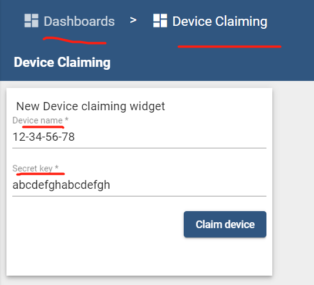

| Supported Targets | ESP32 | ESP32-C2 | ESP32-C3 | ESP32-H2 | ESP32-S3 |
| ----------------- | ----- | -------- | -------- | -------- | -------- |

# Claiming Device - ThingsBoard MQTT Client Example

* [中文版](./README_CN.md)

This example is based on [`$ESP-IDF\examples\protocols\mqtt\tcp`](https://github.com/espressif/esp-idf/tree/master/examples/protocols/mqtt/tcp).

This example implements Claiming device related functions:

* Send claiming devices msg to the server:
  * Topic: `v1/devices/me/claim`
  * Payload: `{"secretKey":"value", "durationMs":60000}`

**Note**: See [Claiming devices API](https://thingsboard.io/docs/reference/mqtt-api/#claiming-devices)

## Hardware Required

* A development board with ESP32/ESP32-C3/ESP32-H2/ESP32-C2/ESP32-S3 SoC (e.g., ESP32-DevKitC, ESP-WROVER-KIT, etc.)
* A USB cable for Power supply and programming

See [Development Boards](https://www.espressif.com/en/products/devkits) for more information about it.

## How to Use Example

1. Get a device access token

   `Login in ThingsBoard CE/PE` --> `Devices` --> Click my device --> `Details` --> `Copy Access Token`.

1. set-targe (optional)

   Before project configuration and build, be sure to set the correct chip target using:

   ```bash
   idf.py set-target <chip_name>
   ```

1. menuconfig

   Then project configuration:

   ```bash
   idf.py menuconfig
   ```

   Configuration: ThingsBoard MQTT URI, access token, Wi-Fi SSID, password:

   ```menuconfig
   Example Configuration  --->
       (mqtt://MyThingsboardServerIP) Broker URL
       (MyDeviceToken) Access Token 
   Example Connection Configuration  --->
       [*] connect using WiFi interface
       (MySSID) WiFi SSID 
       (MyPassword) WiFi Password                  
   Component config  --->
       ThingsBoard MQTT Client library (TBMQTTClient)  ---> 
           [*] Enable TBMQTTClient Helper
   ```

1. build, flash and monitor

   Run `idf.py -p PORT flash monitor` to build, flash and monitor the project.

   (To exit the serial monitor, type ``Ctrl-]``.)

   See the [Getting Started Guide](https://idf.espressif.com/) for full steps to configure and use ESP-IDF to build projects.

1. Create a dashboard for claiming device in ThingsBoard

   Referece [here](https://thingsboard.io/docs/user-guide/claiming-devices/#device-claiming-widget).

   * Create a dashboard: `Dashboards` --> `+` Add Dashboard --> `Create new dashboard` --> Title: `Device Claiming` --> `Add`.

   * Add Device Claiming Widget: `Dashboards` --> Click `Device Claiming` --> `Open dashboard` --> `Enter edit mode` --> `Add new widget` --> `Input widgets` --> `Device Claiming widget` --> `Add` --> `Apply Changes`.

      

## Example Output

```none
...
0x40081188: call_start_cpu1 at C:/Espressif/frameworks/esp-idf-v4.4.1/components/esp_system/port/cpu_start.c:160

I (0) cpu_start: App cpu up.
I (459) cpu_start: Pro cpu start user code
...
I (28033) SERVER_RPC_EXAMPLE: Disconnect tbmch ...
I (28033) tb_mqtt_client_helper: disconnecting from mqtt://192.168.0.186...
W (28143) MQTT_CLIENT: Client asked to stop, but was not started
I (28243) SERVER_RPC_EXAMPLE: Destroy tbmch ...
I (28243) tb_mqtt_client_helper: It already disconnected from thingsboard MQTT server!
```

## Troubleshooting

For any technical queries, please open an [issue](https://github.com/liang-zhu-zi/esp32-thingsboard-mqtt-client/issues) on GitHub. We will get back to you soon.
